# 🕷️ سبايدرمان ديالنا — الفيلم الكامل (24 مشهد = 2:24 دقيقة)

> 📌 **كل مشهد فيه: الصورة + البرومبوت الكامل تحتها**
> **القاعدة:** الهوية السرية — أنيس عادي بدون قناع، سبايدرمان ببدلة كاملة والوجه مخفي
> **الاستعمال في Flow:** انسخ البرومبوت + ارفع الصورة + ولّد 6 ثواني

---

## 🧑🎨 الشخصيات (مرجع ثابت)

### 🕷️ أنيس / سبايدرمان
```
Photorealistic young Algerian man, Anis, 25 years old, 178 cm tall, slim athletic
build, short black wavy hair, thin dark eyebrows, expressive dark brown eyes,
light stubble beard covering the jawline, medium olive-tan skin, small scar on
his left eyebrow. As Spider-Man he wears the classic red-and-blue suit with black
web pattern, large white expressive eyes on the mask. Same identity in every scene.
```

### 👵 خالتي زهرة
```
Photorealistic elderly Algerian woman, Aunt Zahra, 72 years old, short and slightly
hunched, deep wrinkles, warm brown eyes, grey hair in a bun under a traditional
white haik head covering, dark blue traditional karakou-style dress with gold
embroidery, worn brown leather handbag. Same appearance in every scene.
```

### 👮 قويدر (الشرطي)
```
Photorealistic Algerian police officer, Kouider, 40 years old, medium height,
stocky build, short grey-flecked black hair, thick moustache, stern but kind face,
light brown skin, wearing the dark blue Algerian police uniform with badge and cap.
Same appearance in every scene.
```

### 🧑 حرامي السوق
```
Photorealistic thin Algerian man, market thief, 30 years old, thin build, shifty
narrow eyes, short black messy hair, thin goatee, light brown skin, dark grey
hooded jacket, black jeans, small black bag. Same appearance in every scene.
```

### 🚖 سي الطاهر (سائق التاكسي)
```
Photorealistic Algerian taxi driver, Si Tahar, 50 years old, medium build, grey
moustache, weathered friendly face with laugh lines, light brown skin, beige shirt,
dark trousers, white and yellow taxi. Same appearance in every scene.
```

---

# 🎬 المشاهد (1 → 24)

## 🎬 المشهد 1 — "اللدغة في السوق" (6 ثواني)

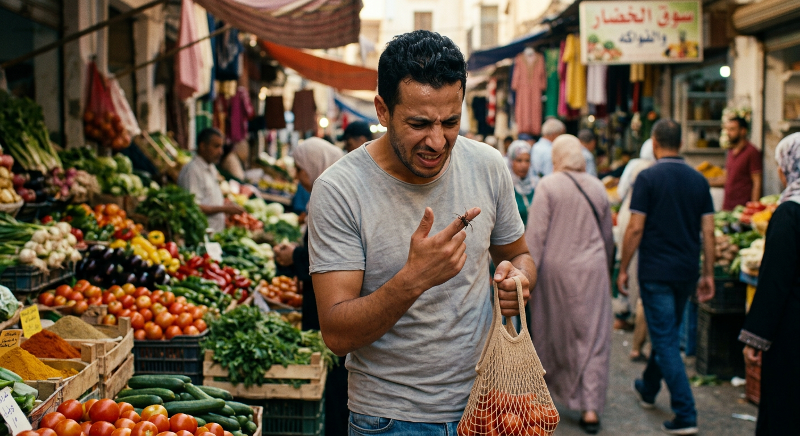

**البرومبوت الكامل:**
```
Photorealistic cinematic scene, 6 seconds, Algerian souk market, warm afternoon light.

CHARACTER: Anis, a young Algerian man, 25 years old, short black wavy hair, light
stubble beard on jawline, medium olive-tan skin, wearing a light grey t-shirt and
blue jeans, holding a bag of tomatoes at a vegetable stall.

ENVIRONMENT: A busy Algerian vegetable market, colorful vegetable stalls, blurred
shoppers moving around, warm afternoon sunlight.

CAMERA: Medium close-up on Anis's hand and face.

ACTION WITH TIMING:
- 0-2 seconds: Anis picks tomatoes at the market stall, looking at the vegetables.
- 2-4 seconds: A small spider suddenly bites his hand, he winces and looks down.
- 4-6 seconds: He looks at the small bite on his hand with a surprised confused expression.

DIALOGUE (Algerian Arabic, text on screen): "آي! واش هادي؟! عنكبوت؟ في السوق؟!"

SOUND: Market ambience, people talking, then a sudden "ouch" sound.
```

---

---

## 🎬 المشهد 2 — "محاولة الطيران الفاشلة" (6 ثواني)

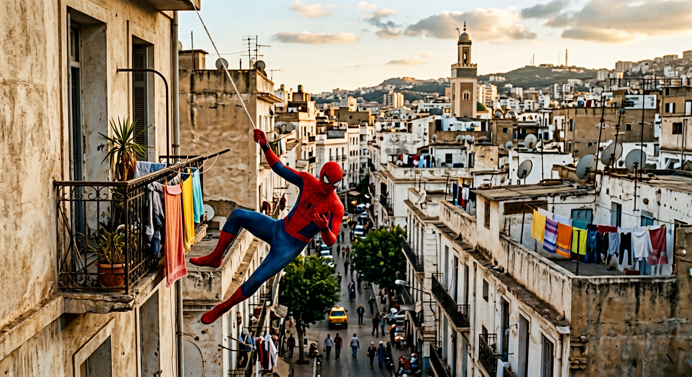

**البرومبوت الكامل:**
```
Photorealistic comedic cinematic scene, 6 seconds, Algerian low-rise neighborhood, warm afternoon light.

CHARACTER: Spider-Man (Anis in the classic red-and-blue suit with black web pattern,
large white eyes on the mask, slim athletic build).

ENVIRONMENT: Rooftop of a low 3-story Algerian building, surrounding buildings are
all low (2-4 stories), satellite dishes, laundry hanging on balconies, minarets in
the distance, blue sky.

CAMERA: Wide shot showing Spider-Man on the rooftop and the low city around him.

ACTION WITH TIMING:
- 0-2 seconds: Spider-Man raises his hand to shoot a web, confident pose.
- 2-4 seconds: He shoots a web, but it only reaches a small balcony railing nearby,
  he looks at his hand in comedic disbelief.
- 4-6 seconds: He sags awkwardly mid-air, holding the web, looking down at the
  short distance to the ground with a defeated funny expression.

DIALOGUE (Algerian Arabic, text on screen): "هذا؟! ها هو سطيح من 3 طوابق؟! وين الأبراج في هذي البلاد؟!"

SOUND: Web shooting sound, comedic sad trombone, pigeon cooing.
```

---

---

## 🎬 المشهد 3 — "سرقة الحقيبة" (6 ثواني)

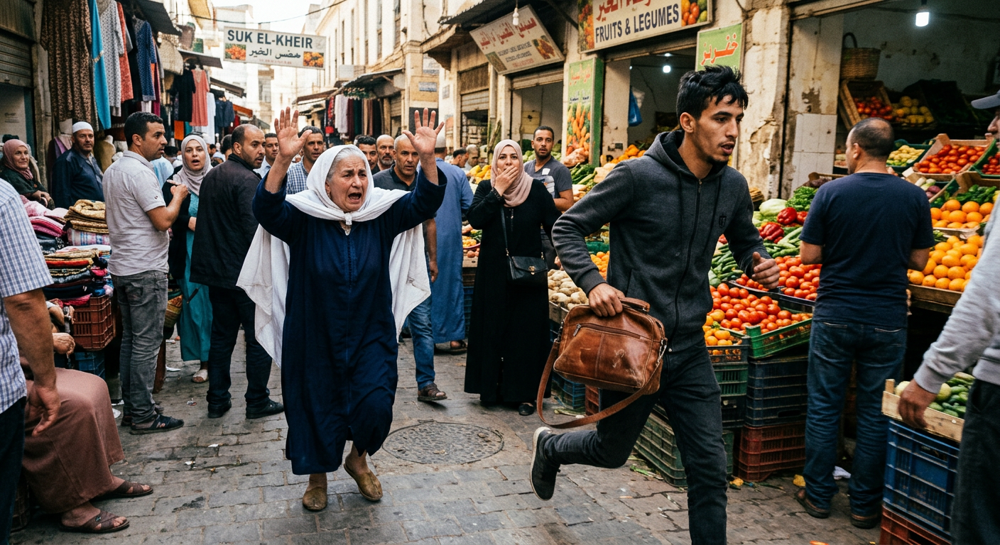

**البرومبوت الكامل:**
```
Photorealistic cinematic action scene, 6 seconds, Algerian street market, warm daylight.

CHARACTERS:
- Market thief: thin young Algerian man, 30 years old, short messy black hair,
  thin goatee, dark grey hooded jacket, black jeans.
- Aunt Zahra: elderly Algerian woman, 72 years old, grey hair in a bun under a
  white haik head covering, dark blue traditional dress, brown leather handbag.

ENVIRONMENT: Busy Algerian street market with vegetable and goods stalls, shocked
shoppers around.

CAMERA: Dynamic medium shot capturing the snatch moment.

ACTION WITH TIMING:
- 0-2 seconds: The thief sneaks behind Aunt Zahra, reaches for her handbag.
- 2-4 seconds: He snatches the brown handbag from her arm and starts running away.
- 4-6 seconds: Aunt Zahra cries out, raising her hands in shock, shoppers turn around.

DIALOGUE (Algerian Arabic, text on screen): "أي يا ولدي! الحرامي! الحقو! سرقلي حقيبتي!"

SOUND: Market noise suddenly stops, a gasp, quick footsteps.
```

---

---

## 🎬 المشهد 4 — "الإمساك بالحرامي" (6 ثواني)

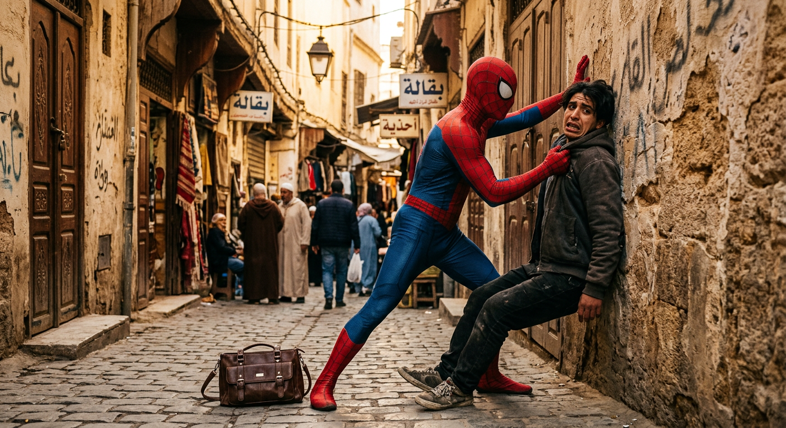

**البرومبوت الكامل:**
```
Photorealistic cinematic action scene, 6 seconds, narrow Algerian alley, warm afternoon light.

CHARACTERS:
- Spider-Man: red and blue suit with black web pattern, white eyes on mask.
- Market thief: thin young man, 30 years old, messy black hair, goatee, dark grey
  hooded jacket, scared expression.

ENVIRONMENT: Narrow stone-walled alley in an old Algerian neighborhood.

CAMERA: Dramatic low-angle medium shot.

ACTION WITH TIMING:
- 0-2 seconds: Spider-Man holds the thief by the collar against the alley wall.
- 2-4 seconds: The thief struggles scared, Spider-Man shakes his head disapprovingly.
- 4-6 seconds: Spider-Man points down at the brown handbag on the ground, then at
  the thief with a "shame on you" gesture.

DIALOGUE (Algerian Arabic, text on screen): "تسرق حقيبة وحدة عجوز؟! عيب عليك! هذي حقيبة خالتي زهرة!"

SOUND: Dramatic tension music, a scuffle, then a firm tone.
```

---

---

## 🎬 المشهد 5 — "انقطاع الكهرباء" (6 ثواني)

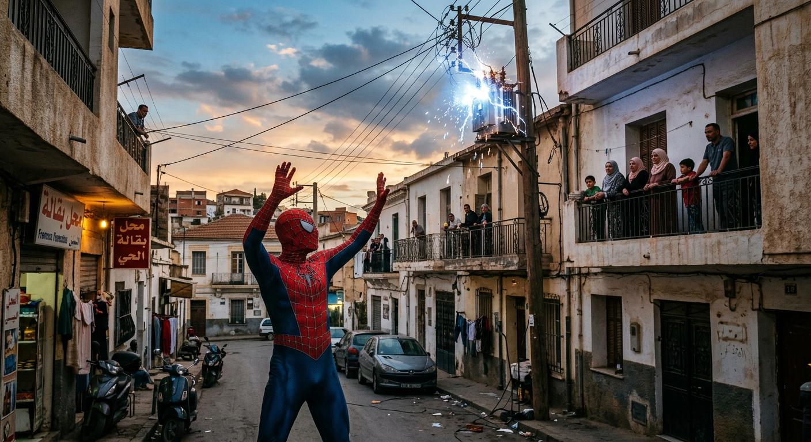

**البرومبوت الكامل:**
```
Photorealistic cinematic heroic scene, 6 seconds, Algerian neighborhood at dusk, orange sky.

CHARACTER: Spider-Man (red and blue suit, white eyes on mask) climbing an electricity pole.

ENVIRONMENT: Low Algerian apartment building, residents on balconies watching,
one balcony with working warm lights, the rest dark, damaged transformer box
sparking, orange dusk sky.

CAMERA: Dramatic low-angle wide shot showing Spider-Man high on the pole.

ACTION WITH TIMING:
- 0-2 seconds: Spider-Man climbs the electricity pole, sparks flying from the
  damaged transformer.
- 2-4 seconds: He uses his web to fix and re-connect the transformer wires, sparks stop.
- 4-6 seconds: The building lights turn on one by one, residents on balconies cheer
  with raised hands.

DIALOGUE (Algerian Arabic, text on screen): "ها هي الضو رجعت! أنيس، والله أنت بطل!" (الناس يصفقون)

SOUND: Electrical crackle, then a "click" and joyful cheering from the neighborhood.
```

---

## ⏭️ المشاهد القادمة (نكملهم في الجلسة الجاية)

| # | المشهد |
|---|---|
| 6 | شكر خالتي زهرة — يرجعلها الحقيبة |
| 7 | البيروقراطية في البلدية — يوديها تدير وثائقها |
| 8 | التاكسي — سي الطاهر يتعرف عليه ويطلب سيلفي |
| 9 | المنتجات المقلدة — يكشف المحتال في السوق |
| 10 | النهاية — جالس على السطح، يبتسم — "حتى بلا أبراج، نقدر نخدم" |

---

**المجموع الحالي: 5 مشاهد × 6 ثواني = 30 ثانية** (نكمل حتى 60+ ثانية)

# 🕷️ سبايدرمان ديالنا — المشاهد (6-10) برومبوتات كاملة

> 📌 **القاعدة المطبقة:** الهوية السرية — أنيس عادي بدون قناع، سبايدرمان ببدلة كاملة والوجه مخفي.
> **كل مشهد 6 ثواني** — برومبوت كامل فيه كل شيء.

---

---

## 🎬 المشهد 6 — "التاكسي" (6 ثواني) 🚖

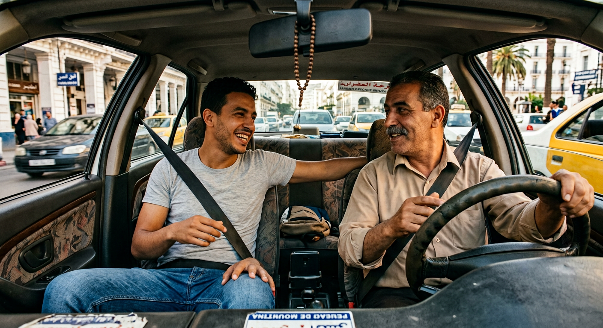

**البرومبوت الكامل:**
```
Photorealistic cinematic scene, 6 seconds, inside an Algerian taxi, warm daylight.

CHARACTERS:
- Anis: young Algerian man, 25 years old, short black wavy hair, light stubble
  on jawline, medium olive-tan skin, wearing a light grey t-shirt and blue jeans
  (completely normal casual clothes, NO mask, NO costume, nobody knows his identity).
- Si Tahar: Algerian taxi driver, 50 years old, grey moustache, beige shirt,
  friendly face, driving.

ENVIRONMENT: Inside a white and yellow Algerian taxi, city street visible through
the windows, warm daylight.

CAMERA: Medium shot from the back seat area, showing both Anis and the driver.

ACTION WITH TIMING:
- 0-2 seconds: Anis sits in the back seat, relaxed, looking out the window.
- 2-4 seconds: The driver looks back and asks him something with a friendly smile.
- 4-6 seconds: Anis answers casually, then looks out the window with a small
  knowing smile (as if he has a secret).

DIALOGUE (Algerian Darija, text on screen):
Driver: "وين رايح يا ولدي؟ علاش كسول هكاك؟"
Anis: "خويا، راني رايح نخدم... وخا الخدمة ما تبانش، غير توقّع المفاجآت."
Driver: "ياك تتكلم على الفلوس؟"
Anis (يبتسم): "لا خويا، على شيء ما تتصوّروش..."

SOUND: Taxi engine, city traffic, casual friendly tones, then a mysterious soft
laugh from Anis.
```

---

---

## 🎬 المشهد 7 — "التحول" (6 ثواني) 🎒

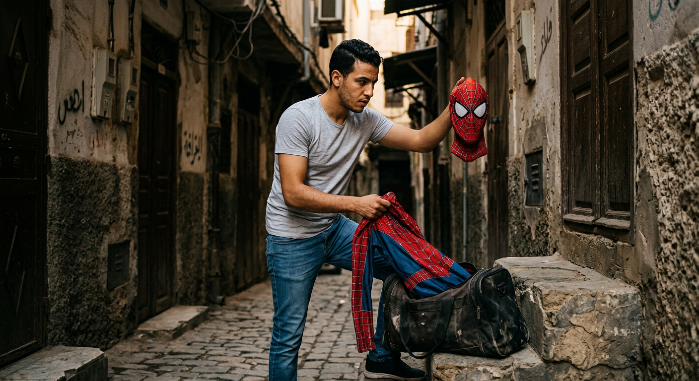

**البرومبوت الكامل:**
```
Photorealistic cinematic scene, 6 seconds, hidden narrow Algerian alley, dramatic
warm light, secretive mood.

CHARACTER: Anis, young Algerian man, 25 years old, short black wavy hair, light
stubble, olive-tan skin, wearing a light grey t-shirt and blue jeans, holding an
open black sports bag.

ENVIRONMENT: Empty hidden narrow alley with old stone walls, dramatic shafts of
warm light.

CAMERA: Medium shot, slightly low angle for drama.

ACTION WITH TIMING:
- 0-2 seconds: Anis looks around to make sure nobody is watching, then opens his
  black sports bag.
- 2-4 seconds: He pulls out the red and blue Spider-Man suit from the bag, the
  fabric catching the light.
- 4-6 seconds: He holds the suit up, a determined look on his face, ready to
  change (cut before he actually wears it — the suit covers his face only in
  the next action scene).

DIALOGUE (Algerian Darija, text on screen, whispered to himself):
"يا الله... كي نلبس هادي، نولي 'سبايدرمان'... وخا ما يكونوش عارفين مين أنا،
المهم الناس تكون مرتاحة. يلا، نبداو الخدمة."

SOUND: Dramatic suspense music building up, zipper sound of the bag, fabric
rustling.
```

---

---

## 🎬 المشهد 8 — "سبايدرمان يظهر للناس" (6 ثواني) 💪

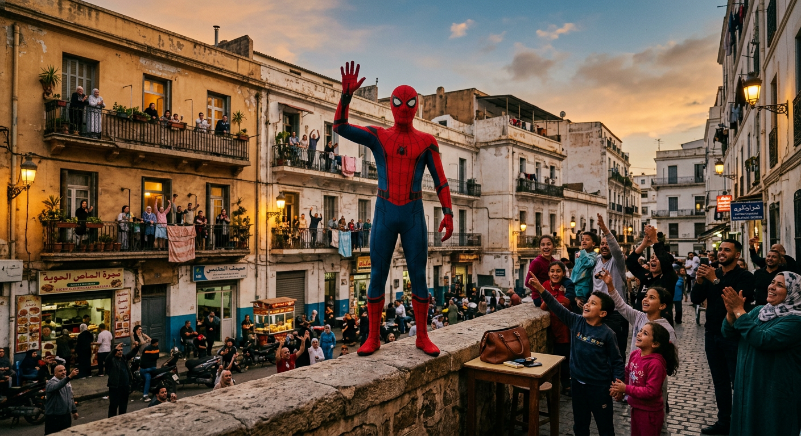

**البرومبوت الكامل:**
```
Photorealistic cinematic scene, 6 seconds, Algerian street at dusk, warm orange
light, festive heroic mood.

CHARACTER: Spider-Man, wearing the complete red and blue suit with black web
pattern, full mask covering his ENTIRE face — only large white expressive eyes
visible, NO skin or face shown at all. He stands on a low wall in a heroic
confident pose, one hand raised waving, the stolen brown handbag returned on a
table beside him.

ENVIRONMENT: Algerian street with low buildings, residents watching from
balconies, excited children in the street, warm dusk sky.

CAMERA: Low-angle wide shot making Spider-Man look heroic.

ACTION WITH TIMING:
- 0-2 seconds: Spider-Man lands/stands on the low wall, raising his hand in a
  heroic greeting.
- 2-4 seconds: He points to the returned handbag, then to himself with a thumbs
  up, residents clap.
- 4-6 seconds: He does a small dramatic bow, children cheer, he waves goodbye
  and prepares to leave.

DIALOGUE (Algerian Darija, text on screen):
"سلام عليكم! أنا سبايدرمان... وخا ما تعرفوش وجهي، المهم تعرفوا إني هنا نحمي
الحومة تاعنا. خالتي زهرة، الحقيبة تاعك رجعات، وعيشة ماشي مسروقة!"

SOUND: Cheering crowd, children laughing, heroic upbeat music, then a web
shooting "swish" as he leaves.
```

---

---

## 🎬 المشهد 9 — "البلدية" (6 ثواني) 🏛️

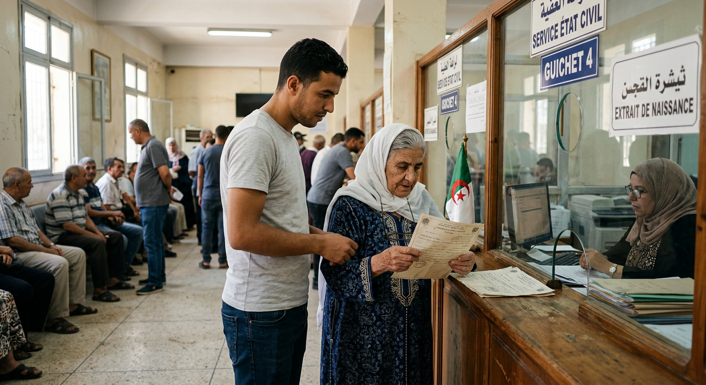

**البرومبوت الكامل:**
```
Photorealistic cinematic scene, 6 seconds, inside an Algerian municipal office
(baladiya), daylight through windows.

CHARACTERS:
- Anis: young Algerian man, 25 years old, short black wavy hair, light stubble,
  olive-tan skin, light grey t-shirt and blue jeans (completely normal, NO mask).
- Aunt Zahra: elderly Algerian woman, 72 years old, grey hair in a bun under a
  white haik head covering, dark blue traditional dress, holding papers.

ENVIRONMENT: Algerian baladiya office interior, counter with employee behind a
window, other people waiting, official paperwork atmosphere.

CAMERA: Medium shot of the two at the counter.

ACTION WITH TIMING:
- 0-2 seconds: Zahra looks confused at her papers, shaking her head.
- 2-4 seconds: Anis leans in, pointing at the paper and explaining patiently.
- 4-6 seconds: Zahra smiles gratefully, Anis nods kindly, they move to the
  counter together.

DIALOGUE (Algerian Darija, text on screen):
Zahra: "يا ولدي، هذي الوثائق نهار ولا عام ما كملتهمش... البيروقراطية هادي
ماشي شغلة."
Anis: "لا تخافي يا خالتي، أنا معاك. هاك توقيعي هنا، وتوقيعك هنا، وروحو نكملو
مع بعض. فين رانا فين؟! نكملو شغلتنا وما نخليوكش."
Zahra (تضحك): "يعيشك يا ولدي، واش كنا نعملو بلايك؟"

SOUND: Office ambience, papers shuffling, stamp sounds, warm kind voices.
```

---

---

## 🎬 المشهد 10 — "النهاية" (6 ثواني) 🌅

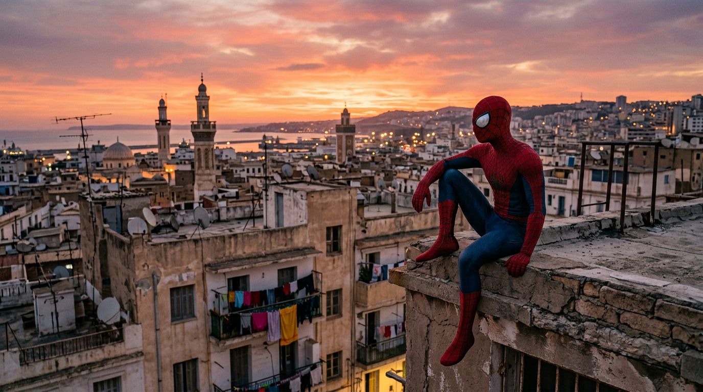

**البرومبوت الكامل:**
```
Photorealistic cinematic final scene, 6 seconds, Algerian rooftop at sunset,
emotional peaceful mood.

CHARACTER: Spider-Man, complete red and blue suit, full mask covering his face
with large white eyes, sitting on the edge of a low rooftop, feet dangling over
the edge, looking over the city.

ENVIRONMENT: Low Algerian buildings with satellite dishes and minarets, laundry
on balconies, orange and purple sunset sky, city lights beginning to glow.

CAMERA: Wide cinematic shot from behind-side, showing him and the city view.

ACTION WITH TIMING:
- 0-2 seconds: Spider-Man sits on the rooftop edge, looking over the city calmly.
- 2-4 seconds: He looks down at his hands, then back at the city, a peaceful
  moment (even with the mask, his posture shows a smile).
- 4-6 seconds: He looks up at the sky, nods to himself, then a slow zoom out —
  freeze frame on him against the sunset (end card).

DIALOGUE (Algerian Darija, text on screen — inner thought, voiceover):
"الناس يعرفوني باسم سبايدرمان، ولكن... في الحقيقة أنا أنيس، ولد الحومة.
حتى بلا أبراج، وبلا ضجيج نيويورك... نقدر نخدم في بلادي. لأن البطل الحقيقي،
ماشي اللي يطير... البطل اللي يقف مع الناس. والجزائر، تستاهل بطلها.
(يبتسم تحت القناع) يلا، نرجع نخدم. غدوة نهار آخر."

SOUND: Emotional cinematic music, city ambience at dusk, a gentle wind, then
a soft web "swish" as the end card appears.
```

---

## 🎬 ملخص الفيلم كامل (10 مشاهد = 60 ثانية)

| # | المشهد | الحالة | الحوار المفتاحي |
|---|---|---|---|
| 1 | اللدغة في السوق | أنيس عادي | "عنكبوت في السوق؟!" |
| 2 | محاولة الطيران الفاشلة | سبايدرمان (بدلة) | "وين الأبراج في هذي البلاد؟!" |
| 3 | سرقة الحقيبة | أنيس يشاهد + زهرة | "الحقو! سرقلي حقيبتي!" |
| 4 | الإمساك بالحرامي | سبايدرمان (بدلة) | "تسرق حقيبة وحدة عجوز؟! عيب عليك!" |
| 5 | انقطاع الكهرباء | سبايدرمان (بدلة) | "ها هي الضو رجعت!" |
| 6 | التاكسي | أنيس عادي 🧑 | "راني رايح نخدم... وخا الخدمة ما تبانش" |
| 7 | التحول | أنيس → يجبد البدلة | "نلبس هادي، نولي سبايدرمان..." |
| 8 | الظهور للناس | سبايدرمان (بدلة كاملة) | "ما تعرفوش وجهي، المهم نحمي الحومة!" |
| 9 | البلدية | أنيس عادي 🧑 | "لا تخافي يا خالتي، أنا معاك" |
| 10 | النهاية | سبايدرمان (بدلة كاملة) | "البطل الحقيقي اللي يقف مع الناس" |

**المجموع: 10 مشاهد × 6 ثواني = 60 ثانية (دقيقة كاملة)** 🎬

---

## ✅ ملاحظات الإتقان:

1. **الهوية السرية** محترمة: أنيس يظهر في المشاهد 1، 3، 6، 7، 9 بملابس عادية — سبايدرمان في 2، 4، 5، 8، 10 ببدلة كاملة والوجه مخفي.
2. **الدارجة الجزائرية 100%** — حوار واقعي يستعمله الناس فعلاً.
3. **الكوميديا** في المشاهد 2 (فشل الطيران) و6 (التاكسي).
4. **الأكشن** في المشاهد 4 و8.
5. **العاطفة** في المشهد 10 (النهاية).
6. **كل مشهد 6 ثواني** — الحوار الطويل يُقرأ بسرعة على الشاشة أو يُحكى كتعليق صوتي.

# 🕷️ سبايدرمان ديالنا — المشاهد (11-20) برومبوتات كاملة

> **القاعدة:** الهوية السرية — أنيس عادي بدون قناع، سبايدرمان ببدلة كاملة والوجه مخفي.
> **كل مشهد 6 ثواني** — برومبوت كامل فيه كل شيء.

---

---

## 🎬 المشهد 11 — "الحي يتكلم" (6 ثواني) 🗣️

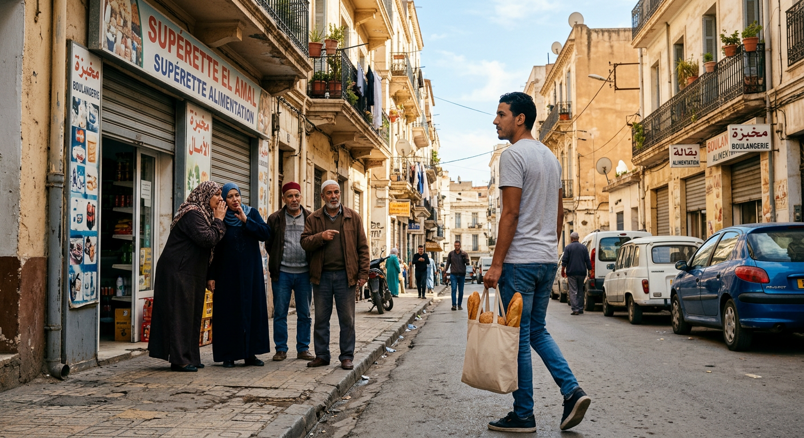

**البرومبوت الكامل:**
```
Photorealistic cinematic scene, 6 seconds, Algerian neighborhood street, sunny morning.

CHARACTER: Anis, a young Algerian man, 25 years old, short black wavy hair, light
stubble on jawline, medium olive-tan skin, wearing a light grey t-shirt and blue
jeans (completely normal, NO mask, nobody knows his secret).

ENVIRONMENT: Low Algerian buildings, sidewalk with a group of neighbors.

CAMERA: Medium shot from behind the neighbors, showing Anis walking and them
whispering.

ACTION WITH TIMING:
- 0-2 seconds: Anis walks down the street carrying a bag of bread, looking normal.
- 2-4 seconds: A group of neighbors on the sidewalk notice him and start
  whispering to each other, pointing slightly.
- 4-6 seconds: Anis notices them looking at him, gives a confused friendly smile
  and keeps walking.

DIALOGUE (Algerian Darija, text on screen — neighbors whispering):
Neighbor 1: "هذا هو اللي يهز في الحومة؟"
Neighbor 2: "آه، نسمعو عليه... الرجل العنكبوت!"
Neighbor 1: "لا، هذا أنيس... ولد الحومة، عادي."
Anis (لنفسه): "واش يهمسو عليّ؟ المهم، ياك ما عرفونيش."

SOUND: Morning street ambience, birds, low whispers, then Anis's light footsteps.
```

---

---

## 🎬 المشهد 12 — "سيلفي مع سي الطاهر" (6 ثواني) 🤳

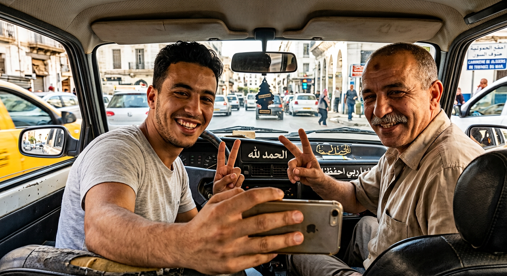

**البرومبوت الكامل:**
```
Photorealistic comedic scene, 6 seconds, inside an Algerian taxi, warm daylight.

CHARACTERS:
- Anis: young Algerian man, 25 years old, short black wavy hair, light stubble,
  olive-tan skin, light grey t-shirt (normal clothes, NO mask).
- Si Tahar: taxi driver, 50 years old, grey moustache, beige shirt, friendly.

ENVIRONMENT: White and yellow taxi interior, city street through windows.

CAMERA: Front-facing selfie angle showing both of them.

ACTION WITH TIMING:
- 0-2 seconds: Si Tahar recognizes Anis and gets excited, turning in his seat.
- 2-4 seconds: He grabs Anis's arm and insists on taking a selfie together.
- 4-6 seconds: Both smile and make peace signs toward the camera (selfie POV),
  the driver's arm reaching up holding the phone.

DIALOGUE (Algerian Darija, text on screen):
Si Tahar: "أنا عارفك! إنت اللي مع الرجل العنكبوت، ههه! يلا، صورة!"
Anis (يضحك): "خويا، أنا ما نعرف حتى واحد... غير سائق تاكسي!"
Si Tahar: "برك، سيلفي! ونحطها في واتساب!"
Anis (متفاجئ): "واتساب؟! لا لا خويا... برك صورة وحدة!"

SOUND: Taxi engine, laughter, phone camera shutter click.
```

---

---

## 🎬 المشهد 13 — "طابور المخبزة" (6 ثواني) 🥖

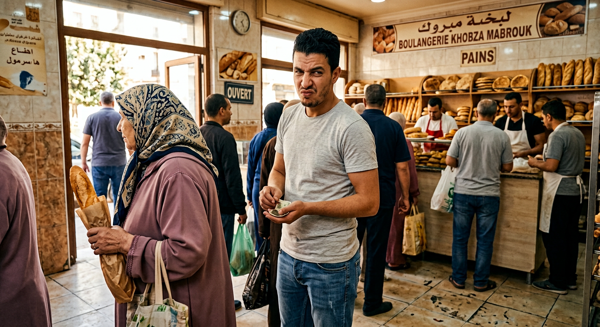

**البرومبوت الكامل:**
```
Photorealistic comedic scene, 6 seconds, Algerian street bakery (khobza), warm morning light.

CHARACTER: Anis, young Algerian man, 25 years old, short black wavy hair, light
stubble, olive-tan skin, light grey t-shirt, blue jeans (normal clothes, NO mask).

ENVIRONMENT: Simple street bakery with a queue of people, an elderly woman with
a baguette in front of him.

CAMERA: Medium shot from behind Anis, showing the queue ahead.

ACTION WITH TIMING:
- 0-2 seconds: Anis stands in the bread queue, looking at the long line ahead
  with an impatient funny expression.
- 2-4 seconds: He counts the people in front of him with his fingers, sighing.
- 4-6 seconds: The elderly woman in front takes her bread and leaves, Anis steps
  forward with a hopeful look.

DIALOGUE (Algerian Darija, text on screen):
"يا خويا، الطابور هذا؟! نهار ولا عام؟! أنا اللي نقدر نطير فوقهم... ولكن لا،
البطل الحقيقي يوقف في الطابور كيما الناس. المهم، الخبز سخون."
(Anis looks at his small change and sighs)
"غير نقدر نشري غير نصيب... والأرزاق على الله."

SOUND: Bakery ambience, people chatting, bread being taken out of the oven.
```

---

---

## 🎬 المشهد 14 — "المنتجات المقلدة" (6 ثواني) 👟

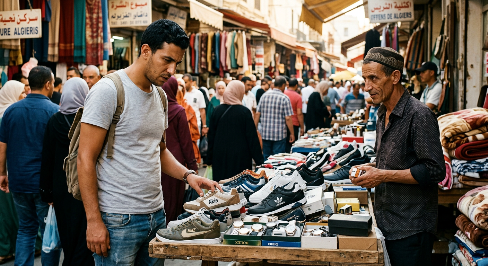

**البرومبوت الكامل:**
```
Photorealistic scene, 6 seconds, Algerian market, warm daylight.

CHARACTER: Anis, young Algerian man, 25 years old, short black wavy hair, light
stubble, olive-tan skin, light grey t-shirt, blue jeans (normal clothes, NO mask).

ENVIRONMENT: Market stall with counterfeit products (fake branded sneakers and
watches) displayed on a table, a thin sly seller.

CAMERA: Medium shot over Anis's shoulder looking at the stall.

ACTION WITH TIMING:
- 0-2 seconds: Anis picks up a fake branded sneaker, examining it suspiciously.
- 2-4 seconds: He notices the poor stitching and the fake logo, shaking his head.
- 4-6 seconds: He looks at the seller with a knowing look, the seller smiles
  nervously, Anis puts the shoe down and walks away determined.

DIALOGUE (Algerian Darija, text on screen — Anis thinking):
"هادي؟! ماركة عالمية بـ 1500 دج؟! هذا نصاب، يبيع المقلد للناس.
المشكلة، الناس ما يعرفوش. ولكن... أنا نعرف.
(ينظر للساعة) واش يلزم نعمل؟ نرجع الليلة."

SOUND: Market noise, chatter of sellers, a fake watch ticking sound.
```

---

---

## 🎬 المشهد 15 — "التحول الثاني" (6 ثواني) 🎒

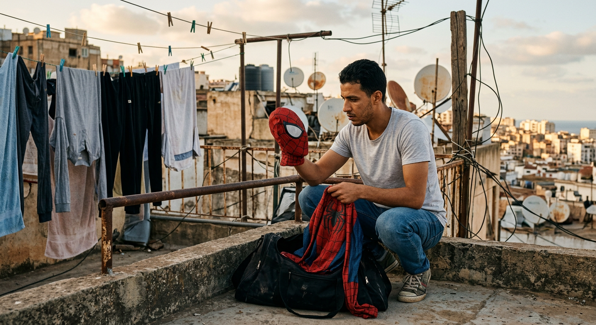

**البرومبوت الكامل:**
```
Photorealistic scene, 6 seconds, hidden rooftop corner of an Algerian building,
late afternoon warm light, secretive mood.

CHARACTER: Anis, young Algerian man, 25 years old, short black wavy hair, light
stubble, olive-tan skin, light grey t-shirt, blue jeans, holding a black sports bag.

ENVIRONMENT: Rooftop with laundry lines and satellite dishes, warm light.

CAMERA: Medium shot, slightly low angle.

ACTION WITH TIMING:
- 0-2 seconds: Anis checks the rooftop is empty, opens his black sports bag.
- 2-4 seconds: He pulls out the red and blue Spider-Man suit, holding it up.
- 4-6 seconds: He looks at the suit with a determined look, nods, and begins to
  put it on (mask still in hand — face still visible at this moment).

DIALOGUE (Algerian Darija, text on screen — whispered):
"يا الله... السوق مليان بالمقلد، والناس يتضروا. حان الوقت نبان.
(يضحك لنفسه) المرة هادي، راني عارف وين نرمي الخيط... ما نقعش كيما
المرة الأولى. يلا، سبايدرمان يبدأ الخدمة."

SOUND: Wind on the rooftop, zipper of the bag, dramatic music build-up.
```

---

---

## 🎬 المشهد 16 — "كشف المنتجات المقلدة" (6 ثواني) 💥

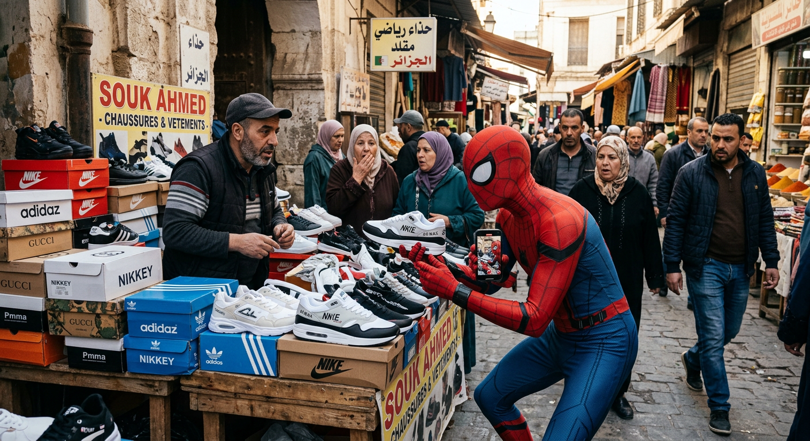

**البرومبوت الكامل:**
```
Photorealistic action scene, 6 seconds, Algerian market, warm daylight.

CHARACTER: Spider-Man, complete red and blue suit with black web pattern, full
mask covering his entire face with large white eyes (NO face visible).

ENVIRONMENT: Market stall with counterfeit products, shocked shoppers around.

CAMERA: Medium shot, dynamic heroic angle.

ACTION WITH TIMING:
- 0-2 seconds: Spider-Man holds up a fake branded sneaker in one hand, pointing
  at it with the other in a "caught you" gesture.
- 2-4 seconds: He shows the fake logo and the poor stitching to the shocked crowd.
- 4-6 seconds: The seller tries to run, Spider-Man catches his shoulder with one
  hand, stopping him calmly.

DIALOGUE (Algerian Darija, text on screen):
"شوفو هذي! ماركة 'أصلية'؟! هذي مقلدة! الناس تخدم و تدفع فلوسها في الزبل!
أنا سبايدرمان، وهادي حومتي، وما نسمحش النصابين ياكلو في قوت الناس!
(للبائع) وانت يا خويا... عندك شيء تقولو قبل ما نجيب الشرطة؟"

SOUND: Market noise stops suddenly, dramatic music, fabric swish.
```

---

---

## 🎬 المشهد 17 — "مساعدة قويدر" (6 ثواني) 👮

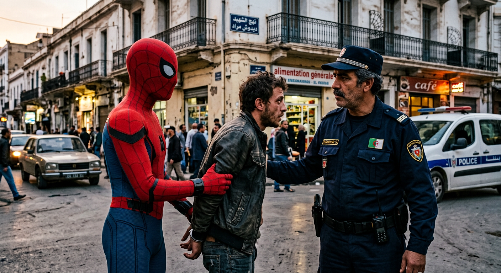

**البرومبوت الكامل:**
```
Photorealistic scene, 6 seconds, Algerian street at dusk, warm light.

CHARACTERS:
- Spider-Man: complete red and blue suit, full mask, large white eyes.
- Officer Kouider: 40 years old, grey-flecked black hair, thick moustache, dark
  blue Algerian police uniform with cap.

ENVIRONMENT: Low Algerian buildings, street at dusk.

CAMERA: Medium shot of the two facing each other.

ACTION WITH TIMING:
- 0-2 seconds: Spider-Man hands a captured small criminal by the arm to Officer
  Kouider.
- 2-4 seconds: Kouider looks at Spider-Man with a mix of suspicion and respect,
  taking the criminal.
- 4-6 seconds: Kouider tips his cap slightly in a thank-you gesture, Spider-Man
  nods back.

DIALOGUE (Algerian Darija, text on screen):
Kouider: "راك تحب تقوم بدوري؟!"
Spider-Man: "خويا قويدر، أنا ما نحبش نحل محلك... غير نساعد. هذا اللي كان
يسرق في الحومة، خذيوه."
Kouider: "يعني... أنت ماشي شرير؟"
Spider-Man (يضحك): "لا خويا، أنا ولد هذي الحومة. غير القناع غيّرني."
Kouider: "نشوفك... نراقبك."

SOUND: Dusk ambience, police radio static, firm but respectful voices.
```

---

---

## 🎬 المشهد 18 — "فض الشجار" (6 ثواني) 🥊

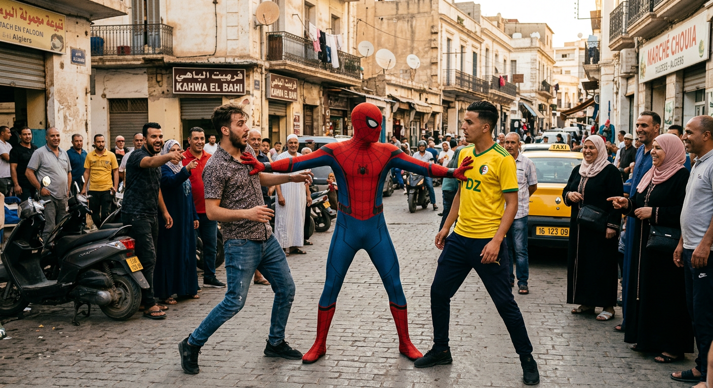

**البرومبوت الكامل:**
```
Photorealistic comedic action scene, 6 seconds, Algerian street, warm afternoon light.

CHARACTER: Spider-Man, complete red and blue suit, full mask with large white eyes.

ENVIRONMENT: Street with a small crowd watching, two angry young men.

CAMERA: Medium shot showing Spider-Man between the two men.

ACTION WITH TIMING:
- 0-2 seconds: Two young men are about to fight, shouting at each other.
- 2-4 seconds: Spider-Man lands between them, holding them apart with one hand
  on each chest, a calm "stop" gesture.
- 4-6 seconds: The two men look surprised and slightly embarrassed, the crowd
  laughs, Spider-Man shakes his head amused.

DIALOGUE (Algerian Darija, text on screen):
"وقفو! وقفو! على واش تتقاتلو؟! على 500 دج؟! على الكورة؟!
أنا اللي نقدر نطير في الهواء، وواقف هنا نقولكم: ارجعوا لبيوتكم!
(يضحك) وكي تحبو تتقاتلو... قاتلو في الدوري، ماشي في الشارع!"

SOUND: Shouting stops suddenly, crowd laughter, a comedic "boing" sound.
```

---

---

## 🎬 المشهد 19 — "مطاردة قويدر" (6 ثواني) 🏃

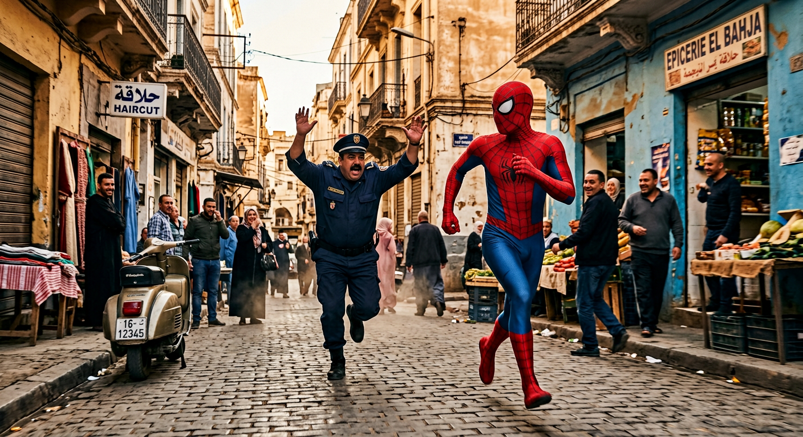

**البرومبوت الكامل:**
```
Photorealistic comedic chase scene, 6 seconds, Algerian street, warm afternoon.

CHARACTERS:
- Spider-Man: complete red and blue suit, full mask, large white eyes, running on foot.
- Officer Kouider: 40 years old, thick moustache, dark blue uniform, chasing on foot.

ENVIRONMENT: Low Algerian buildings (no tall towers to swing on), street.

CAMERA: Wide tracking shot following the chase.

ACTION WITH TIMING:
- 0-2 seconds: Spider-Man runs on foot through the street, looking back over his
  shoulder with a funny panicked expression (visible through the mask's posture).
- 2-4 seconds: Officer Kouider chases him on foot, waving his hands and shouting.
- 4-6 seconds: Spider-Man ducks into a narrow alley, Kouider stops at the entrance
  panting, shaking his fist.

DIALOGUE (Algerian Darija, text on screen):
Kouider: "وقوف! وقوف! ماشي كيما الأفلام هوني، هنا مافيهش أبراج!"
Spider-Man (يجري ويلتفت): "خويا، حتى أنا لقيت! هذي المشكلة!
(يختفي في الزنقة) نرجعو غدوة، وعد!"
Kouider (لاهث): "هذا... هذا يهرب على رجليه! حتى في هذي ما يطيرش!"

SOUND: Running footsteps, panting, comedic chase music, then silence in the alley.
```

---

---

## 🎬 المشهد 20 — "أطفال الحي" (6 ثواني) 🧒

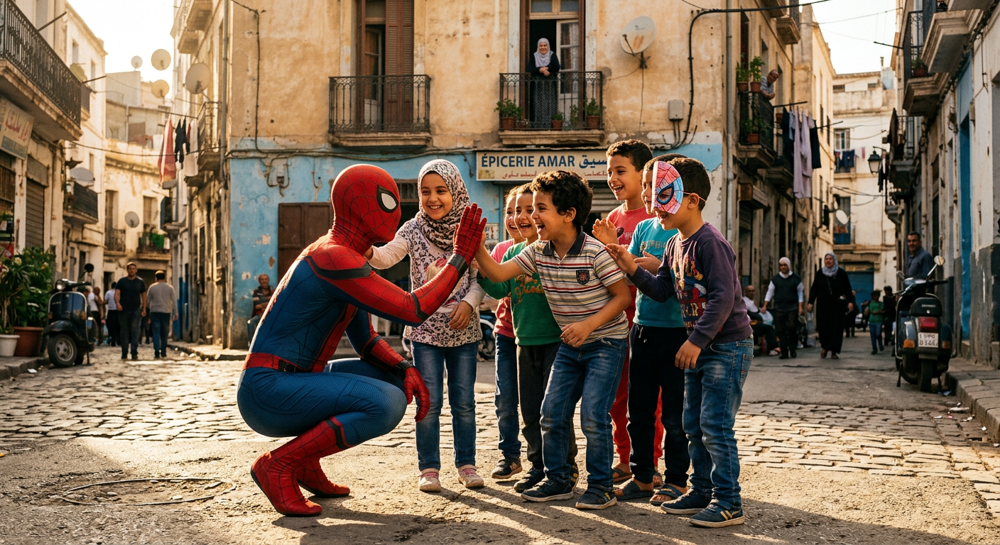

**البرومبوت الكامل:**
```
Photorealistic heartwarming scene, 6 seconds, Algerian neighborhood street, golden afternoon light.

CHARACTER: Spider-Man, complete red and blue suit, full mask with large white eyes,
crouching down to the children's level.

ENVIRONMENT: Street with excited children, one child wearing a homemade paper
Spider-Man mask, low buildings behind.

CAMERA: Low angle from the children's perspective.

ACTION WITH TIMING:
- 0-2 seconds: Spider-Man crouches down and raises his hand for a high-five.
- 2-4 seconds: The children cheer and jump, one by one high-fiving his hand.
- 4-6 seconds: The child with the paper mask salutes him, Spider-Man returns the
  salute with a thumbs up.

DIALOGUE (Algerian Darija, text on screen):
Children: "سبايدرمان! سبايدرمان! خويا سبايدرمان!"
Child with paper mask: "أنا كيماك! شوف! درت ماسك بالورق!"
Spider-Man: "واش راك تشبه لي! حافظ على الحومة وانا نكون نشوفك!
(للأطفال) خليكوا في الدروس، وبعدين توليو أبطال حقيقيين!"
Children: "نعدو! نعدو!"

SOUND: Children cheering and laughing, joyful music, a soft web "swish".
```

---

## ⏭️ المشاهد القادمة (21-24) — في الجلسة الجاية

| # | المشهد |
|---|---|
| 21 | يوقف سرقة سيارة |
| 22 | شاي مع خالتي زهرة — كوميدي |
| 23 | تصالح مع قويدر — احترام متبادل |
| 24 | النهاية — على السطح عند الغروب |

**المجموع حتى الآن: 20 مشهد × 6 ثواني = 120 ثانية (دقيقتين)** — نكمل حتى 24 = 2:24 🎬

# 🕷️ سبايدرمان ديالنا — المشاهد الأخيرة (21-24) — خاتمة الفيلم

> **القاعدة:** الهوية السرية — سبايدرمان ببدلة كاملة والوجه مخفي.
> **كل مشهد 6 ثواني** — برومبوت كامل فيه كل شيء.

---

---

## 🎬 المشهد 21 — "يوقف سرقة سيارة" (6 ثواني) 🚗

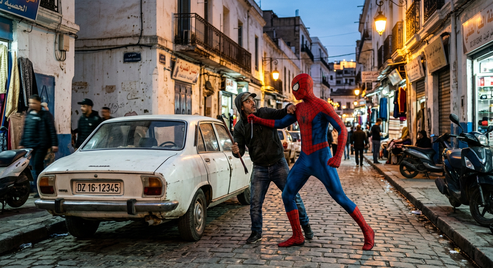

**البرومبوت الكامل:**
```
Photorealistic action scene, 6 seconds, Algerian street at dusk, dramatic warm light.

CHARACTER: Spider-Man, complete red and blue suit with black web pattern, full mask
covering his ENTIRE face with large white eyes (no face visible), slim athletic build.

ENVIRONMENT: Algerian street with low buildings, street lamps glowing, a white car.

CAMERA: Dynamic low-angle heroic shot.

ACTION WITH TIMING:
- 0-2 seconds: A thief with a crowbar tries to break into a white car, Spider-Man
  lands silently behind him.
- 2-4 seconds: The thief turns and sees Spider-Man, drops the crowbar in shock,
  hands up.
- 4-6 seconds: Spider-Man points to the car, then to the street, gesturing "go
  walk" — the thief runs away, Spider-Man shakes his head amused.

DIALOGUE (Algerian Darija, text on screen):
"سرقة سيارة في وضح النهار؟! شويا من الحشمة!
(للسارق) هاك كاين الشرطة في الشارع التالي... وإلا تفضل تبقى هنا ونصورك
سيلفي ونحطها في الإنستغرام؟! ههه، يلا امشي!"
Thief (يهرب): "ما نرجعش! ما نرجعش!"

SOUND: Dusk ambience, a dramatic landing thud, comedic chase footsteps.
```

---

---

## 🎬 المشهد 22 — "شاي مع خالتي زهرة" (6 ثواني) 🍵

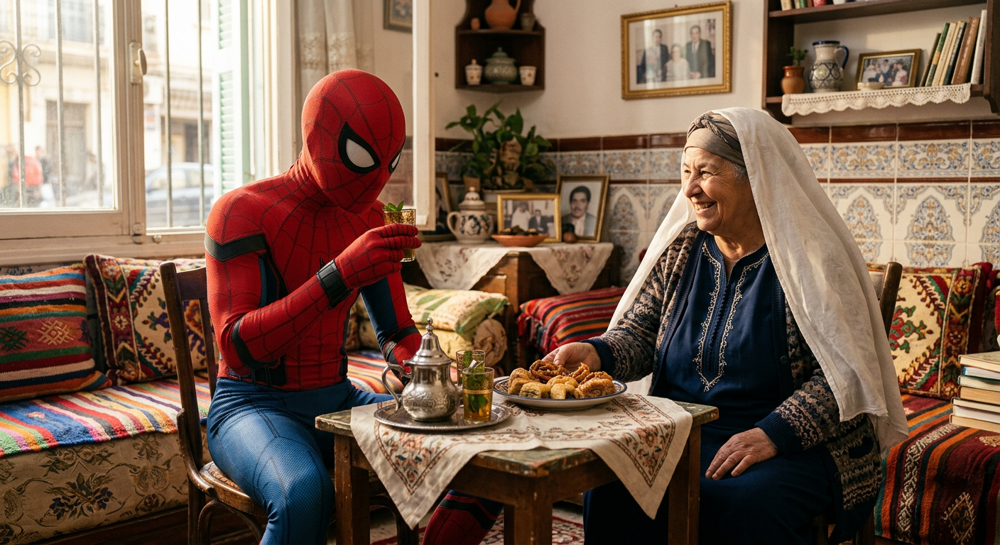

**البرومبوت الكامل:**
```
Photorealistic comedic heartwarming scene, 6 seconds, inside a modest Algerian home, warm afternoon light.

CHARACTERS:
- Spider-Man: complete red and blue suit, full mask with large white eyes, sitting
  at a small table holding a glass of mint tea.
- Aunt Zahra: elderly Algerian woman, 72 years old, grey hair in a bun under a
  white haik head covering, dark blue traditional dress, smiling warmly.

ENVIRONMENT: Cozy modest Algerian living room with traditional decor, small table
with tea and pastries.

CAMERA: Medium shot of the two at the table.

ACTION WITH TIMING:
- 0-2 seconds: Spider-Man sits at the table holding the mint tea, looking at it
  a bit awkwardly (drinking with a mask on is funny).
- 2-4 seconds: Aunt Zahra pushes the plate of pastries toward him, insisting he eat.
- 4-6 seconds: Spider-Man lifts the bottom edge of his mask slightly to sip the
  tea, Zahra laughs warmly, he gives a thumbs up.

DIALOGUE (Algerian Darija, text on screen):
Zahra: "اشرب يا ولدي، الشاي يبرد! وكل كعبة!"
Spider-Man (يرفع حافة القناع بشوية): "شكرا خالتي... ولكن، شوفيني كياش
نشرب بالقناع هذا؟ ههه!"
Zahra: "حتى مع القناع، نعرفك... إنت اللي رجعتلي حقيبتي. يجعلها في ميزان
حسناتك!"
Spider-Man: "خالتي، أنا غير خدمت واجبي. الحومة تاعنا، وكيما نقولو:
'إيد وحدة ما تصفقش.'"

SOUND: Tea pouring, warm laughter, cozy home ambience, a cat purring.
```

---

---

## 🎬 المشهد 23 — "تصالح مع قويدر" (6 ثواني) 🤝

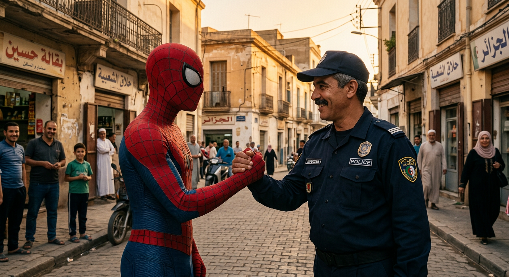

**البرومبوت الكامل:**
```
Photorealistic cinematic scene, 6 seconds, Algerian street at golden hour, warm respectful mood.

CHARACTERS:
- Spider-Man: complete red and blue suit, full mask with large white eyes.
- Officer Kouider: 40 years old, grey-flecked black hair, thick moustache, dark
  blue Algerian police uniform with cap, a small respectful smile.

ENVIRONMENT: Low Algerian buildings, warm golden hour light.

CAMERA: Medium shot of the two shaking hands.

ACTION WITH TIMING:
- 0-2 seconds: Kouider extends his hand to Spider-Man, looking at him with respect.
- 2-4 seconds: Spider-Man shakes his hand firmly, both nodding.
- 4-6 seconds: Kouider tips his cap and points to the sky, as if saying "keep
  watching over the neighborhood," Spider-Man returns a thumbs up and turns to leave.

DIALOGUE (Algerian Darija, text on screen):
Kouider: "أول مرة نحب نقولها... شكرا. الحومة صارت أهدى بياك.
وخا ما نعرفش وجهك... نعرف إنك من هنا."
Spider-Man: "شكرا خويا قويدر. أنا وأنا واحد منكم... غير عندي قناع.
(يضحك) واذا احتجت حاجة، ارمي في السماء ونبان."
Kouider: "نعتمد عليك يا 'الرجل العنكبوت'. وبرك، حافظ على نفسك."
Spider-Man: "وعد. ونشوفك في الخدمة."

SOUND: Golden hour ambience, a firm handshake, respectful music, then a web swish.
```

---

---

## 🎬 المشهد 24 — "النهاية" (6 ثواني) 🌅

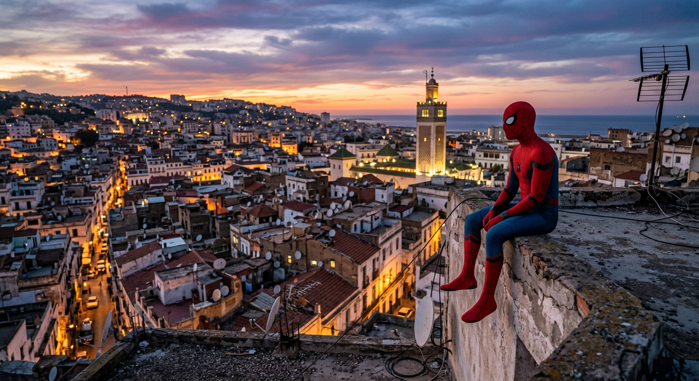

**البرومبوت الكامل:**
```
Photorealistic cinematic final scene, 6 seconds, Algerian rooftop at sunset, emotional peaceful mood.

CHARACTER: Spider-Man, complete red and blue suit, full mask with large white eyes,
sitting on the edge of a low rooftop, feet dangling over the edge.

ENVIRONMENT: Low Algerian buildings with satellite dishes, minarets and laundry on
balconies, deep orange and purple sunset sky, city lights beginning to glow below.

CAMERA: Wide cinematic shot from behind-side, showing him and the city view.

ACTION WITH TIMING:
- 0-2 seconds: Spider-Man sits on the rooftop edge, looking calmly over the city.
- 2-4 seconds: He looks down at the neighborhood below — children playing, people
  walking, lights turning on — a peaceful satisfied posture.
- 4-6 seconds: He looks up at the sky, nods to himself, then a slow zoom out —
  freeze frame on him against the sunset (end card with title).

DIALOGUE (Algerian Darija, text on screen — inner voice):
"في نيويورك، سبايدرمان يطير بين الأبراج. هنا في الجزائر...
نطير بين القلوب. مافيهش أبراج، مافيهش مشاكل؟! لا، مليحة فيها.
ولكن، البطل الحقيقي ماشي اللي يطير... البطل اللي يوقف مع الناس في
الطابور، في البلدية، في السوق. (يبتسم تحت القناع) يلا، نرجع نخدم.
غدوة نهار آخر. لأن الحومة تاعنا، تستاهل."

SOUND: Emotional cinematic music, city ambience at dusk, wind, a gentle web
swish, then the end card music.
```

---

# 🎬 الفيلم اكتمل — 24 مشهد = 2:24 دقيقة 🎉

## 📊 جدول الفيلم الكامل:

| الفصل | المشاهد | المدة | المحتوى |
|---|---|---|---|
| 1 — الأصل | 1-5 | 30 ث | اللدغة، فشل الطيران، سرقة زهرة، الإمساك بالحرامي |
| 2 — الحياة اليومية | 6-10 | 30 ث | التاكسي، التحول، الكهرباء، البلدية، التأمل |
| 3 — شهرة الحي | 11-16 | 36 ث | الحي يتكلم، السيلفي، المخبزة، المقلدة، التحول 2، الكشف |
| 4 — البطل الحقيقي | 17-20 | 24 ث | قويدر، فض الشجار، المطاردة، الأطفال |
| 5 — الخاتمة | 21-24 | 24 ث | سرقة السيارة، شاي زهرة، تصالح قويدر، النهاية |

**المجموع: 24 مشهد × 6 ثواني = 144 ثانية = 2:24 دقيقة** 🎬🕷️🇩🇿

---

## 📁 الملفات النهائية:

```
سبايدرمان-الجزائر/
├── السيناريو-الكامل.md        ← القصة الكاملة
├── الهوية-السرية.md           ← القاعدة الذهبية
├── المشاهد-1-5.md             ← برومبوتات (صورة + برومبوت)
├── المشاهد-6-10.md            ← برومبوتات
├── المشاهد-11-20.md           ← برومبوتات
├── المشاهد-21-24.md           ← برومبوتات (هذا الملف)
├── الشخصيات/ (5 صور)
└── المشاهد/ (24 صورة)
```

---


---

# ✅ الخلاصة

**24 مشهد × 6 ثواني = 144 ثانية = 2:24 دقيقة** 🎬🕷️🇩🇿

| الفصل | المشاهد | المحتوى |
|---|---|---|
| 1 — الأصل | 1-5 | اللدغة، فشل الطيران، سرقة زهرة، الإمساك بالحرامي |
| 2 — الحياة اليومية | 6-10 | التاكسي، التحول، الكهرباء، البلدية، التأمل |
| 3 — شهرة الحي | 11-16 | الحي يتكلم، السيلفي، المخبزة، المقلدة، الكشف |
| 4 — البطل الحقيقي | 17-20 | قويدر، فض الشجار، المطاردة، الأطفال |
| 5 — الخاتمة | 21-24 | سرقة السيارة، شاي زهرة، تصالح قويدر، النهاية |

**الاستعمال في Google Flow:**
1. افتح المشهد → انسخ البرومبوت الكامل
2. ارفع صورة المشهد (من مجلد `المشاهد/`)
3. ولّد 6 ثواني → كرر مع كل مشهد → اربطهم في مونتاج
