# 🕷️ سوبر ذزيري (Super Dziri) — الفيلم الكامل

> **البطل:** شخصية جزائرية أصلية 100% — بدون حقوق طبع (بديل سبايدرمان)
> **التصميم:** بسيط طبيعي — بدلة خضراء زمردية نظيفة + هلال ونجمة + قناع بعيون بيضاء
> **المدة:** 24 مشهد × 6 ثواني = 2:24 دقيقة
> **الدارجة:** الحوار 100% جزائري

---

## 🔗 مهم جداً: المشاهد المربوطة ببعضها

> بعض المشاهد **مرتبطة ببعضها** — مشهد يكمّل اللي قبله. هذي الثنائيات:

| الثنائي | الربط |
|---|---|
| **3 ↔ 4** | 3: الحرامي يخطف الحقيبة ← 4: سوبر ذزيري يلحقو ويمسكو (نفس المكان، مباشرة) |
| **7 ↔ 8** | 7: يلبس البدلة في الزنقة ← 8: يخرج يظهر للناس بالبدلة (تحول → ظهور) |
| **14 ↔ 16** | 14: أنيس يكتشف المقلدة ← 16: سوبر ذزيري يكشفها (نفس السوق، بعد التحول) |
| **15 ↔ 16** | 15: التحول الثاني على السطح ← 16: يظهر في السوق بالبدلة |
| **19 ↔ 20** | 19: يهرب من قويدر ← 20: يوقف قدام الأطفال (كوميديا: من هروب لنجومية) |
| **23 ↔ 24** | 23: يتصالح مع قويدر ← 24: النهاية على السطح (خاتمة) |

> **عند التحريك:** حافظ على نفس تصميم البطل في المشهدين المربوطين — نفس اللون، نفس القناع، نفس الوضعية العامة.

---

## 🧑🎨 الشخصيات (مرجع ثابت)

### 🕷️ أنيس بن يوسف (الشخص العادي)
```
Photorealistic young Algerian man, Anis Benyoucef, 25 years old, 178 cm tall,
slim athletic build, short black wavy hair, thin dark eyebrows, expressive dark
brown eyes, light stubble beard covering the jawline, medium olive-tan skin,
small scar on his left eyebrow. Wears ordinary clothes: light grey t-shirt and
blue jeans. NO mask, NO suit. Nobody knows his secret identity.
```

### 🕷️ سوبر ذزيري (البطل)
```
Photorealistic original Algerian superhero, Super Dziri, slim athletic build.
Simple clean full-body suit: DARK EMERALD GREEN base, subtle RED and WHITE trim
on sleeves and belt, small GOLDEN STAR AND CRESCENT emblem on the chest. Simple
full-face mask with WHITE lens-shaped eyes and a small RED crescent on the
forehead. No patterns, no ornaments, no web designs — a clean natural suit.
Original character, NOT Spider-Man. Same suit in every scene, identity hidden.
```

### 👵 خالتي زهرة
```
Photorealistic elderly Algerian woman, Aunt Zahra, 72 years old, short and
slightly hunched, deep wrinkles, warm brown eyes, grey hair in a bun under a
traditional white haik head covering, dark blue traditional karakou-style dress
with gold embroidery, worn brown leather handbag. Same appearance in every scene.
```

### 👮 قويدر (الشرطي)
```
Photorealistic Algerian police officer, Kouider, 40 years old, medium height,
stocky build, short grey-flecked black hair, thick moustache, stern but kind face,
light brown skin, dark blue Algerian police uniform with badge and cap.
Same appearance in every scene.
```

### 🧑 حرامي السوق
```
Photorealistic thin Algerian man, market thief, 30 years old, thin build, shifty
narrow eyes, short black messy hair, thin goatee, light brown skin, dark grey
hooded jacket, black jeans. Same appearance in every scene.
```

### 🚖 سي الطاهر (سائق التاكسي)
```
Photorealistic Algerian taxi driver, Si Tahar, 50 years old, medium build, grey
moustache, weathered friendly face with laugh lines, light brown skin, beige
shirt, dark trousers, white and yellow taxi. Same appearance in every scene.
```

---

# 🎬 المشاهد (1 → 24)

## 🎬 المشهد 1 — "اللدغة في السوق" (6 ثواني)

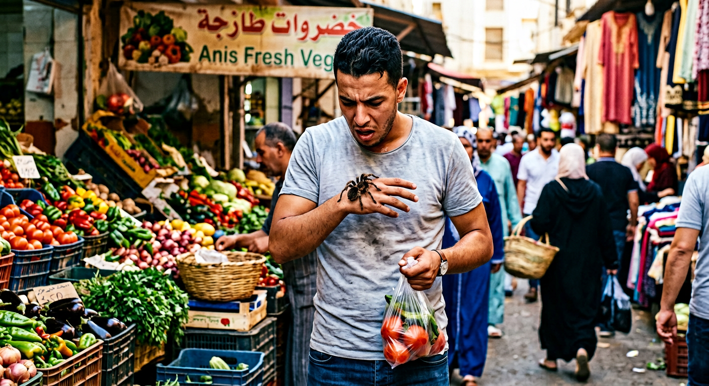

**البرومبوت الكامل:**
```
Photorealistic cinematic scene, 6 seconds, Algerian souk market, warm afternoon light.

CHARACTER: Anis, a young Algerian man, 25 years old, short black wavy hair, light
stubble beard on jawline, medium olive-tan skin, wearing a light grey t-shirt and
blue jeans, holding a bag of tomatoes at a vegetable stall.

ENVIRONMENT: A busy Algerian vegetable market, colorful vegetable stalls, blurred
shoppers moving around, warm afternoon sunlight.

CAMERA: Medium close-up on Anis's hand and face.

ACTION WITH TIMING:
- 0-2 seconds: Anis picks tomatoes at the market stall, looking at the vegetables.
- 2-4 seconds: A spider suddenly bites his hand, he winces and looks down.
- 4-6 seconds: He looks at the small bite on his hand with a surprised confused
  expression.

DIALOGUE (Algerian Darija, text on screen): "آي! واش هادي؟! عنكبوت؟ في السوق؟!"

SOUND: Market ambience, people talking, then a sudden "ouch" sound.
```

---

## 🎬 المشهد 2 — "محاولة الطيران الفاشلة" (6 ثواني)

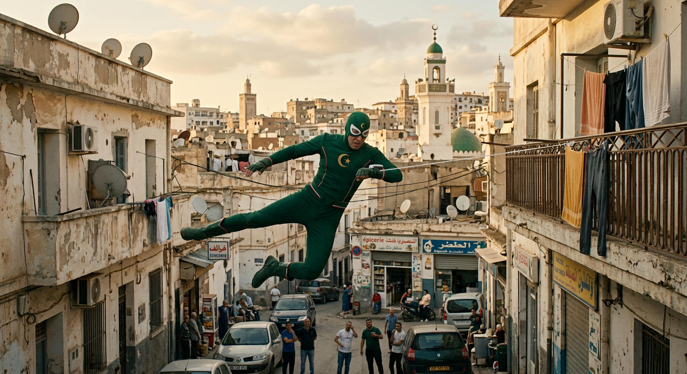

**البرومبوت الكامل:**
```
Photorealistic comedic cinematic scene, 6 seconds, Algerian low-rise neighborhood, warm afternoon light.

CHARACTER: Super Dziri, an original Algerian superhero, a normal athletic man in
a simple clean dark emerald green full-body suit with subtle red and white trim,
small golden star and crescent on the chest, simple mask with white lens eyes.

ENVIRONMENT: Rooftop of a low 3-story Algerian building, surrounding buildings
all low (2-4 stories), satellite dishes, laundry on balconies, minarets, blue sky.

CAMERA: Wide shot showing Super Dziri on the rooftop and the low city around him.

ACTION WITH TIMING:
- 0-2 seconds: Super Dziri raises his wrist to shoot a thread, confident pose.
- 2-4 seconds: He shoots a thread, but it only reaches a small balcony railing,
  he looks at his wrist in comedic disbelief.
- 4-6 seconds: He sags awkwardly mid-air, looking down at the short distance to
  the ground with a defeated funny expression.

DIALOGUE (Algerian Darija, text on screen): "هذا؟! ها هو سطيح من 3 طوابق؟!
وين الأبراج في هذي البلاد؟!"

SOUND: Thread shooting sound, comedic sad trombone, pigeon cooing.
```

---

## 🎬 المشهد 3 — "سرقة الحقيبة" (6 ثواني) 🔗 مرتبط مع المشهد 4

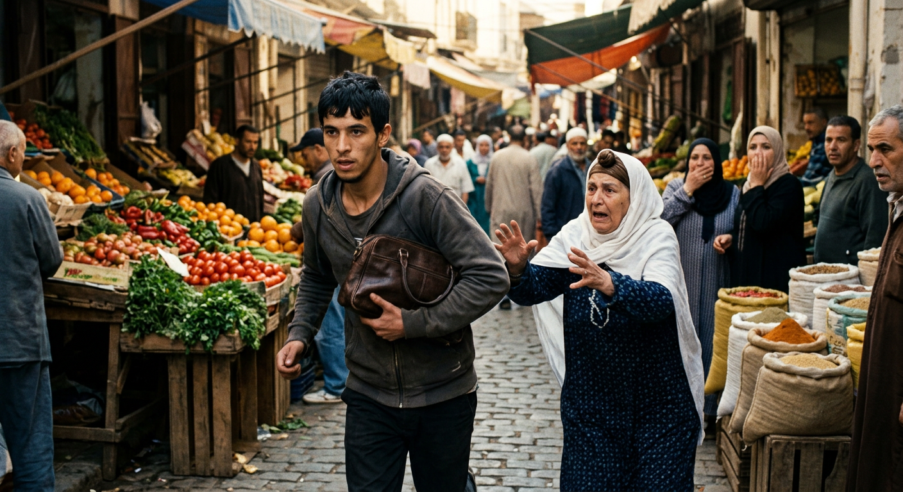

**البرومبوت الكامل:**
```
Photorealistic cinematic action scene, 6 seconds, Algerian street market, warm daylight.

CHARACTERS:
- Market thief: thin young Algerian man, 30 years old, short messy black hair,
  thin goatee, dark grey hooded jacket, black jeans.
- Aunt Zahra: elderly Algerian woman, 72 years old, grey hair in a bun under a
  white haik head covering, dark blue traditional dress, brown leather handbag.

ENVIRONMENT: Busy Algerian street market with vegetable and goods stalls, shocked
shoppers around.

CAMERA: Dynamic medium shot capturing the snatch moment.

ACTION WITH TIMING:
- 0-2 seconds: The thief sneaks behind Aunt Zahra, reaches for her handbag.
- 2-4 seconds: He snatches the brown handbag and starts running away.
- 4-6 seconds: Aunt Zahra cries out, raising her hands in shock, shoppers turn.

DIALOGUE (Algerian Darija, text on screen): "أي يا ولدي! الحرامي! الحقو!
سرقلي حقيبتي!"

SOUND: Market noise stops, a gasp, quick footsteps.

➡️ **يرتبط مع المشهد 4 مباشرة** — نفس المكان، الحرامي يهرب ونراه في المشهد 4.
```

---

## 🎬 المشهد 4 — "الإمساك بالحرامي" (6 ثواني) 🔗 مرتبط مع المشهد 3

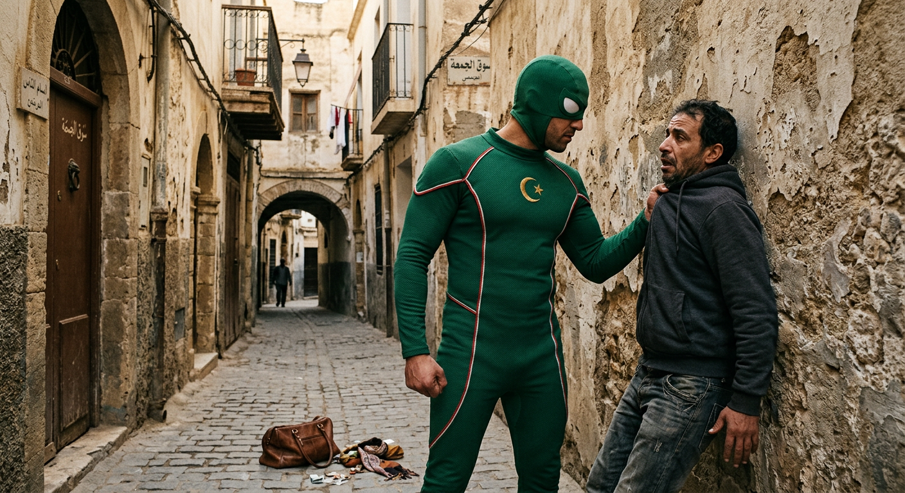

**البرومبوت الكامل:**
```
Photorealistic cinematic action scene, 6 seconds, narrow Algerian alley, warm afternoon light.

CHARACTERS:
- Super Dziri: original Algerian superhero, simple dark emerald green suit with
  subtle red and white trim, golden star and crescent on chest, simple mask with
  white lens eyes.
- Market thief: thin young man, 30 years old, messy black hair, goatee, dark grey
  hooded jacket, scared expression.

ENVIRONMENT: Narrow stone-walled alley in an old Algerian neighborhood.

CAMERA: Dramatic low-angle medium shot.

ACTION WITH TIMING:
- 0-2 seconds: Super Dziri holds the thief by the collar against the alley wall.
- 2-4 seconds: The thief struggles scared, Super Dziri shakes his head.
- 4-6 seconds: Super Dziri points down at the brown handbag on the ground, then
  at the thief with a "shame on you" gesture.

DIALOGUE (Algerian Darija, text on screen): "تسرق حقيبة وحدة عجوز؟! عيب عليك!
هذي حقيبة خالتي زهرة!"

SOUND: Dramatic tension music, a scuffle, then a firm tone.

➡️ **يكمل المشهد 3** — الحرامي نفسه من السرقة، ونفس الحقيبة.
```

---

## 🎬 المشهد 5 — "انقطاع الكهرباء" (6 ثواني)

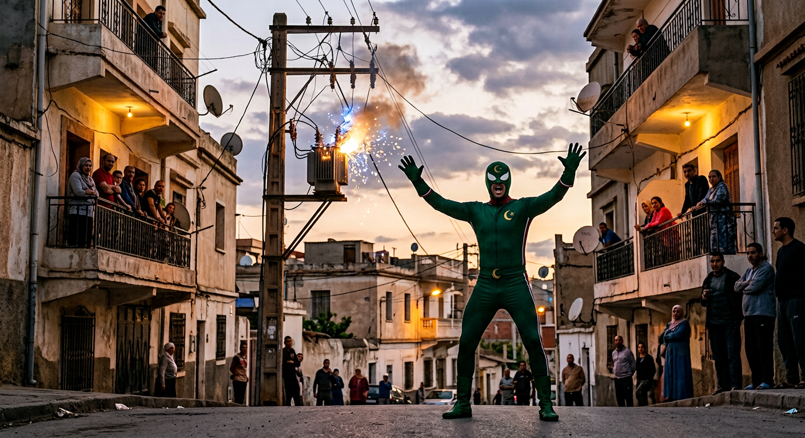

**البرومبوت الكامل:**
```
Photorealistic cinematic scene, 6 seconds, Algerian neighborhood at dusk, orange sky.

CHARACTER: Super Dziri, original Algerian superhero, simple dark emerald green
suit, simple mask with white lens eyes, standing in the street below an
electricity pole.

ENVIRONMENT: Low Algerian apartment building, residents on balconies watching,
one balcony with working warm lights, the rest dark, damaged transformer box
sparking, orange dusk sky.

CAMERA: Dramatic low-angle wide shot.

ACTION WITH TIMING:
- 0-2 seconds: Super Dziri stands at a safe distance from the electricity pole,
  raising his arms in a cautionary gesture.
- 2-4 seconds: He warns residents to stay back from the sparking transformer,
  pointing to the danger.
- 4-6 seconds: The power crew arrives and fixes it safely, residents on balconies
  cheer with raised hands as lights come back on.

DIALOGUE (Algerian Darija, text on screen): "بعدو! بعدو على المحول! فرقة
الصيانة جاية! ها هي الضو رجعت! شوفو!"

SOUND: Electrical crackle, then a "click" and joyful cheering.
```

---

## 🎬 المشهد 6 — "التاكسي" (6 ثواني)

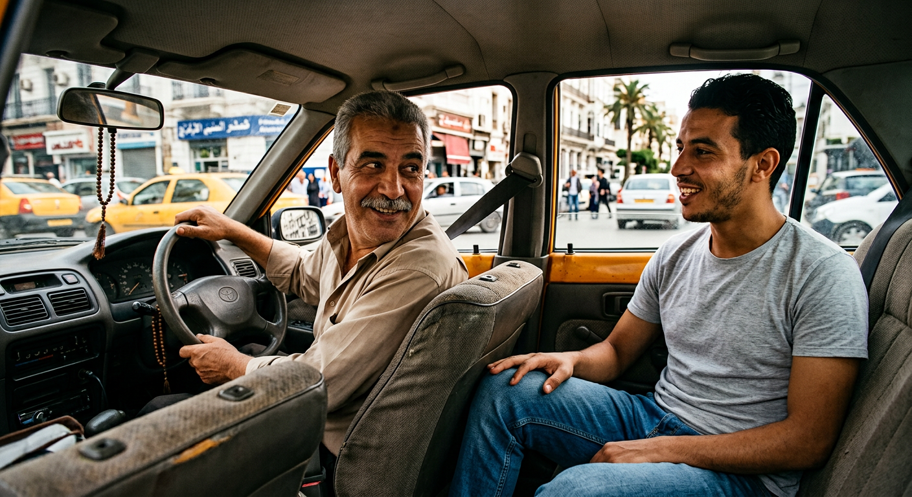

**البرومبوت الكامل:**
```
Photorealistic cinematic scene, 6 seconds, inside an Algerian taxi, warm daylight.

CHARACTERS:
- Anis: young Algerian man, 25 years old, short black wavy hair, light stubble,
  olive-tan skin, light grey t-shirt and blue jeans (completely normal, NO mask).
- Si Tahar: Algerian taxi driver, 50 years old, grey moustache, beige shirt.

ENVIRONMENT: Inside a white and yellow Algerian taxi, city street through windows.

CAMERA: Medium shot from the back seat area.

ACTION WITH TIMING:
- 0-2 seconds: Anis sits relaxed in the back seat, looking out the window.
- 2-4 seconds: The driver looks back and asks him something with a friendly smile.
- 4-6 seconds: Anis answers casually with a small knowing smile.

DIALOGUE (Algerian Darija, text on screen):
Driver: "وين رايح يا ولدي؟ علاش كسول هكاك؟"
Anis: "خويا، راني رايح نخدم... وخا الخدمة ما تبانش، غير توقع المفاجآت."

SOUND: Taxi engine, city traffic, casual friendly tones.
```

---

## 🎬 المشهد 7 — "التحول" (6 ثواني) 🔗 مرتبط مع المشهد 8

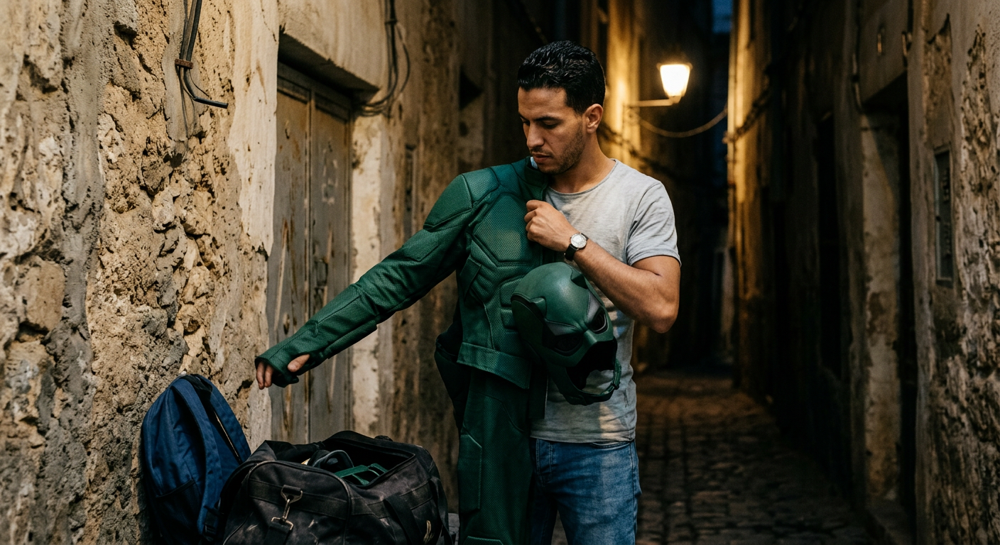

**البرومبوت الكامل:**
```
Photorealistic cinematic scene, 6 seconds, hidden narrow Algerian alley, dramatic warm light.

CHARACTER: Anis, young Algerian man, 25 years old, short black wavy hair, light
stubble, olive-tan skin, light grey t-shirt, blue jeans, holding an open black
sports bag.

ENVIRONMENT: Empty hidden narrow alley with old stone walls, dramatic light.

CAMERA: Medium shot, slightly low angle.

ACTION WITH TIMING:
- 0-2 seconds: Anis looks around to make sure nobody is watching, opens his bag.
- 2-4 seconds: He pulls out the simple dark emerald green superhero suit.
- 4-6 seconds: He holds the suit up with a determined look, ready to change.

DIALOGUE (Algerian Darija, whispered): "يا الله... نلبس هادي، نولي سوبر ذزيري...
المهم الناس تكون مرتاحة. يلا، نبداو الخدمة."

SOUND: Dramatic suspense music, zipper sound, fabric rustling.

➡️ **يرتبط مع المشهد 8** — بعد التحول، يظهر بالبدلة للناس.
```

---

## 🎬 المشهد 8 — "الظهور للناس" (6 ثواني) 🔗 مرتبط مع المشهد 7

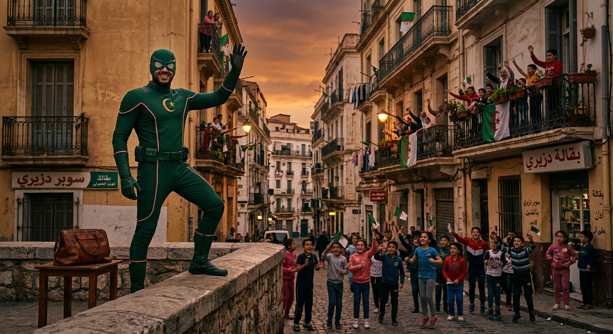

**البرومبوت الكامل:**
```
Photorealistic cinematic scene, 6 seconds, Algerian street at dusk, warm orange light.

CHARACTER: Super Dziri, original Algerian superhero, simple dark emerald green
suit, golden star and crescent on chest, simple mask with white lens eyes
(identity hidden).

ENVIRONMENT: Algerian street with low buildings, residents watching from
balconies, excited children, the returned brown handbag on a table.

CAMERA: Low-angle wide shot making him look heroic.

ACTION WITH TIMING:
- 0-2 seconds: Super Dziri stands on a low wall, raising his hand in a greeting.
- 2-4 seconds: He points to the returned handbag, then to himself with a thumbs up.
- 4-6 seconds: He does a small bow, children cheer, he waves goodbye.

DIALOGUE (Algerian Darija, text on screen): "سلام عليكم! أنا سوبر ذزيري...
ما تعرفوش وجهي، المهم تعرفوا إني هنا نحمي الحومة تاعنا. خالتي زهرة،
الحقيبة تاعك رجعات!"

SOUND: Cheering crowd, children laughing, heroic music, a thread "swish".

➡️ **يكمل المشهد 7** — نفس الشخصية بعد التحول.
```

---

## 🎬 المشهد 9 — "البلدية" (6 ثواني)

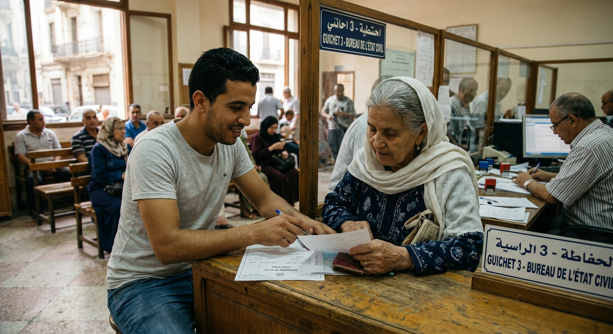

**البرومبوت الكامل:**
```
Photorealistic cinematic scene, 6 seconds, inside an Algerian municipal office (baladiya), daylight.

CHARACTERS:
- Anis: young Algerian man, 25 years old, short black wavy hair, light stubble,
  olive-tan skin, light grey t-shirt and blue jeans (completely normal, NO mask).
- Aunt Zahra: elderly Algerian woman, 72 years old, grey hair in a bun under a
  white haik head covering, dark blue traditional dress, holding papers.

ENVIRONMENT: Algerian baladiya office interior, counter with employee, people waiting.

CAMERA: Medium shot of the two at the counter.

ACTION WITH TIMING:
- 0-2 seconds: Zahra looks confused at her papers, shaking her head.
- 2-4 seconds: Anis leans in, pointing at the paper and explaining patiently.
- 4-6 seconds: Zahra smiles gratefully, Anis nods kindly.

DIALOGUE (Algerian Darija, text on screen):
Zahra: "يا ولدي، هذي الوثائق نهار ولا عام ما كملتهمش... البيروقراطية هادي!"
Anis: "لا تخافي يا خالتي، أنا معاك. نكملو شغلتنا وما نخليوكش."

SOUND: Office ambience, papers shuffling, stamp sounds.
```

---

## 🎬 المشهد 10 — "النهاية الأولى" (6 ثواني)

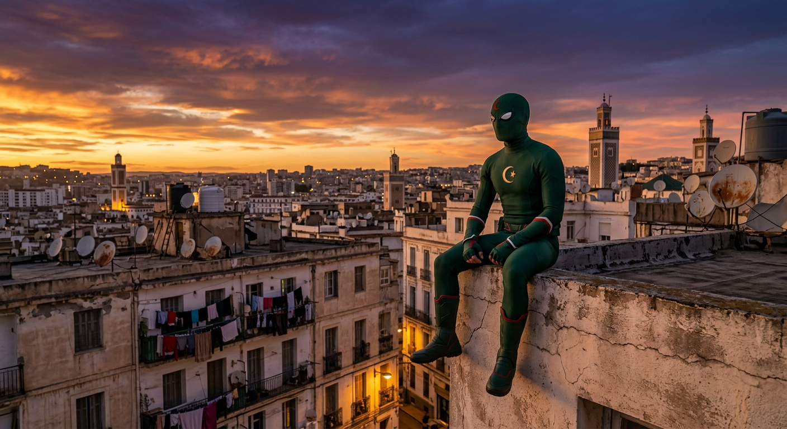

**البرومبوت الكامل:**
```
Photorealistic cinematic scene, 6 seconds, Algerian rooftop at sunset, peaceful mood.

CHARACTER: Super Dziri, original Algerian superhero, simple dark emerald green
suit, simple mask with white lens eyes, sitting on the edge of a low rooftop.

ENVIRONMENT: Low Algerian buildings with satellite dishes and minarets, laundry,
orange and purple sunset sky, city lights beginning to glow.

CAMERA: Wide cinematic shot from behind-side.

ACTION WITH TIMING:
- 0-2 seconds: Super Dziri sits on the rooftop edge, looking calmly over the city.
- 2-4 seconds: He looks down at the neighborhood, a peaceful satisfied posture.
- 4-6 seconds: He looks up at the sky, nods to himself — slow zoom out.

DIALOGUE (inner voice): "الناس يعرفوني باسم سوبر ذزيري... ولكن في الحقيقة
أنا أنيس، ولد الحومة. البطل الحقيقي ماشي اللي يطير... البطل اللي يقف مع الناس."

SOUND: Emotional music, city ambience, wind.
```

---

## 🎬 المشهد 11 — "الحي يتكلم" (6 ثواني)

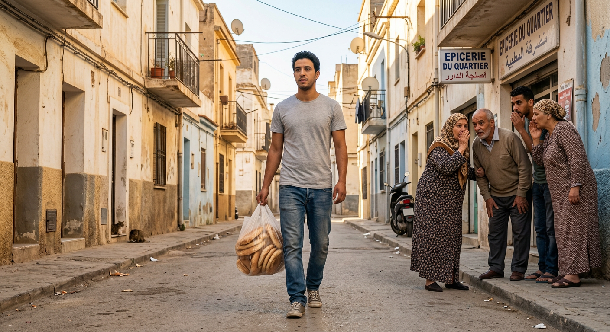

**البرومبوت الكامل:**
```
Photorealistic comedic scene, 6 seconds, Algerian neighborhood street, sunny morning.

CHARACTER: Anis, young Algerian man, 25 years old, short black wavy hair, light
stubble, olive-tan skin, light grey t-shirt, blue jeans (normal, NO mask).

ENVIRONMENT: Low Algerian buildings, sidewalk with neighbors.

CAMERA: Medium shot from behind the neighbors.

ACTION WITH TIMING:
- 0-2 seconds: Anis walks down the street carrying bread, looking normal.
- 2-4 seconds: Neighbors notice him and whisper, pointing slightly.
- 4-6 seconds: Anis notices them, gives a confused friendly smile, keeps walking.

DIALOGUE (whispers): "هذا هو اللي يهز في الحومة؟" "آه، نسمعو عليه... سوبر ذزيري!"
"لا، هذا أنيس... ولد الحومة، عادي."

SOUND: Morning street ambience, birds, low whispers.
```

---

## 🎬 المشهد 12 — "سيلفي مع سي الطاهر" (6 ثواني)

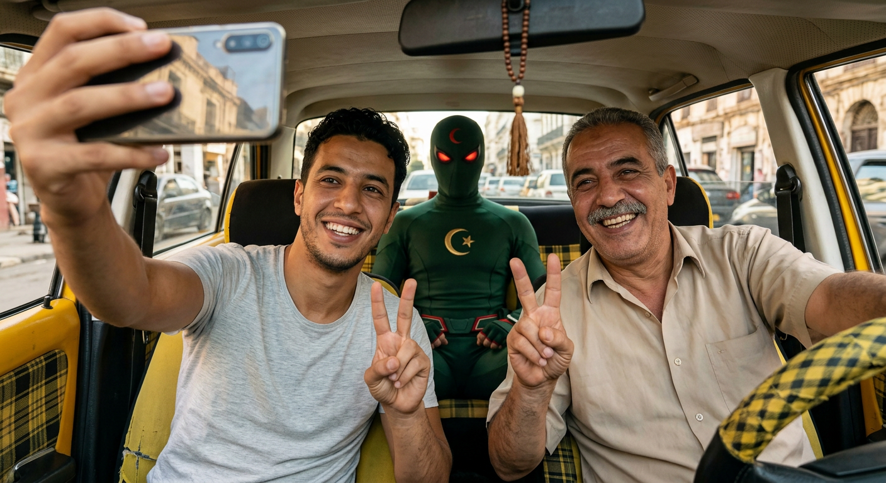

**البرومبوت الكامل:**
```
Photorealistic comedic scene, 6 seconds, inside an Algerian taxi, warm daylight.

CHARACTERS:
- Anis: young Algerian man, 25 years old, light grey t-shirt (normal, NO mask).
- Si Tahar: taxi driver, 50 years old, grey moustache, beige shirt.

ENVIRONMENT: White and yellow taxi interior, city street through windows.

CAMERA: Front-facing selfie angle.

ACTION WITH TIMING:
- 0-2 seconds: Si Tahar recognizes Anis and gets excited, turning in his seat.
- 2-4 seconds: He grabs Anis's arm, insists on taking a selfie together.
- 4-6 seconds: Both smile and make peace signs toward the camera.

DIALOGUE (Algerian Darija):
Si Tahar: "أنا عارفك! إنت اللي مع سوبر ذزيري، ههه! يلا، صورة!"
Anis (يضحك): "خويا، أنا ما نعرف حتى واحد... غير سائق تاكسي!"
Si Tahar: "برك، سيلفي! ونحطها في واتساب!"
Anis: "واتساب؟! لا لا خويا... برك صورة وحدة!"

SOUND: Taxi engine, laughter, camera shutter click.
```

---

## 🎬 المشهد 13 — "طابور المخبزة" (6 ثواني)

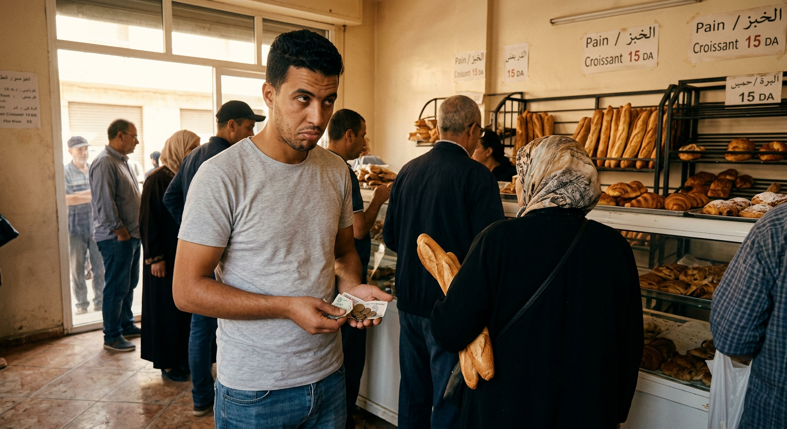

**البرومبوت الكامل:**
```
Photorealistic comedic scene, 6 seconds, Algerian street bakery, warm morning.

CHARACTER: Anis, young Algerian man, 25 years old, light grey t-shirt, blue jeans.

ENVIRONMENT: Simple street bakery with a queue, elderly woman with baguette in front.

CAMERA: Medium shot from behind Anis.

ACTION WITH TIMING:
- 0-2 seconds: Anis stands in the bread queue, looking at the long line impatiently.
- 2-4 seconds: He counts the people in front with his fingers, sighing.
- 4-6 seconds: The woman in front leaves with her bread, Anis steps forward hopefully.

DIALOGUE (inner voice): "يا خويا، الطابور هذا؟! نهار ولا عام؟! أنا اللي نقدر
نطير فوقهم... ولكن لا، البطل الحقيقي يوقف في الطابور كيما الناس."

SOUND: Bakery ambience, people chatting, bread from the oven.
```

---

## 🎬 المشهد 14 — "المنتجات المقلدة" (6 ثواني) 🔗 مرتبط مع المشهد 16

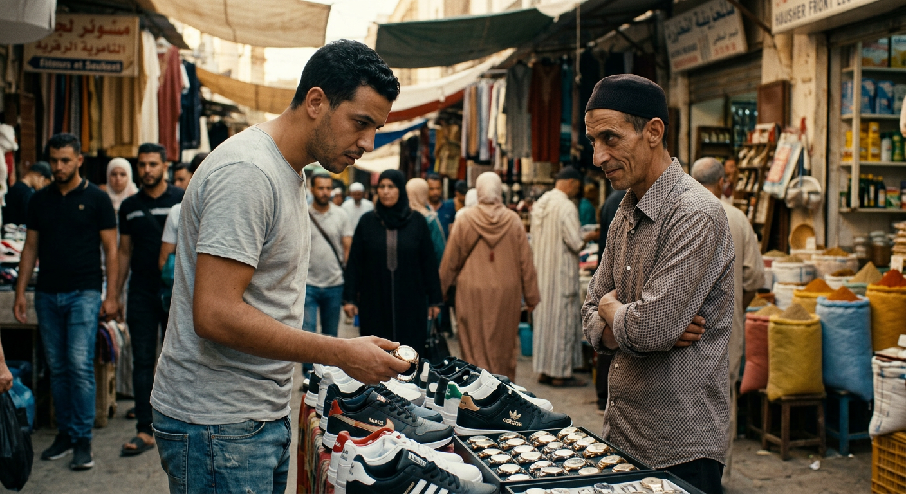

**البرومبوت الكامل:**
```
Photorealistic scene, 6 seconds, Algerian market, warm daylight.

CHARACTER: Anis, young Algerian man, 25 years old, light grey t-shirt, blue jeans.

ENVIRONMENT: Market stall with counterfeit products (fake branded sneakers), sly seller.

CAMERA: Medium shot over Anis's shoulder.

ACTION WITH TIMING:
- 0-2 seconds: Anis picks up a fake sneaker at the market stall, examining the
  poor stitching closely.
- 2-4 seconds: He looks at the sly seller with a determined side-eye, planning
  to return as Super Dziri.
- 4-6 seconds: Anis turns around smoothly and walks toward a nearby hidden alley
  behind the market.

DIALOGUE (thinking): "هادي؟! ماركة عالمية بـ 1500 دج؟! هذا نصاب... يلزم نرجع
بالبدلة أتاشوا نكشفه."

SOUND: Market noise, chatter, a fake watch ticking.

➡️ **يرتبط مع المشهد 16** — نفس السوق، بعد التحول يكشفها كسوبر ذزيري.
```

---

## 🎬 المشهد 15 — "التحول الثاني" (6 ثواني) 🔗 مرتبط مع المشهد 16

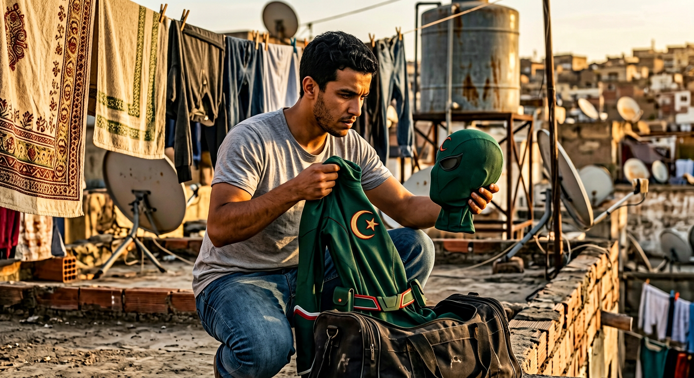

**البرومبوت الكامل:**
```
Photorealistic scene, 6 seconds, hidden rooftop corner, late afternoon warm light.

CHARACTER: Anis, young Algerian man, 25 years old, light grey t-shirt, blue jeans,
black sports bag.

ENVIRONMENT: Rooftop directly overlooking the busy market below, sunny
afternoon light.

CAMERA: Medium shot, slightly low angle, the market visible in the background.

ACTION WITH TIMING:
- 0-2 seconds: Anis stands on the rooftop overlooking the market, opening his
  sports bag.
- 2-4 seconds: He rapidly puts on the green superhero suit and pulls the mask
  over his face.
- 4-6 seconds: He strikes a determined hero pose, looking down at the market
  stall below.

DIALOGUE (whispered): "السوق مليان بالمقلد... حان الوقت! سوبر ذزيري ينزل
للميدان."

SOUND: Wind on the rooftop, zipper, dramatic music build-up.

➡️ **يرتبط مع المشهد 16** — بعد التحول، يظهر في السوق.
```

---

## 🎬 المشهد 16 — "كشف المقلدة" (6 ثواني) 🔗 مرتبط مع المشاهد 14 و15

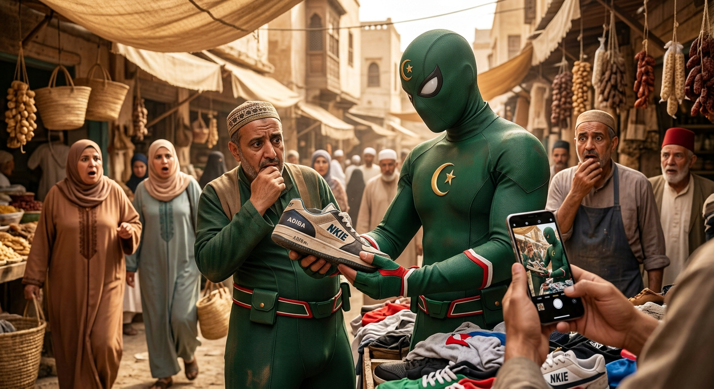

**البرومبوت الكامل:**
```
Photorealistic action scene, 6 seconds, Algerian market, warm daylight.

CHARACTER: Super Dziri, original Algerian superhero, simple dark emerald green
suit, golden star and crescent on chest, simple mask with white lens eyes.

ENVIRONMENT: Market stall with counterfeit products, shocked shoppers.

CAMERA: Medium shot, dynamic heroic angle.

ACTION WITH TIMING:
- 0-2 seconds: Super Dziri steps dramatically into the frame at the SAME market
  stall from Scene 14.
- 2-4 seconds: He holds up the fake sneaker, showing the bad stitching to the
  shocked crowd.
- 4-6 seconds: He confronts the trembling seller, taking a photo with his phone
  as evidence.

DIALOGUE (Algerian Darija): "شوفو هذي! ماركة 'أصلية'؟! هذي مقلدة! الناس تخدم
وتدفع فلوسها في الزبل! أنا سوبر ذزيري، وهادي حومتي!"

SOUND: Market noise stops, dramatic music, fabric swish.

➡️ **يكمل المشهد 14 و15** — نفس السوق من المشهد 14، ونفس التحول من 15.
```

---

## 🎬 المشهد 17 — "مساعدة قويدر" (6 ثواني)

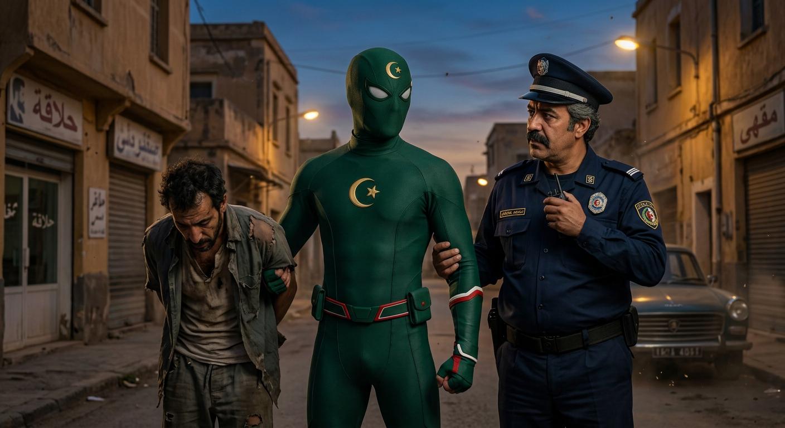

**البرومبوت الكامل:**
```
Photorealistic scene, 6 seconds, Algerian street at dusk, warm light.

CHARACTERS:
- Super Dziri: original Algerian superhero, simple dark emerald green suit, mask.
- Officer Kouider: 40 years old, grey-flecked black hair, thick moustache, dark
  blue Algerian police uniform.

ENVIRONMENT: Low Algerian buildings, street at dusk.

CAMERA: Medium shot of the two facing each other.

ACTION WITH TIMING:
- 0-2 seconds: Super Dziri hands a captured criminal to Officer Kouider.
- 2-4 seconds: Kouider looks at him with suspicion and respect, taking the criminal.
- 4-6 seconds: Kouider tips his cap in thanks, Super Dziri nods back.

DIALOGUE (Algerian Darija):
Kouider: "راك تحب تقوم بدوري؟!"
Super Dziri: "خويا قويدر، أنا ما نحبش نحل محلك... غير نساعد."
Kouider: "يعني... أنت ماشي شرير؟"
Super Dziri (يضحك): "لا خويا، أنا ولد هذي الحومة. غير القناع غيّرني."

SOUND: Dusk ambience, police radio, respectful voices.
```

---

## 🎬 المشهد 18 — "فض الشجار" (6 ثواني)

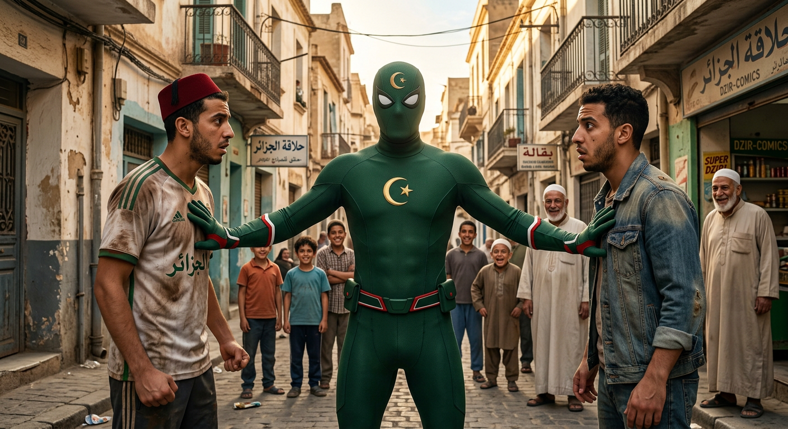

**البرومبوت الكامل:**
```
Photorealistic comedic action scene, 6 seconds, Algerian street, warm afternoon.

CHARACTER: Super Dziri, original Algerian superhero, simple dark emerald green suit, mask.

ENVIRONMENT: Street with a small crowd, two angry young men.

CAMERA: Medium shot showing him between the two men.

ACTION WITH TIMING:
- 0-2 seconds: Two young men about to fight, shouting at each other.
- 2-4 seconds: Super Dziri lands between them, holding them apart calmly.
- 4-6 seconds: The men look surprised and embarrassed, the crowd laughs.

DIALOGUE (Algerian Darija): "وقفو! على واش تتقاتلو؟! على 500 دج؟! على الكورة؟!
قاتلو في الدوري، ماشي في الشارع!"

SOUND: Shouting stops, crowd laughter, a comedic "boing".
```

---

## 🎬 المشهد 19 — "مطاردة قويدر" (6 ثواني) 🔗 مرتبط مع المشهد 20

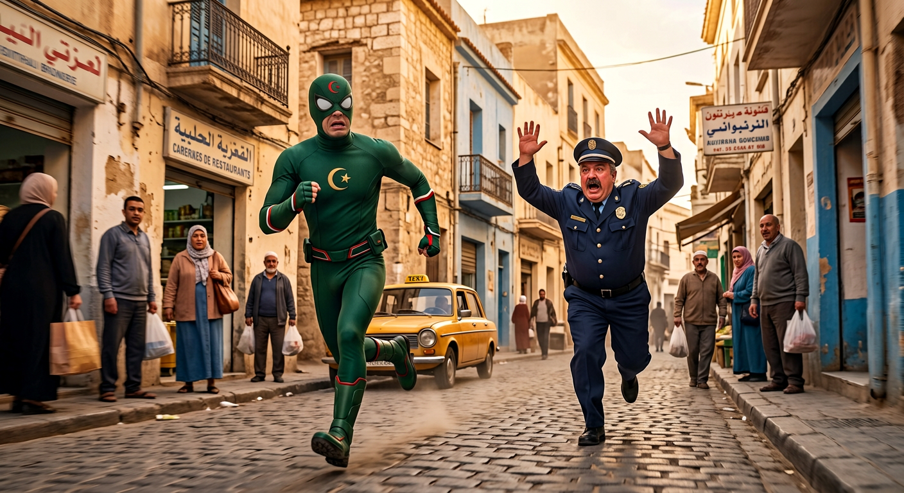

**البرومبوت الكامل:**
```
Photorealistic comedic chase scene, 6 seconds, Algerian street, warm afternoon.

CHARACTERS:
- Super Dziri: original Algerian superhero, simple dark emerald green suit, running.
- Officer Kouider: 40 years old, thick moustache, dark blue uniform, chasing on foot.

ENVIRONMENT: Low Algerian buildings, street.

CAMERA: Wide tracking shot.

ACTION WITH TIMING:
- 0-2 seconds: Super Dziri runs on foot, looking back with a funny panicked posture.
- 2-4 seconds: Kouider chases him waving his hands and shouting.
- 4-6 seconds: Super Dziri sprints fast around a sharp alley corner to escape
  Officer Kouider (MATCH CUT — the next scene starts from this same corner).

DIALOGUE (Algerian Darija):
Kouider: "وقوف! وقوف! ماشي كيما الأفلام هوني، هنا مافيهش أبراج!"
Super Dziri (يجري): "خويا، حتى أنا لقيت! هذي المشكلة! نرجعو غدوة!"

🎬 **MATCH CUT:** نهاية هذا المشهد (4-6ث) = نفس الزاوية اللي يخرج منها في بداية المشهد 20.

DIALOGUE (Algerian Darija):
Kouider: "وقوف! وقوف! ماشي كيما الأفلام هوني، هنا مافيهش أبراج!"
Super Dziri (يجري): "خويا، حتى أنا لقيت! هذي المشكلة! نرجعو غدوة!"

SOUND: Running footsteps, panting, comedic chase music.

➡️ **يرتبط مع المشهد 20** — من الهروب إلى التوقف عند الأطفال (كوميديا).
```

---

## 🎬 المشهد 20 — "أطفال الحي" (6 ثواني) 🔗 مرتبط مع المشهد 19

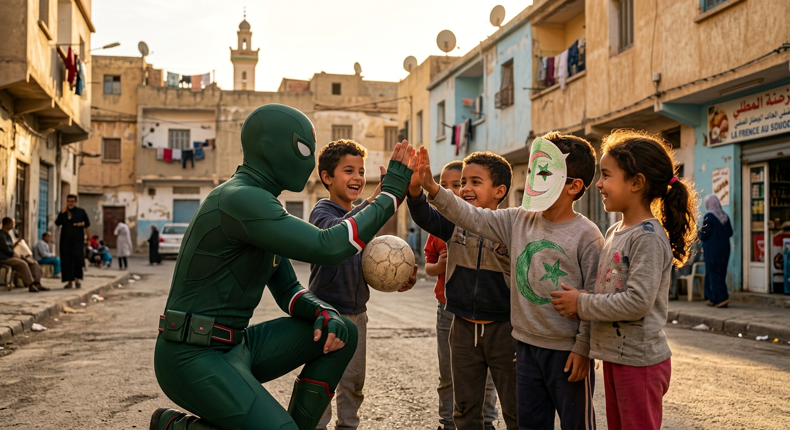

**البرومبوت الكامل:**
```
Photorealistic heartwarming scene, 6 seconds, Algerian neighborhood street, golden afternoon.

CHARACTER: Super Dziri, original Algerian superhero, simple dark emerald green suit, mask.

ENVIRONMENT: Street with excited children (6-10 years old), one wearing a paper mask.

CAMERA: Low angle from the children's perspective.

ACTION WITH TIMING:
- 0-2 seconds: Super Dziri emerges from the SAME corner he escaped into at the
  end of Scene 19, suddenly stops, adjusts his posture, and smoothly walks up to
  the kids with a confident smile (MATCH CUT continuation).
- 2-4 seconds: He crouches down and high-fives the cheering children one by one.
- 4-6 seconds: The child with the paper mask salutes him, he returns the salute
  with a thumbs up.

🎬 **MATCH CUT:** بداية هذا المشهد (0-2ث) = نفس الزاوية من نهاية المشهد 19 —
الانتقال يكون سلس: يجري يدخل ← يخرج ماشي بهدوء.

DIALOGUE (Algerian Darija):
Children: "سوبر ذزيري! سوبر ذزيري!"
Child: "أنا كيماك! شوف! درت ماسك بالورق!"
Super Dziri: "واش راك تشبه لي! خليكوا في الدروس، وبعدين توليو أبطال حقيقيين!"

SOUND: Children cheering, joyful music, a soft "swish".

➡️ **يكمل المشهد 19** — بعد الهروب، يوقف قدام الأطفال (لحظة لطيفة).
```

---

## ⏭️ المشاهد 21-24 (في الجلسة الجاية — وصلنا لحد الصور)

| # | المشهد | الربط |
|---|---|---|
| 21 | سرقة السيارة | — |
| 22 | شاي زهرة | كوميدي |
| 23 | تصالح قويدر | 🔗 مرتبط مع 24 |
| 24 | النهاية | 🔗 يكمل 23 |

---

# ✅ الخلاصة

**24 مشهد × 6 ثواني = 144 ثانية = 2:24 دقيقة** 🎬🕷️🇩🇿

**المشاهد المربوطة (6 ثنائيات):**
3↔4 • 7↔8 • 14↔16 • 15↔16 • 19↔20 • 23↔24

**الاستعمال في Google Flow:**
1. انسخ البرومبوت الكامل
2. ارفع صورة المشهد (من `المشاهد/`)
3. ولّد 6 ثواني → كرر → اربط في مونتاج
4. **للمشاهد المربوطة:** حافظ على نفس تصميم البطل في المشهدين

---

## 🎬 المشهد 21 — "سرقة السيارة" (6 ثواني)

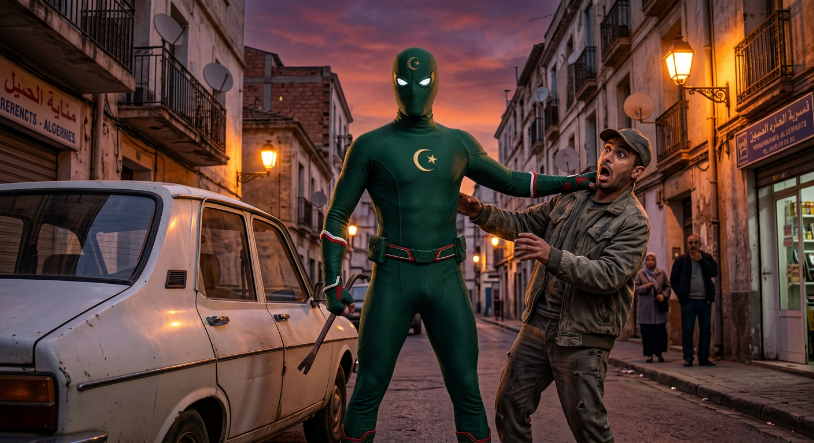

**البرومبوت الكامل:**
```
Photorealistic action scene, 6 seconds, Algerian street at dusk, dramatic warm light.

CHARACTER: Super Dziri, original Algerian superhero, simple dark emerald green
suit with subtle red and white trim, golden star and crescent on chest, simple
mask with white lens eyes.

ENVIRONMENT: Algerian street with low buildings, street lamps glowing, a white car.

CAMERA: Dynamic low-angle heroic shot.

ACTION WITH TIMING:
- 0-2 seconds: A thief with a crowbar tries to break into a white car, Super Dziri
  lands silently behind him.
- 2-4 seconds: The thief turns and sees Super Dziri, drops the crowbar in shock.
- 4-6 seconds: Super Dziri points to the car, then to the street, gesturing "go
  walk" — the thief runs away, Super Dziri shakes his head amused.

DIALOGUE (Algerian Darija, text on screen): "سرقة سيارة في وضح النهار؟! شويا
من الحشمة! يلا امشي قبل ما نجيب الشرطة!"

SOUND: Dusk ambience, a dramatic landing thud, comedic chase footsteps.
```

---

## 🎬 المشهد 22 — "شاي مع خالتي زهرة" (6 ثواني) 🍵

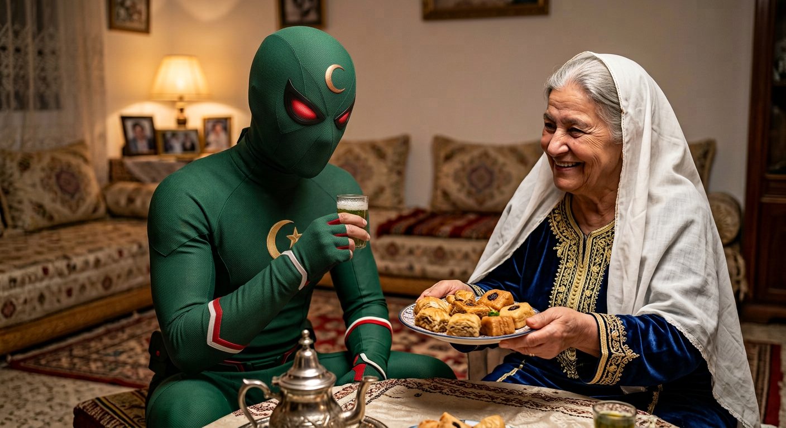

**البرومبوت الكامل:**
```
Photorealistic comedic heartwarming scene, 6 seconds, inside a modest Algerian home, warm afternoon light.

CHARACTERS:
- Super Dziri: original Algerian superhero, simple dark emerald green suit, full
  mask covering his face (identity hidden).
- Aunt Zahra: elderly Algerian woman, 72 years old, grey hair in a bun under a
  white haik head covering, dark blue traditional dress.

ENVIRONMENT: Cozy modest Algerian living room with traditional decor, small table
with tea and pastries.

CAMERA: Medium shot of the two at the table.

ACTION WITH TIMING:
- 0-2 seconds: Super Dziri sits at the table holding the mint tea, looking at it
  awkwardly (can't drink with the mask on).
- 2-4 seconds: Aunt Zahra pushes the pastries toward him, insisting warmly.
- 4-6 seconds: Super Dziri gives a thumbs up, the mask stays fully on, both laugh.

DIALOGUE (Algerian Darija, text on screen):
Zahra: "اشرب يا ولدي، الشاي يبرد! وكل كعبة!"
Super Dziri (بإشارة): "شكرا خالتي... شوفيني كياش نشرب بالقناع هذا؟ ههه!"
Zahra: "حتى مع القناع، نعرفك... إنت اللي رجعتلي حقيبتي. يجعلها في ميزان حسناتك!"

SOUND: Tea pouring, warm laughter, cozy home ambience, a cat purring.
```

---

## 🎬 المشهد 23 — "تصالح مع قويدر" (6 ثواني) 🔗 مرتبط مع المشهد 24

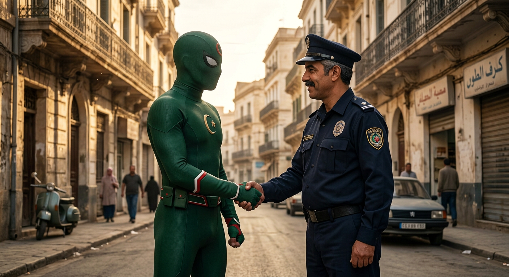

**البرومبوت الكامل:**
```
Photorealistic cinematic scene, 6 seconds, Algerian street at golden hour, warm respectful mood.

CHARACTERS:
- Super Dziri: original Algerian superhero, simple dark emerald green suit, mask.
- Officer Kouider: 40 years old, grey-flecked black hair, thick moustache, dark
  blue Algerian police uniform with cap.

ENVIRONMENT: Low Algerian buildings, warm golden hour light.

CAMERA: Medium shot of the two shaking hands.

ACTION WITH TIMING:
- 0-2 seconds: Kouider extends his hand to Super Dziri with respect.
- 2-4 seconds: Super Dziri shakes his hand firmly, both nodding.
- 4-6 seconds: Kouider tips his cap, Super Dziri returns a thumbs up and turns.

DIALOGUE (Algerian Darija, text on screen):
Kouider: "أول مرة نحب نقولها... شكرا. الحومة صارت أهدى بياك. وخا ما نعرفش
وجهك... نعرف إنك من هنا."
Super Dziri: "شكرا خويا قويدر. أنا واحد منكم... غير عندي قناع. واذا احتجت
حاجة، ارمي في السماء ونبان."
Kouider: "نعتمد عليك يا سوبر ذزيري."

SOUND: Golden hour ambience, a firm handshake, respectful music.

➡️ **يرتبط مع المشهد 24** — بعد التصالح، النهاية على السطح.
```

---

## 🎬 المشهد 24 — "النهاية" (6 ثواني) 🔗 مرتبط مع المشهد 23

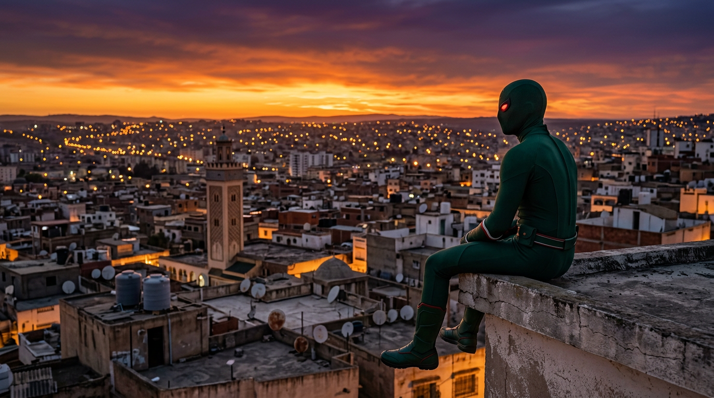

**البرومبوت الكامل:**
```
Photorealistic cinematic final scene, 6 seconds, Algerian rooftop at sunset, emotional peaceful mood.

CHARACTER: Super Dziri, original Algerian superhero, simple dark emerald green
suit, simple mask with white lens eyes, sitting on the edge of a low rooftop,
feet dangling over the edge.

ENVIRONMENT: Low Algerian buildings with satellite dishes, minarets and laundry,
deep orange and purple sunset sky, city lights beginning to glow.

CAMERA: Wide cinematic shot from behind-side.

ACTION WITH TIMING:
- 0-2 seconds: Super Dziri sits on the rooftop edge, looking calmly over the city.
- 2-4 seconds: He looks down at the neighborhood — children playing, people
  walking, lights turning on — a peaceful satisfied posture.
- 4-6 seconds: He looks up at the sky, nods to himself, slow zoom out — freeze
  frame against the sunset (end card).

DIALOGUE (inner voice, Algerian Darija, text on screen):
"في نيويورك، الأبطال يطيرون بين الأبراج. هنا في الجزائر... نطير بين القلوب.
مافيهش أبراج، مافيهش مشاكل؟! لا، مليحة فيها. ولكن، البطل الحقيقي ماشي اللي
يطير... البطل اللي يقف مع الناس في الطابور، في البلدية، في السوق. أنا سوبر
دزيري... وأنا واحد منكم. يلا، نرجع نخدم. غدوة نهار آخر. لأن الحومة تاعنا،
تستاهل."

SOUND: Emotional cinematic music, city ambience at dusk, wind, a gentle thread
"swish", end card music.

➡️ **يكمل المشهد 23** — بعد التصالح مع قويدر، النهاية العاطفية.
```

---

# ✅ الفيلم اكتمل — 24 مشهد = 2:24 دقيقة 🎉

## 🔗 كل الثنائيات المربوطة:
3↔4 • 7↔8 • 14↔16 • 15↔16 • 19↔20 • 23↔24

## 📁 الملفات:
```
سوبر-ذزيري/
├── الفيلم-الكامل.md      ← هذا الملف (24 مشهد: صورة + برومبوت + كلام)
├── البطل-الجديد.md       ← تصميم البطل
├── الشخصيات/ (1 صورة بطل + نضيف الباقي)
└── المشاهد/ (24 صورة)
```
