# 🥖 فيلم «اَلْخُبْزَةْ» — المذكرة النهائية الإنتاجية (مراجعة سينمائية شاملة)

> **8 مشاهد × 60 ثانية** — كوميديا جزائرية إنسانية قصيرة
> **المقاس:** 16:9 | **الأسلوب:** Photorealistic live-action Algerian cinema | **الموسيقى:** بدون موسيقى نهائياً
> **اللغة:** الدارجة الجزائرية مع التشكيل المعتمد للنطق الصوتي

---

## 🧑🎤 CHARACTER REFERENCE SHEETS — أوراق الشخصيات المرجعية

> **قاعدة:** قبل أي مشهد، هذه الأوراق هي الأساس الثابت لكل شخصية. كل صورة مشهد يجب أن تُبنى من الـ MASTER الخاصة بالشخصية (نفس الوجه، الشعر، الملابس، الجسم).

> **كل ورقة = TURNAROUND SHEET مقسمة إلى 4 لوحات:** PANEL 1 (أمامي) + PANEL 2 (ثلاثة أرباع 45°) + PANEL 3 (جانبي) + PANEL 4 (خلفي) — نفس الشخصية بالضبط في الألواح الأربعة.

### YASSINE_MASTER — ياسين — YASSINE

**ملف الورقة المرجعية:** `YASSINE_MASTER_Turnaround.png`

**الوصف الثابت (CHARACTER LOCK):**

- شاب جزائري بالغ، 25 سنة، شعر أسود قصير متموج قليلاً، عينان بنيتان داكنتان، لحية خفيفة، بشرة زيتونية متوسطة، جسم متوسط نحيف قليلاً.
- الملابس الثابتة: T-shirt أبيض مائل للرمادي (light grey-white)، جينز أزرق، حذاء رياضي داكن.

**PROMPT إنشاء الورقة المرجعية (4 لوحات):**

```text
PROFESSIONAL CHARACTER TURNAROUND REFERENCE SHEET, 16:9 aspect, divided into 4 clear panels of the SAME fictional character. YASSINE: a 25-year-old Algerian young man, short slightly wavy black hair, dark brown eyes, light facial stubble, medium olive skin, slim average build. Clothing: light grey-white T-shirt, blue jeans, dark sneakers. PANEL 1 (left): FULL FRONT VIEW, facing directly forward. PANEL 2: THREE-QUARTER VIEW at 45 degrees. PANEL 3: SIDE PROFILE facing right. PANEL 4 (right): FULL BACK VIEW. The character is IDENTICAL in all four panels: same face, same hair, same clothing, same shoes, same body proportions. Neutral standing pose, arms relaxed at sides, full body visible in every panel, consistent scale across panels. Plain light grey studio background, soft even lighting, photorealistic live-action film production reference style, realistic skin texture, natural human proportions. Thin visual divider lines separate the 4 panels. No text, no labels, no logos, no watermark.
```

---

### MOTHER_MASTER — الأم — THE MOTHER

**ملف الورقة المرجعية:** `MOTHER_MASTER_Turnaround.png`

**الوصف الثابت (CHARACTER LOCK):**

- امرأة جزائرية 55-65 سنة، وجه دافئ طبيعي، تعبير أمومي حنون لكن جاد قليلاً، حجاب بني/بيج يغطي الشعر، فستان منزلي بسيط محتشم.

**PROMPT إنشاء الورقة المرجعية (4 لوحات):**

```text
PROFESSIONAL CHARACTER TURNAROUND REFERENCE SHEET, 16:9 aspect, divided into 4 clear panels of the SAME fictional character. THE MOTHER: a fictional Algerian woman, approximately 55-65 years old, warm natural face, kind but slightly serious maternal expression, modest brown/beige hijab covering her hair, simple modest home dress (plain long dress), natural olive skin, average maternal build. PANEL 1 (left): FULL FRONT VIEW. PANEL 2: THREE-QUARTER VIEW at 45 degrees. PANEL 3: SIDE PROFILE facing right. PANEL 4 (right): FULL BACK VIEW. IDENTICAL in all four panels: same face, same hijab, same dress, same body proportions. Neutral standing pose, arms relaxed, full body visible, consistent scale. Plain light grey studio background, soft even lighting, photorealistic live-action film production reference style, realistic skin texture. Thin visual divider lines separate the 4 panels. No text, no labels, no logos, no watermark.
```

---

### ELDERLY_WOMAN_MASTER — العجوز — THE ELDERLY WOMAN

**ملف الورقة المرجعية:** `ELDERLY_WOMAN_MASTER_Turnaround.png`

**الوصف الثابت (CHARACTER LOCK):**

- امرأة جزائرية 65-70 سنة، وجه دافئ مجعد، حجاب بني/بيج، ملابس محتشمة بسيطة (فستان طويل مع كارديغان خفيف)، تحمل كيس خبز قماشي (صاك).

**PROMPT إنشاء الورقة المرجعية (4 لوحات):**

```text
PROFESSIONAL CHARACTER TURNAROUND REFERENCE SHEET, 16:9 aspect, divided into 4 clear panels of the SAME fictional character. THE ELDERLY WOMAN: a fictional Algerian woman, approximately 65-70 years old, warm wrinkled face, modest brown/beige hijab, simple modest clothing (plain long dress with a light cardigan), holding a simple cloth bread bag (صاك) in one hand, natural elderly build. PANEL 1 (left): FULL FRONT VIEW. PANEL 2: THREE-QUARTER VIEW at 45 degrees. PANEL 3: SIDE PROFILE facing right. PANEL 4 (right): FULL BACK VIEW. IDENTICAL in all four panels: same face, same hijab, same dress, same cloth bread bag, same body proportions. Neutral standing pose, full body visible, consistent scale. Plain light grey studio background, soft even lighting, photorealistic live-action film production reference style, realistic aged skin texture. Thin visual divider lines separate the 4 panels. No text, no labels, no logos, no watermark.
```

---

### BAKER_MASTER — الخباز — THE BAKER

**ملف الورقة المرجعية:** `BAKER_MASTER_Turnaround.png`

**الوصف الثابت (CHARACTER LOCK):**

- رجل جزائري في منتصف الأربعينات، مظهر عادي، شعر قصير داكن، شارب خفيف، بشرة زيتونية، جسم متوسط، مئزر عمل بسيط فوق قميص فاتح مع سروال داكن.

**PROMPT إنشاء الورقة المرجعية (4 لوحات):**

```text
PROFESSIONAL CHARACTER TURNAROUND REFERENCE SHEET, 16:9 aspect, divided into 4 clear panels of the SAME fictional character. THE BAKER: a fictional Algerian man, mid-40s, ordinary appearance, short dark hair, light moustache, medium olive skin, average build, wearing a simple work apron over a light shirt and dark trousers. PANEL 1 (left): FULL FRONT VIEW. PANEL 2: THREE-QUARTER VIEW at 45 degrees. PANEL 3: SIDE PROFILE facing right. PANEL 4 (right): FULL BACK VIEW. IDENTICAL in all four panels: same face, same moustache, same apron, same shirt, same trousers, same body proportions. Neutral standing pose, arms relaxed at sides, full body visible, consistent scale. Plain light grey studio background, soft even lighting, photorealistic live-action film production reference style, realistic skin texture. Thin visual divider lines separate the 4 panels. No text, no labels, no logos, no watermark.
```

---

## 🔒 CHARACTER LOCK — قواعد تثبيت الشخصيات

| ID | الشخصية | الظهور في المشاهد |
|---|---|---|
| YASSINE_MASTER | ياسين | SC01، SC02، SC03، SC04، SC05، SC06، SC07، SC08 |
| MOTHER_MASTER | الأم | SC01 |
| ELDERLY_WOMAN_MASTER | العجوز | SC02، SC03، SC07، SC08 |
| BAKER_MASTER | الخباز | SC05، SC06، SC07، SC08 |

**قواعد إلزامية:**
- ممنوع إعادة تصميم الشخصية من الصفر في كل مشهد.
- ممنوع تغيير الوجه قليلاً بين المشاهد.
- ممنوع تغيير العمر، لون البشرة، شكل الشعر، الجسم، الملابس، الحذاء، الإكسسوارات.
- الهدف: نضع صور المشاهد بجانب بعضها ولا نحس أن الشخصية تغيرت (No Morphing / No Identity Drift).

---

## 🚫 MASTER NEGATIVE PROMPT (لكل توليد)

```text
No text, no subtitles, no captions, no text overlays, no logos, no watermark.
No morphing, no identity drift, no teleportation, no sudden appearance, no disappearance.
No cartoon, no anime, no illustration, no CGI-looking render, no artificial beauty filter.
No exaggerated acting, no robotic faces, no frozen characters, no theatrical dialogue.
No music in any video.
```

---

## 🖼️ قاعدة عدد الصور لكل مشهد

| المشهد | صورة واحدة | صورتان (START + END) | السبب |
|---|---|---|---|
| SC01 | | ✅ 2 | فتح الباب ثم الخروج — انتقال فيزيائي واضح |
| SC02 | | ✅ 2 | مشي → سقوط الخبز → انحناء — انتقال فيزيائي |
| SC03 | | ✅ 2 | START = نهاية SC02 (ACTION MATCH) + END تسليم الخبز |
| SC04 | ✅ 1 | | مشي بسيط مستمر نحو المخبزة |
| SC05 | ✅ 1 | | لقطة ثابتة عند الكاونتر (فعل واحد بسيط) |
| SC06 | ✅ 1 | | حوار ثابت عند الكاونتر (لا انتقال مكاني) |
| SC07 | | ✅ 2 | دخول من المدخل ثم المشي إلى الكاونتر والدفع |
| SC08 | ✅ 1 | | لقطة ختامية ثابتة (حوار قصير) |

**سلسلة الاتصال (CONTINUITY CHAIN):**
```text
SC01_END → (Cut) → SC02_START
SC02_END = SC03_START  ← ACTION MATCH (نفس وضعية الانحناء)
SC03_END → (Cut) → SC04_START
SC04_START → (Cut) → SC05_START
SC05_START → (متابعة) → SC06_START (نفس الكاونتر)
SC06_START → (Cut) → SC07_START
SC07_END → (Cut) → SC08_START
```

---

## 📊 جدول المشاهد

| # | الحدث | المدة | الصور |
|---|---|---|---|
| SC01 | جِيبْ اَلْخُبْزْ | 7 ث | `SC01_START_Yassine_Home.png` + `SC01_END_Yassine_DoorOpen.png` |
| SC02 | اَلْعَجُوزْ وَاَلْخُبْزْ | 8 ث | `SC02_START_Yassine_Street.png` + `SC02_END_Woman_DroppedBread.png` |
| SC03 | رَبِّي يَفْتَحْهَا عَلِيكْ | 8 ث | `SC02_END_Woman_DroppedBread.png` + `SC03_END_Yassine_GivesBread.png` |
| SC04 | رَايَحْ لِلْمَخْبْزَةْ | 7 ث | `SC04_START_Yassine_ReturnsBread.png` |
| SC05 | وَيْنْ رَاحُو اَلدَّرَاهِمْ؟ | 7 ث | `SC05_START_Yassine_Bakery.png` |
| SC06 | غَدْوَةْ؟ | 10 ث | `SC06_START_Yassine_NoMoney.png` |
| SC07 | أَنَا نَخْلَصْ عَلِيهْ | 9 ث | `SC07_START_OldWoman_EntersBakery.png` + `SC07_END_OldWoman_Pays.png` |
| SC08 | اَلْخِيرْ مَا يَضِيعْشْ | 4 ث | `SC08_END_FinalMessage.png` |

**المجموع = 60 ثانية**

---

## 🎬 SC01 — جِيبْ اَلْخُبْزْ

> **المدة: 7 ثواني**

### 🖼️ الصور المرجعية

**`SC01_START_Yassine_Home.png`** — START — ياسين أمام الباب المغلق والأم خلفه

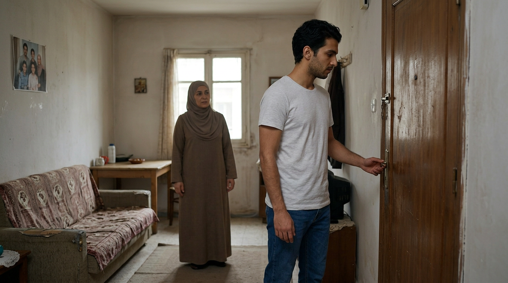

**`SC01_END_Yassine_DoorOpen.png`** — END — الباب مفتوح وياسين يخرج

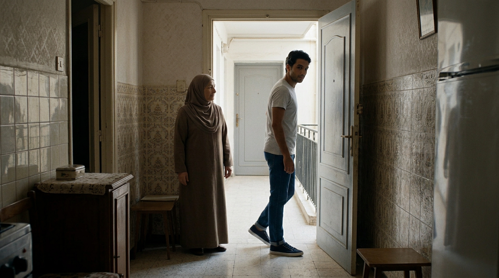

### 📝 PROMPT إنشاء الصور

**START — `SC01_START_Yassine_Home.png`:**

```text
CREATE A PHOTOREALISTIC CINEMATIC LIVE-ACTION STILL IMAGE, 16:9. Interior of a modest authentic Algerian family apartment, late morning. YASSINE (exactly the YASSINE_MASTER reference: 25-year-old Algerian man, short slightly wavy black hair, dark brown eyes, light facial stubble, medium olive skin, slim build, light grey-white T-shirt, blue jeans, dark sneakers) stands IN FRONT OF THE CLOSED apartment entrance door, his body oriented toward the door, his hand CLOSE TO THE DOOR HANDLE, clearly about to open it. BEHIND him inside the apartment, his MOTHER (exactly the MOTHER_MASTER reference: 55-65-year-old Algerian woman, modest brown/beige hijab, simple home dress, warm maternal face) is clearly visible, standing naturally a short distance behind him, looking at him as if about to speak, her face fully readable, NOT hidden, NOT behind a wall, NOT a silhouette. Both characters in the same continuous physical space. The door is CLOSED. Camera: natural medium-wide shot from inside the apartment facing the entrance; Yassine in the foreground, mother clearly readable in the mid-ground. Authentic modest Algerian apartment interior, simple furniture, realistic entrance door, natural household objects, plain realistic walls, natural daylight. Photorealistic Algerian live-action cinema, natural skin texture, 35mm, natural depth of field, natural color grading. No text, no subtitles, no logo, no watermark.
```

**END — `SC01_END_Yassine_DoorOpen.png`:**

```text
CREATE A PHOTOREALISTIC CINEMATIC LIVE-ACTION STILL IMAGE, 16:9. The SAME apartment and SAME camera position as SC01 START. The apartment entrance door is now OPEN. YASSINE (exactly the YASSINE_MASTER reference: 25-year-old Algerian man, short slightly wavy black hair, light stubble, medium olive skin, light grey-white T-shirt, blue jeans, dark sneakers) is PASSING THROUGH the open doorway, stepping OUT toward the exterior corridor, one foot outside, his body mid-exit, his head slightly turned back. BEHIND him inside the apartment, his MOTHER (exactly the MOTHER_MASTER reference: 55-65, modest brown/beige hijab, simple home dress, warm maternal face) remains visible standing naturally, watching him leave, her face readable. Same door, same walls, same furniture, same lighting. Camera: medium-wide shot from inside the apartment facing the entrance. Photorealistic Algerian live-action cinema, 35mm, natural color grading. No text, no subtitles, no logo, no watermark.
```

### 🎬 PROMPT تحويل الصورة إلى فيديو (VIDEO GENERATION PROMPT)

```text
REFERENCE IMAGE ASSIGNMENT:
IMAGE 1 = PRIMARY REFERENCE / EXACT START FRAME: `SC01_START_Yassine_Home.png`
IMAGE 2 = END FRAME: `SC01_END_Yassine_DoorOpen.png`

The first uploaded image is the exact physical and visual starting state.
The second uploaded image is the exact visual ending state.
START EXACTLY FROM IMAGE 1. END EXACTLY AT IMAGE 2.
Do not treat the two images as a slideshow. Create the physical action that connects them.

Create ONE continuous 7-second photorealistic live-action cinematic shot, 16:9.

START STATE:
Yassine is inside the apartment, standing in front of the CLOSED entrance door, his hand close to the door handle. His mother is clearly visible inside the apartment behind him. The door is closed.

END STATE:
The same door is now OPEN. Yassine is passing through the doorway, stepping out to the exterior corridor, head slightly turned back. The mother remains visible inside, watching him.

SCENE PURPOSE:
Yassine's mother calls him from inside the apartment and asks him to bring bread. He opens the door, answers respectfully, and leaves. Establishes Yassine as an ordinary young Algerian man and a warm family atmosphere.

CHARACTERS:
YASSINE — 25-year-old Algerian man, short slightly wavy black hair, dark brown eyes, light stubble, medium olive skin, slim build, light grey-white T-shirt, blue jeans, dark sneakers.
MOTHER — 55-65-year-old Algerian woman, modest brown/beige hijab, simple home dress, warm maternal face.

ENVIRONMENT:
Authentic modest Algerian apartment interior. Simple furniture, realistic entrance door, plain walls, natural daylight from the doorway. No environment transformation.

SPATIAL CONTINUITY:
WHO is where: Yassine at the doorway (foreground), mother inside the apartment behind him (mid-ground). WHO faces whom: Yassine faces the door, then turns to face his mother; the mother faces Yassine. WHERE is the camera: inside the apartment, medium-wide, facing the entrance. WHERE is the door: directly in front of Yassine, in the center of the frame; it stays the SAME door throughout. WHAT direction: Yassine moves toward the door, then OUT through it. The mother must NOT appear suddenly, must NOT disappear, must NOT move to another location. Yassine must NOT teleport. Do not reverse left/right geography. Do not change camera geography.

TIMELINE:
0.0-2.0: Yassine prepares to leave, exactly from IMAGE 1. He makes a small natural movement toward the closed door; his hand reaches toward the handle. His mother remains visible behind him, looking at him. Natural blinking, breathing.
2.0-3.5: Yassine's hand reaches the handle, turns it, and he opens the door naturally — hand to handle, handle turns, door rotates, opening appears. Physical chain only, no skipping.
3.5-5.5: As the door begins to open, the mother calls from inside: «يَاسِينْ، مَا تَنْسَاشْ تْجِيبْ اَلْخُبْزْ كِي تْرُوحْ لْلدَّارْ!» Yassine stops for a moment and turns his head toward her.
5.5-7.0: Yassine answers: «مَاشِي مْشْكِلْ يَمَّا، مَا نَنْسَاشْ، كُونِي هَانِيَةْ.» Then he turns forward and exits through the SAME door, arriving at the exact state of IMAGE 2.

MOTION DYNAMICS:
Natural handheld medium shot with very subtle human camera sway. Yassine: natural blinking, breathing, small respectful smile, natural head turn, accurate lip movement, natural body movement while leaving, door-opening arm motion. Mother: natural blinking, breathing, subtle maternal expression, realistic mouth movement during dialogue. Clothing moves naturally with body movement. No frozen faces, no robotic lips, no exaggerated gestures.

CAMERA:
Natural handheld medium-wide cinematic shot from inside the apartment facing the entrance. Keep both Yassine and his mother visible when dialogue begins. A very subtle natural adjustment as Yassine turns toward his mother. No sudden push-in, no abrupt position change, no cuts, no camera teleportation.

DIALOGUE:
Mother: «يَاسِينْ، مَا تَنْسَاشْ تْجِيبْ اَلْخُبْزْ كِي تْرُوحْ لْلدَّارْ!»
Yassine: «مَاشِي مْشْكِلْ يَمَّا، مَا نَنْسَاشْ، كُونِي هَانِيَةْ.»
Natural Algerian Darija, clear speaker separation, mother first, Yassine after. No overlapping dialogue, no additional words, no narration, no spoken translation. Accurate lip-sync.

PRONUNCIATION:
Natural Algerian Darija with normal conversational rhythm. Warm maternal tone for the mother; respectful, relaxed young-son tone for Yassine. Natural pauses, natural breathing, normal speaking speed. Tashkeel guides pronunciation — do NOT sound theatrical or formal.

AUDIO:
Natural Algerian home ambience, subtle room tone, very faint neighborhood sounds from outside, natural footsteps, door handle and door creak sounds, natural clothing movement. Dialogue clear and intelligible. No music, no narrator, no additional dialogue.

REALISM:
Photorealistic Algerian live-action cinema. Natural skin texture, natural facial expressions, natural human proportions, realistic physics, realistic walking, realistic clothing movement, realistic lighting, subtle 35mm cinematic look, subtle film grain. No artificial beauty filter, no cartoon look, no exaggerated acting.

CHARACTER CONTINUITY LOCK:
Keep Yassine and the mother visually consistent with their MASTER references: same face, same hairstyle, same clothing, same body proportions. No identity change, no face change, no hairstyle change, no clothing change, no body deformation.

ENVIRONMENT CONTINUITY LOCK:
Keep the same walls, doorway, furniture and lighting throughout the shot. The door is the same door. No environment transformation.

ENDING STATE:
At ~7 seconds Yassine naturally exits through the apartment doorway, matching IMAGE 2. The final frame shows him leaving naturally while the apartment entrance remains consistent — suitable for a clean cut to SC02.

STRICT NEGATIVE RULES:
NO morphing. NO identity drift. NO teleportation. NO sudden appearance of the mother. NO disappearance of the mother. NO costume change. NO hairstyle change. NO face change. NO camera jump. NO location change. NO hidden cut. NO duplicated characters. NO extra characters appearing inside the apartment. NO extra dialogue. NO subtitles. NO captions. NO text overlays. NO logos. NO watermark.
```

---

## 🎬 SC02 — اَلْعَجُوزْ وَاَلْخُبْزْ

> **المدة: 8 ثواني**

### 🖼️ الصور المرجعية

**`SC02_START_Yassine_Street.png`** — START — ياسين يمشي والعجوز أمامه بمسافة

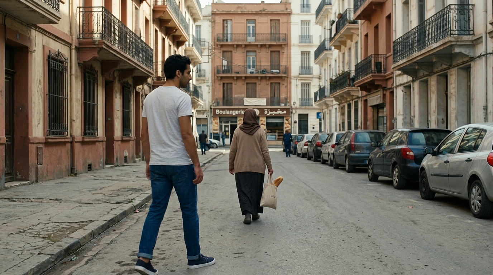

**`SC02_END_Woman_DroppedBread.png`** — END — الخبز سقط وياسين ينحني = START المشهد 03

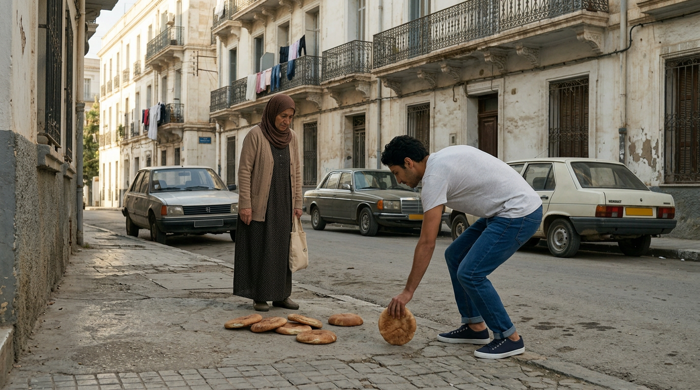

### 📝 PROMPT إنشاء الصور

**START — `SC02_START_Yassine_Street.png`:**

```text
CREATE A PHOTOREALISTIC CINEMATIC LIVE-ACTION STILL IMAGE, 16:9. Authentic Algerian residential street, late morning. YASSINE (exactly the YASSINE_MASTER reference: 25-year-old Algerian man, short slightly wavy black hair, light stubble, olive skin, light grey-white T-shirt, blue jeans, dark sneakers) WALKS along the pavement in the near-to-mid ground, moving forward in one direction. AHEAD of him at a CLEAR PHYSICAL DISTANCE of several meters, the ELDERLY WOMAN (exactly the ELDERLY_WOMAN_MASTER reference: 65-70-year-old Algerian woman, brown/beige hijab, modest dress with light cardigan) walks in the SAME direction, carrying a cloth bread bag (صاك) held at her side in a believable position from which bread could fall. There is enough distance between them — Yassine is NOT standing beside her. The bakery storefront is visible farther ahead in the same direction. Authentic Algerian architecture, balconies, parked cars, distant pedestrians, natural daylight, realistic shadows. Camera: medium-wide handheld tracking view from behind and slightly to the side of Yassine, both characters visible in the frame. Photorealistic Algerian live-action cinema, 35mm, natural color grading. No text, no subtitles, no logo, no watermark.
```

**END — `SC02_END_Woman_DroppedBread.png`:**

```text
CREATE A PHOTOREALISTIC CINEMATIC LIVE-ACTION STILL IMAGE, 16:9. The SAME Algerian residential street as the SC02 START frame, same lighting, same time of day, same camera direction. ACTION MID-STATE: the ELDERLY WOMAN (exactly the ELDERLY_WOMAN_MASTER reference: 65-70, brown/beige hijab, modest dress, cloth bread bag) has JUST dropped several pieces of traditional Algerian bread from her cloth bag; pieces of bread are visibly scattered on the pavement at her feet. Yassine (exactly the YASSINE_MASTER reference: 25, short wavy black hair, light stubble, olive skin, light grey-white T-shirt, blue jeans, dark sneakers) has STOPPED walking at a short distance from the bread and is BEGINNING TO BEND his knees and waist toward the bread, one hand reaching down, his body orientation clearly indicating he is about to pick it up. The elderly woman stands nearby looking down at the fallen bread. Authentic Algerian street, balconies, parked cars, natural daylight, realistic shadows. Camera: medium-wide shot from behind and slightly to the side, both characters and the fallen bread visible. Photorealistic Algerian live-action cinema, 35mm, natural color grading. No text, no subtitles, no logo, no watermark.
```

### 🎬 PROMPT تحويل الصورة إلى فيديو (VIDEO GENERATION PROMPT)

```text
REFERENCE IMAGE ASSIGNMENT:
IMAGE 1 = PRIMARY REFERENCE / EXACT START FRAME: `SC02_START_Yassine_Street.png`
IMAGE 2 = END FRAME: `SC02_END_Woman_DroppedBread.png`

The first uploaded image is the exact physical and visual starting state.
The second uploaded image is the exact visual ending state.
START EXACTLY FROM IMAGE 1. END EXACTLY AT IMAGE 2.
Do not treat the two images as a slideshow. Create the physical action that connects them.

Create ONE continuous 8-second photorealistic live-action cinematic shot, 16:9.

START STATE:
Yassine walks along the Algerian residential street. The elderly woman is visibly AHEAD of him at a clear physical distance, holding her cloth bread bag at her side. The bakery is somewhere ahead in the same direction.

END STATE:
The elderly woman has just dropped several pieces of bread from the bag; the bread is visibly on the pavement. Yassine has stopped and is beginning to bend toward the bread. The woman is nearby. This END FRAME becomes the START FRAME of SC03.

SCENE PURPOSE:
Walking to the bakery, Yassine sees the elderly woman accidentally drop bread from her bag. He stops and begins to help — the seed of the whole story.

CHARACTERS:
YASSINE — 25-year-old Algerian man, short slightly wavy black hair, light stubble, medium olive skin, light grey-white T-shirt, blue jeans, dark sneakers.
ELDERLY WOMAN — 65-70-year-old Algerian woman, brown/beige hijab, modest dress with light cardigan, cloth bread bag.

ENVIRONMENT:
Authentic Algerian residential street: balconies, parked cars, distant pedestrians, the bakery storefront ahead, natural daylight, realistic shadows.

SPATIAL CONTINUITY:
WHO is where: Yassine behind/behind-side of the woman at the start, the woman ahead; Yassine moves forward and ends closer to the woman and the bread. WHO faces whom: both face the same walking direction; the woman looks down at the fallen bread at the end. WHERE is the camera: tracking from behind and slightly to the side; the camera never crosses to the opposite side of the street (screen direction stays constant). WHERE is the bread: it falls at the woman's feet; it remains there. WHAT direction: both move forward in one consistent direction; Yassine slows, stops, and bends forward-down toward the bread. The woman must not disappear; Yassine must not teleport closer; the distance between them closes only through his natural walking.

TIMELINE:
0.0-2.0: Yassine walks naturally through the neighborhood, exactly from IMAGE 1. The elderly woman walks ahead of him.
2.0-4.0: The woman's cloth bag moves as she walks; bread leaves the bag and falls due to gravity, hitting the pavement — a soft realistic fall, a few pieces.
4.0-5.5: Yassine notices the fallen bread, slows his pace, and stops at a natural distance.
5.5-8.0: He begins bending his knees and waist toward the bread, one hand reaching down, arriving at the exact state of IMAGE 2.

MOTION DYNAMICS:
Natural walking: steady stride, arm swing, slight head bob. The fall of the bread: bag shifts → bread slides out → falls by gravity → lands and stays. Yassine decelerates naturally (no abrupt stop), then bends with natural body mechanics. The woman turns slightly and looks down. No exaggerated reaction, no freeze.

CAMERA:
Medium-wide handheld tracking at walking speed, then a subtle natural hold as Yassine stops and bends. Keep the street geography and screen direction consistent. No whip pan, no sudden reframing, no drone move.

DIALOGUE:
No spoken dialogue.

PRONUNCIATION:
Not applicable — no dialogue in this scene.

AUDIO:
Natural footsteps, street ambience (distant traffic, faint voices, birds), the soft sound of bread hitting the pavement. No music, no narration.

REALISM:
Photorealistic live-action. Realistic walking and bending physics, realistic gravity on the bread, natural crowd/street depth, natural daylight.

CHARACTER CONTINUITY LOCK:
Yassine and the elderly woman consistent with their MASTER references: same faces, same hair, same clothing, same body proportions. No identity change, no clothing change.

ENVIRONMENT CONTINUITY LOCK:
Same street, same direction, same lighting, same time of day. The bakery stays ahead. No environment transformation.

ENDING STATE:
Yassine is bending toward the bread, exactly matching IMAGE 2 — physically compatible with the START of SC03 (ACTION MATCH).

STRICT NEGATIVE RULES:
NO teleportation. NO sudden appearance of the woman. NO disappearance of the woman. NO morphing. NO identity drift. NO clothing change. NO exaggerated action-movie speed. NO camera flying. NO reverse screen direction. NO subtitles. NO captions. NO text overlays. NO logo. NO watermark. NO music.
```

---

## 🎬 SC03 — رَبِّي يَفْتَحْهَا عَلِيكْ

> **المدة: 8 ثواني**

### 🖼️ الصور المرجعية

**`SC02_END_Woman_DroppedBread.png`** — START = نهاية المشهد 02 (نفس الوضعية — ACTION MATCH)


**`SC03_END_Yassine_GivesBread.png`** — END — ياسين يسلم الخبز للعجوز

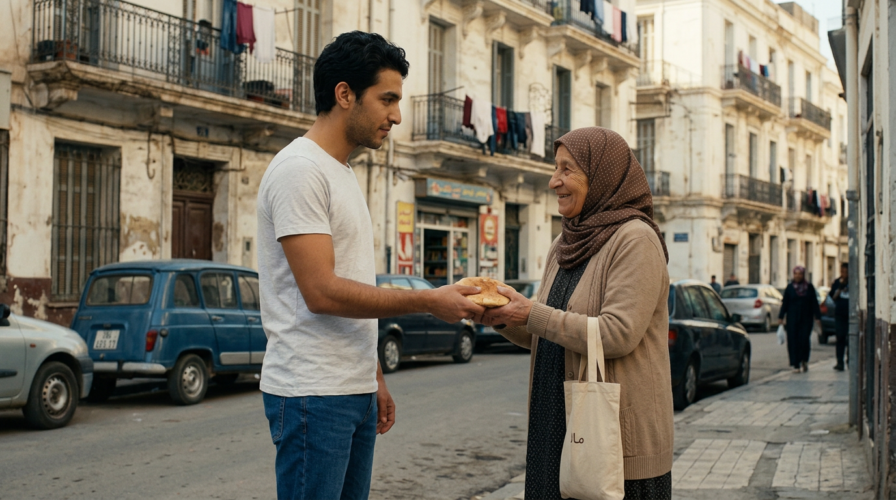

### 📝 PROMPT إنشاء الصور

**START — `SC02_END_Woman_DroppedBread.png`:**

```text
(لا حاجة لصورة جديدة — START هو نفس ملف SC02_END_Woman_DroppedBread.png)
```

**END — `SC03_END_Yassine_GivesBread.png`:**

```text
CREATE A PHOTOREALISTIC CINEMATIC LIVE-ACTION STILL IMAGE, 16:9. The SAME Algerian residential street as the previous frames, same lighting, same camera direction. ACTION: Yassine (exactly the YASSINE_MASTER reference: 25-year-old Algerian man, short slightly wavy black hair, light stubble, olive skin, light grey-white T-shirt, blue jeans, dark sneakers) now stands UPRIGHT facing the ELDERLY WOMAN (exactly the ELDERLY_WOMAN_MASTER reference: 65-70, brown/beige hijab, modest dress, cloth bread bag) at close conversational distance, holding out the last piece of traditional Algerian bread toward her with his hand. The elderly woman is reaching to receive the bread with both hands, a warm grateful smile on her face. Both characters face each other, Yassine on one side, the woman on the other, the bread between them at the moment of handoff. Authentic Algerian street, balconies, parked cars, natural daylight, realistic shadows. Camera: medium two-shot from slightly to the side, both faces and the bread handoff clearly visible. Photorealistic Algerian live-action cinema, 35mm, natural color grading, natural skin texture. No text, no subtitles, no logo, no watermark.
```

### 🎬 PROMPT تحويل الصورة إلى فيديو (VIDEO GENERATION PROMPT)

```text
REFERENCE IMAGE ASSIGNMENT:
IMAGE 1 = PRIMARY REFERENCE / EXACT START FRAME: `SC02_END_Woman_DroppedBread.png`
IMAGE 2 = END FRAME: `SC03_END_Yassine_GivesBread.png`

IMAGE 1 is the exact state where SC02 ended (ACTION MATCH): Yassine bending toward the fallen bread.
The second uploaded image is the exact visual ending state.
START EXACTLY FROM IMAGE 1. END EXACTLY AT IMAGE 2.
Do not treat the two images as a slideshow. Create the physical action that connects them.

Create ONE continuous 8-second photorealistic live-action cinematic shot, 16:9.

START STATE:
Yassine is bending toward the pieces of bread on the pavement. The elderly woman stands nearby. Same street, same lighting as SC02 END.

END STATE:
Yassine stands upright facing the elderly woman, handing her the last piece of bread; she reaches to receive it with both hands, smiling warmly.

SCENE PURPOSE:
Yassine picks up the last piece of bread, stands, takes one or two steps to the elderly woman, gives her the bread, she accepts it and blesses him; he answers respectfully. Kindness acknowledged — will be repaid later.

CHARACTERS:
YASSINE — 25-year-old Algerian man, short slightly wavy black hair, light stubble, medium olive skin, light grey-white T-shirt, blue jeans, dark sneakers.
ELDERLY WOMAN — 65-70-year-old Algerian woman, brown/beige hijab, modest dress with light cardigan, cloth bread bag.

ENVIRONMENT:
Same Algerian residential street, same lighting, same time of day.

SPATIAL CONTINUITY:
WHO is where: Yassine near the bread on the pavement; the woman a step or two away; at the end they stand face to face at close distance. WHO faces whom: initially Yassine faces down toward the bread; the woman faces him; at the end they face each other. WHERE is the camera: medium shot from slightly to the side; camera does not cross the line between them. WHERE is the bread: on the pavement at the start, then in Yassine's hand, then handed to the woman. WHAT direction: Yassine bends down → stands up → walks 1-2 natural steps toward the woman → extends his hand with the bread → she receives it. The woman must not move away; Yassine must not teleport.

TIMELINE:
0.0-2.0: From IMAGE 1, Yassine bends down and picks up the last piece of bread — reach, grasp, stand.
2.0-4.0: He stands fully and walks one or two natural steps toward the elderly woman.
4.0-5.5: He extends the bread toward her; she reaches and accepts it with both hands.
5.5-8.0: She smiles warmly and says: «رَبِّي يَفْتَحْهَا عَلِيكْ يَا وْلِيدِي.» Yassine smiles politely and answers: «آمِينْ، رَبِّي يَحْفَظْكْ.» Settle into the exact composition of IMAGE 2.

MOTION DYNAMICS:
Natural bending and rising with realistic body mechanics (knees and waist), one or two small steps, the handoff of the bread with natural cloth contact, warm smiles, accurate lip movement for the two short lines. No overacting, no robotic faces.

CAMERA:
Medium two-shot with small natural handheld movement. No sudden push-in, no cut, no camera teleportation. Keep the line between the two characters uncrossed.

DIALOGUE:
Elderly woman: «رَبِّي يَفْتَحْهَا عَلِيكْ يَا وْلِيدِي.»
Yassine: «آمِينْ، رَبِّي يَحْفَظْكْ.»
Natural Algerian Darija, warm elderly female voice, soft respectful young male voice, accurate lip-sync, no extra words.

PRONUNCIATION:
Natural Algerian Darija, warm and sincere, normal conversational rhythm and speed. The tashkeel guides pronunciation only — no theatrical or newsreader tone.

AUDIO:
Street ambience, gentle cloth movement of the bread bag, small rustle of the bread, clear dialogue. No music, no narration.

REALISM:
Photorealistic live-action Algerian cinema. Natural human motion, warm interaction, realistic skin texture, natural daylight.

CHARACTER CONTINUITY LOCK:
Yassine and the elderly woman consistent with their MASTER references. No identity change, no clothing change, no morphing.

ENVIRONMENT CONTINUITY LOCK:
Same street, same lighting, same camera side as SC02. No environment transformation.

ENDING STATE:
The handoff of the bread, matching IMAGE 2 — clean cut to SC04 as Yassine continues walking toward the bakery.

STRICT NEGATIVE RULES:
NO morphing. NO identity drift. NO teleportation. NO sudden appearance/disappearance of the woman. NO clothing change. NO extra dialogue. NO subtitles. NO captions. NO text overlays. NO logo. NO watermark. NO music.
```

---

## 🎬 SC04 — رَايَحْ لِلْمَخْبْزَةْ

> **المدة: 7 ثواني**

### 🖼️ الصور المرجعية

**`SC04_START_Yassine_ReturnsBread.png`** — START — ياسين يمشي نحو المخبزة

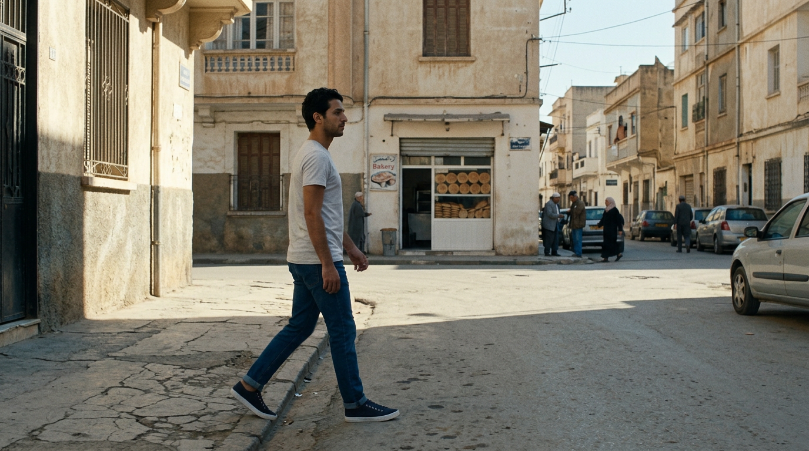

### 📝 PROMPT إنشاء الصور

**START — `SC04_START_Yassine_ReturnsBread.png`:**

```text
CREATE A PHOTOREALISTIC CINEMATIC LIVE-ACTION STILL IMAGE, 16:9. Authentic Algerian residential street, late morning, same street geography as the previous scenes. YASSINE (exactly the YASSINE_MASTER reference: 25-year-old Algerian man, short slightly wavy black hair, dark brown eyes, light stubble, medium olive skin, light grey-white T-shirt, blue jeans, dark sneakers) walks ALONE along the pavement toward a small local bakery visible farther ahead with a simple storefront and a bread display. He is mid-stride, moving in one consistent direction toward the bakery. Ordinary pedestrians, parked cars, authentic Algerian architecture, natural daylight, realistic shadows. Camera: smooth handheld tracking from slightly behind and beside Yassine, the bakery visible ahead in the frame. Photorealistic Algerian live-action cinema, 35mm, natural color grading. No text, no subtitles, no logo, no watermark.
```

### 🎬 PROMPT تحويل الصورة إلى فيديو (VIDEO GENERATION PROMPT)

```text
REFERENCE IMAGE ASSIGNMENT:
IMAGE 1 = PRIMARY REFERENCE / EXACT START FRAME: `SC04_START_Yassine_ReturnsBread.png`

The uploaded image is the exact physical and visual starting state.
START EXACTLY FROM THE UPLOADED IMAGE.

Create ONE continuous 7-second photorealistic live-action cinematic shot, 16:9.

START STATE:
Yassine walks alone along the Algerian street toward the bakery, which is visible ahead.

END STATE:
Yassine approaches the bakery entrance — the bakery is now closer, larger in frame.

SCENE PURPOSE:
Bridging beat: Yassine continues to the bakery. Simple continuous walk, no dialogue.

CHARACTERS:
YASSINE — 25-year-old Algerian man, short slightly wavy black hair, light stubble, medium olive skin, light grey-white T-shirt, blue jeans, dark sneakers.

ENVIRONMENT:
Authentic Algerian residential street leading to the bakery storefront with bread display.

SPATIAL CONTINUITY:
WHO is where: Yassine walking on the pavement, the bakery ahead. WHO faces whom: he faces the walking direction (toward the bakery). WHERE is the camera: tracking from slightly behind and beside Yassine; screen direction constant. WHAT direction: Yassine moves continuously forward toward the bakery; the bakery grows larger in frame naturally. No reversal, no teleport.

TIMELINE:
0.0-3.0: Yassine continues walking toward the bakery at a natural pace.
3.0-5.0: He notices the bakery ahead.
5.0-7.0: He approaches the entrance, the bakery filling more of the frame.

MOTION DYNAMICS:
Natural walking: steady stride, arm swing, slight head bob, subtle head turn as he notices the bakery. No running, no sudden stops.

CAMERA:
Smooth handheld tracking from slightly behind and beside Yassine. Natural sway, steady direction, no whip pan, no drone move.

DIALOGUE:
No spoken dialogue.

PRONUNCIATION:
Not applicable.

AUDIO:
Natural footsteps, distant traffic and street ambience. No music, no narration.

REALISM:
Photorealistic live-action, natural walking physics, realistic perspective as the bakery approaches.

CHARACTER CONTINUITY LOCK:
Yassine consistent with YASSINE_MASTER: same face, hair, clothing, body. No identity change.

ENVIRONMENT CONTINUITY LOCK:
Same street geography and lighting as SC02/SC03; the bakery is the same storefront used later in SC05-SC08.

ENDING STATE:
Yassine reaches the bakery entrance — clean cut into SC05 at the counter.

STRICT NEGATIVE RULES:
NO teleportation. NO morphing. NO identity drift. NO clothing change. NO reverse screen direction. NO subtitles. NO captions. NO text overlays. NO logo. NO watermark. NO music.
```

---

## 🎬 SC05 — وَيْنْ رَاحُو اَلدَّرَاهِمْ؟

> **المدة: 7 ثواني**

### 🖼️ الصور المرجعية

**`SC05_START_Yassine_Bakery.png`** — START — ياسين عند الكاونتر يفتش جيبه

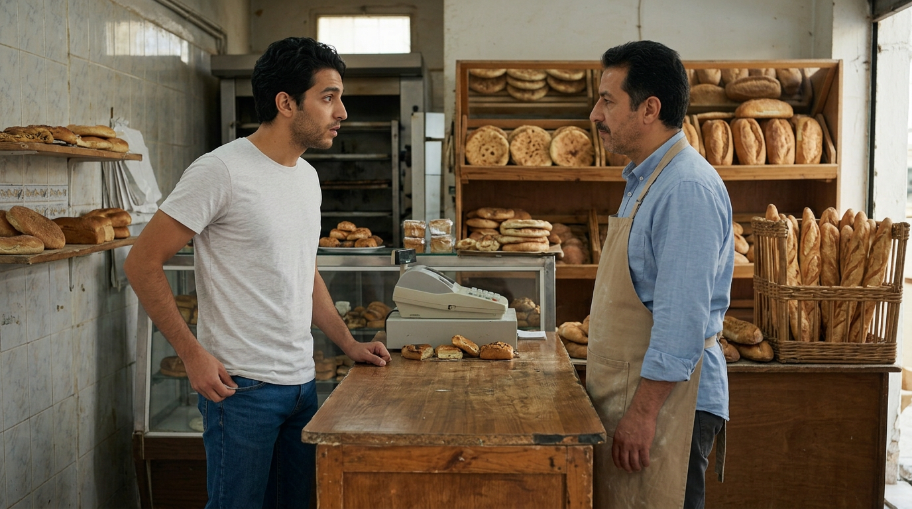

### 📝 PROMPT إنشاء الصور

**START — `SC05_START_Yassine_Bakery.png`:**

```text
CREATE A PHOTOREALISTIC CINEMATIC LIVE-ACTION STILL IMAGE, 16:9. A small authentic Algerian neighborhood bakery, natural daylight. YASSINE (exactly the YASSINE_MASTER reference: 25-year-old Algerian man, short slightly wavy black hair, light stubble, olive skin, light grey-white T-shirt, blue jeans, dark sneakers) stands at the customer side of the counter facing the BAKER (exactly the BAKER_MASTER reference: Algerian man mid-40s, short dark hair, light moustache, simple work apron over a light shirt, dark trousers) who stands behind the counter. Yassine has just reached into his trouser pocket and realizes he has no money — his expression shows mild embarrassment and surprise, not exaggerated comedy. Fresh traditional Algerian bread (kesra, khobz dar, baguettes) is visible behind the counter. Camera: medium two-shot, Yassine on the customer side, baker behind the counter. Natural bakery lighting, photorealistic live-action, realistic bread textures, 35mm, natural color grading. No text, no subtitles, no logo, no watermark.
```

### 🎬 PROMPT تحويل الصورة إلى فيديو (VIDEO GENERATION PROMPT)

```text
REFERENCE IMAGE ASSIGNMENT:
IMAGE 1 = PRIMARY REFERENCE / EXACT START FRAME: `SC05_START_Yassine_Bakery.png`

The uploaded image is the exact physical and visual starting state.
START EXACTLY FROM THE UPLOADED IMAGE.

Create ONE continuous 7-second photorealistic live-action cinematic shot, 16:9.

START STATE:
Yassine is at the customer side of the bakery counter; the baker is behind the counter. Yassine has just reached into his trouser pocket.

END STATE:
Yassine has realized he has no money and gives the baker an embarrassed look; his hand is out of the empty pocket.

SCENE PURPOSE:
The comedic setup played realistically: Yassine reaches for his money and finds nothing. The awkwardness comes from the situation, not exaggerated acting.

CHARACTERS:
YASSINE — 25-year-old Algerian man, short slightly wavy black hair, light stubble, medium olive skin, light grey-white T-shirt, blue jeans, dark sneakers.
BAKER — Algerian man mid-40s, short dark hair, light moustache, work apron over a light shirt, dark trousers.

ENVIRONMENT:
Small authentic bakery: counter, fresh traditional Algerian bread behind the counter, natural bakery lighting.

SPATIAL CONTINUITY:
WHO is where: Yassine on the customer side of the counter; the baker behind the counter. WHO faces whom: they face each other across the counter. WHERE is the camera: medium two-shot in front of the counter. WHERE is the counter: between them, fixed. WHAT direction: no movement across the counter; Yassine's hands move only within his own space (pocket checks). No one changes position.

TIMELINE:
0.0-2.0: Yassine stands at the counter, exactly from IMAGE 1.
2.0-4.0: He reaches into his trouser pocket to pay.
4.0-5.5: He checks another pocket.
5.5-7.0: He realizes he has no money and gives the baker an embarrassed look.

MOTION DYNAMICS:
Small, precise hand movements: pocket reaches, patting, empty-hand pull-out. Subtle facial micro-expressions: eyebrows rise, slight lip part, eyes flick down, a small awkward smile. The baker waits with patient friendly curiosity. Restrained, realistic comedy.

CAMERA:
Medium two-shot with very subtle handheld movement. No dramatic reframing, no sudden push-in.

DIALOGUE:
No spoken dialogue.

PRONUNCIATION:
Not applicable.

AUDIO:
Natural bakery ambience: faint oven hum, distant customers, fabric rustle of the pocket check. No music.

REALISM:
Photorealistic. The comedy is entirely situational; natural human awkwardness.

CHARACTER CONTINUITY LOCK:
Yassine and the baker consistent with their MASTER references. No identity change, no clothing change.

ENVIRONMENT CONTINUITY LOCK:
Same bakery layout, counter, bread and lighting — the same bakery used in SC06/SC07/SC08.

ENDING STATE:
Yassine's embarrassed look toward the baker — clean cut to SC06 where he speaks.

STRICT NEGATIVE RULES:
NO exaggerated acting. NO teleportation. NO morphing. NO identity drift. NO clothing change. NO crossing the counter. NO subtitles. NO captions. NO text overlays. NO logo. NO watermark. NO music.
```

---

## 🎬 SC06 — غَدْوَةْ؟

> **المدة: 10 ثواني**

### 🖼️ الصور المرجعية

**`SC06_START_Yassine_NoMoney.png`** — START — ياسين محرج والخباز يمازحه

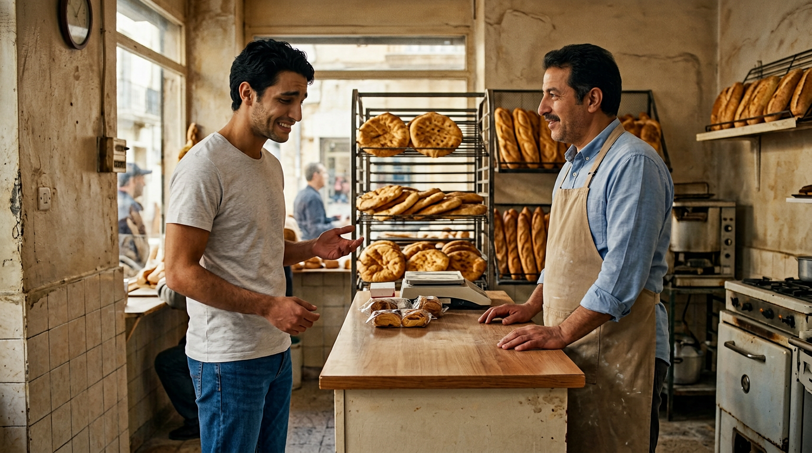

### 📝 PROMPT إنشاء الصور

**START — `SC06_START_Yassine_NoMoney.png`:**

```text
CREATE A PHOTOREALISTIC CINEMATIC LIVE-ACTION STILL IMAGE, 16:9. The SAME small Algerian bakery, same exact character positions as the previous frame. YASSINE (exactly the YASSINE_MASTER reference: 25-year-old Algerian man, short slightly wavy black hair, light stubble, olive skin, light grey-white T-shirt, blue jeans, dark sneakers) stands on the customer side of the counter looking embarrassed with an awkward smile, one hand slightly raised in a questioning gesture. The BAKER (exactly the BAKER_MASTER reference: Algerian man mid-40s, short dark hair, light moustache, work apron, dark trousers) stands behind the counter looking mildly amused but friendly, arms relaxed. Fresh Algerian bread visible behind the counter. Camera: stable medium two-shot, Yassine on one side, baker on the other, no one crossing the counter. Natural bakery lighting, photorealistic live-action, 35mm, natural color grading. No text, no subtitles, no logo, no watermark.
```

### 🎬 PROMPT تحويل الصورة إلى فيديو (VIDEO GENERATION PROMPT)

```text
REFERENCE IMAGE ASSIGNMENT:
IMAGE 1 = PRIMARY REFERENCE / EXACT START FRAME: `SC06_START_Yassine_NoMoney.png`

The uploaded image is the exact physical and visual starting state.
START EXACTLY FROM THE UPLOADED IMAGE.

Create ONE continuous 10-second photorealistic live-action cinematic shot, 16:9.

START STATE:
Yassine stands at the customer side of the counter, embarrassed, awkward smile. The baker stands behind the counter, mildly amused but friendly.

END STATE:
After the exchange, Yassine is silent with an awkward embarrassed smile; the baker watches with light amusement.

SCENE PURPOSE:
The light comic peak: Yassine asks to pay tomorrow; the baker teases him that he said the same yesterday.

CHARACTERS:
YASSINE — 25-year-old Algerian man, short slightly wavy black hair, light stubble, medium olive skin, light grey-white T-shirt, blue jeans, dark sneakers.
BAKER — Algerian man mid-40s, short dark hair, light moustache, work apron, dark trousers.

ENVIRONMENT:
Same small bakery, fresh bread behind the counter, natural lighting.

SPATIAL CONTINUITY:
WHO is where: Yassine on the customer side; the baker behind the counter. WHO faces whom: they face each other across the counter. WHERE is the camera: stable medium two-shot in front of the counter. WHERE is the counter: fixed between them. WHAT direction: no movement across the counter; only subtle upper-body and facial movement. No one changes position; no one crosses the counter.

TIMELINE:
0.0-2.0: Yassine looks embarrassed and checks his empty pocket once more.
2.0-5.0: Yassine says: «عَمِّي... نَقْدِرْ نَخْلَصْكْ غَدْوَة؟» — embarrassed but sincere.
5.0-8.0: The baker replies with light teasing, not angry: «غَدْوَة؟ أَنْتَ اَلْبَارَحْ قُلْتْلِي غَدْوَة!»
8.0-10.0: Yassine becomes silent and gives an awkward embarrassed smile.

MOTION DYNAMICS:
Subtle upper-body movement, natural blinking and breathing, accurate lip-sync for both speakers, small nervous hand gesture from Yassine, the baker's amused eyebrow raise and head tilt. No overacting, no robotic lips.

CAMERA:
Stable medium two-shot. Only very subtle handheld sway. No crossing the counter, no sudden push-in, no camera movement around the counter.

DIALOGUE:
Yassine: «عَمِّي... نَقْدِرْ نَخْلَصْكْ غَدْوَة؟»
Baker: «غَدْوَة؟ أَنْتَ اَلْبَارَحْ قُلْتْلِي غَدْوَة!»
Natural Algerian Darija, embarrassed sincere young voice, then light teasing middle-aged voice. Clear speaker separation, accurate lip-sync, no extra words.

PRONUNCIATION:
Natural Algerian Darija. Yassine: hesitant, embarrassed, sincere. Baker: playful, teasing, friendly — NOT angry, NOT theatrical. Normal speed, natural pauses and breathing.

AUDIO:
Natural bakery ambience, clear dialogue. Small clothing movement. No music, no narrator.

REALISM:
Photorealistic. Natural embarrassed body language, realistic teasing tone, believable facial animation.

CHARACTER CONTINUITY LOCK:
Yassine and the baker consistent with their MASTER references. No identity change, no clothing change, no morphing.

ENVIRONMENT CONTINUITY LOCK:
Same bakery, same counter, same bread, same lighting as SC05.

ENDING STATE:
Yassine's awkward smile holds for a beat — clean cut to SC07 as the old woman enters.

STRICT NEGATIVE RULES:
NO character movement across the counter. NO extra words. NO overlapping dialogue. NO subtitles. NO captions. NO text overlays. NO morphing. NO identity drift. NO logo. NO watermark. NO music.
```

---

## 🎬 SC07 — أَنَا نَخْلَصْ عَلِيهْ

> **المدة: 9 ثواني**

### 🖼️ الصور المرجعية

**`SC07_START_OldWoman_EntersBakery.png`** — START — العجوز تدخل المخبزة

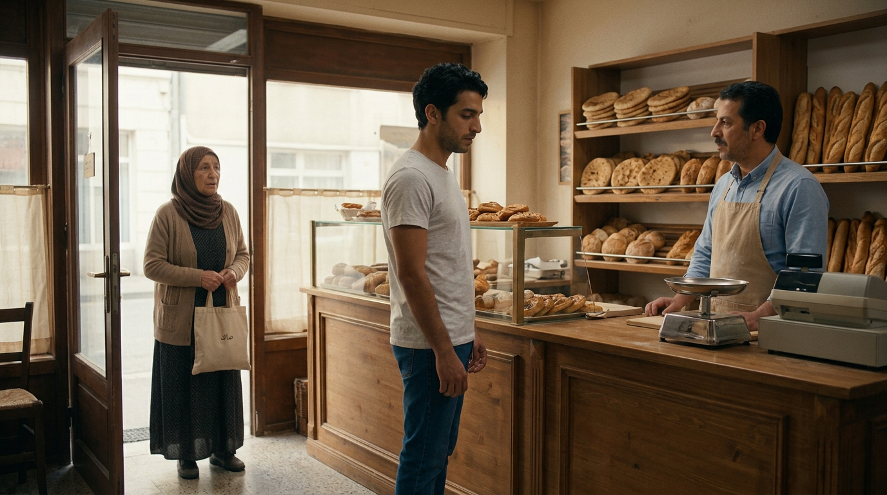

**`SC07_END_OldWoman_Pays.png`** — END — العجوز تدفع عن ياسين

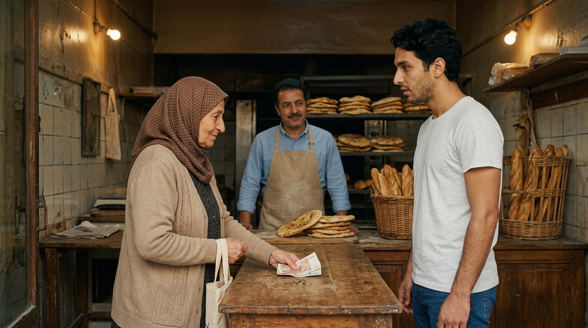

### 📝 PROMPT إنشاء الصور

**START — `SC07_START_OldWoman_EntersBakery.png`:**

```text
CREATE A PHOTOREALISTIC CINEMATIC LIVE-ACTION STILL IMAGE, 16:9. The SAME small Algerian bakery as the previous scenes, same layout, same lighting. The ELDERLY WOMAN (exactly the ELDERLY_WOMAN_MASTER reference: 65-70-year-old Algerian woman, brown/beige hijab, modest dress with light cardigan, holding her cloth bread bag) has JUST ENTERED the bakery and stands near the entrance inside, looking toward the counter with recognition. At the counter: YASSINE (exactly the YASSINE_MASTER reference: 25-year-old Algerian man, short wavy black hair, light stubble, olive skin, light grey-white T-shirt, blue jeans) stands at the customer side looking embarrassed; the BAKER (exactly the BAKER_MASTER reference: mid-40s, short dark hair, light moustache, work apron) stands behind the counter. All three characters visible in the same space: the old woman near the entrance, Yassine at the counter, the baker behind it. Camera: medium-wide shot from inside the bakery showing all three. Natural bakery lighting, photorealistic live-action, 35mm, natural color grading. No text, no subtitles, no logo, no watermark.
```

**END — `SC07_END_OldWoman_Pays.png`:**

```text
CREATE A PHOTOREALISTIC CINEMATIC LIVE-ACTION STILL IMAGE, 16:9. The SAME small Algerian bakery, same layout and lighting. ACTION: the ELDERLY WOMAN (exactly the ELDERLY_WOMAN_MASTER reference: 65-70-year-old Algerian woman, brown/beige hijab, modest dress, cloth bread bag) now stands AT the counter BESIDE Yassine, placing money gently on the counter with her hand, a warm sincere look on her face. YASSINE (exactly the YASSINE_MASTER reference: 25-year-old Algerian man, short wavy black hair, light stubble, olive skin, light grey-white T-shirt, blue jeans) stands beside her at the customer side, looking surprised and grateful. The BAKER (exactly the BAKER_MASTER reference: mid-40s, short dark hair, light moustache, work apron) stands behind the counter, watching with a small warm smile. Fresh Algerian bread visible behind the counter. Camera: medium two-shot focused on the old woman and Yassine at the counter, baker readable behind. Natural bakery lighting, photorealistic live-action, 35mm, natural color grading. No text, no subtitles, no logo, no watermark.
```

### 🎬 PROMPT تحويل الصورة إلى فيديو (VIDEO GENERATION PROMPT)

```text
REFERENCE IMAGE ASSIGNMENT:
IMAGE 1 = PRIMARY REFERENCE / EXACT START FRAME: `SC07_START_OldWoman_EntersBakery.png`
IMAGE 2 = END FRAME: `SC07_END_OldWoman_Pays.png`

The first uploaded image is the exact physical and visual starting state.
The second uploaded image is the exact visual ending state.
START EXACTLY FROM IMAGE 1. END EXACTLY AT IMAGE 2.
Do not treat the two images as a slideshow. Create the physical action that connects them.

Create ONE continuous 9-second photorealistic live-action cinematic shot, 16:9.

START STATE:
The elderly woman has just entered the bakery and stands near the entrance, holding her cloth bread bag, looking at Yassine with recognition. Yassine is at the counter, embarrassed. The baker is behind the counter.

END STATE:
The elderly woman stands at the counter beside Yassine, placing money on the counter; Yassine is surprised and grateful; the baker watches warmly.

SCENE PURPOSE:
The emotional turn: the same old woman enters, recognizes Yassine, and pays for his bread — kindness comes back around.

CHARACTERS:
ELDERLY WOMAN — 65-70-year-old Algerian woman, brown/beige hijab, modest dress with light cardigan, cloth bread bag.
YASSINE — 25-year-old Algerian man, short slightly wavy black hair, light stubble, medium olive skin, light grey-white T-shirt, blue jeans.
BAKER — mid-40s Algerian man, short dark hair, light moustache, work apron.

ENVIRONMENT:
Same small bakery, same counter, fresh bread, natural lighting.

SPATIAL CONTINUITY:
WHO is where: the old woman near the entrance at the start, then walking to the counter beside Yassine; Yassine at the customer side; the baker behind the counter. WHO faces whom: the woman faces toward the counter/Yassine; she and Yassine face each other at the counter; the baker faces them. WHERE is the camera: medium-wide inside the bakery, then a small natural adjustment following her walk to the counter. WHERE is the counter: fixed. WHERE is the purse/money: in her small purse, taken out and placed on the counter. WHAT direction: the woman walks from the entrance to the counter — a natural, visible physical movement. No teleport, no sudden appearance.

TIMELINE:
0.0-2.0: The elderly woman enters and notices Yassine (from IMAGE 1).
2.0-4.0: She walks naturally toward the counter — entrance to counter, visible steps.
4.0-5.5: She takes money from her small purse.
5.5-7.5: She places the money gently on the counter and says: «خَلِّيهْ يَا وْلِيدِي، أَنَا نَخْلَصْ عَلِيهْ.»
7.5-9.0: Yassine looks surprised and grateful, settling into IMAGE 2.

MOTION DYNAMICS:
Natural walking (entrance to counter), natural purse handling, the gentle placement of money on the counter, warm facial expressions, accurate lip-sync for the line. No exaggerated acting, no sudden movement.

CAMERA:
Medium-wide shot with a small natural camera adjustment (subtle pan/reframe) following the old woman's entrance and walk to the counter, settling into the two-shot of IMAGE 2. No cut, no teleport, no sudden push-in.

DIALOGUE:
Elderly woman: «خَلِّيهْ يَا وْلِيدِي، أَنَا نَخْلَصْ عَلِيهْ.»
Natural Algerian Darija, warm sincere elderly female voice, accurate lip-sync. No other dialogue.

PRONUNCIATION:
Natural Algerian Darija, warm and sincere, normal conversational speed and rhythm, natural pauses.

AUDIO:
Bakery ambience, gentle footsteps, small purse and coin sounds, the money placed on the counter, clear dialogue. No music, no narrator.

REALISM:
Photorealistic live-action. Warm human moment, natural movement, realistic skin texture, natural lighting.

CHARACTER CONTINUITY LOCK:
All three characters consistent with their MASTER references. No identity change, no clothing change, no morphing.

ENVIRONMENT CONTINUITY LOCK:
Same bakery, same counter, same bread display, same lighting as SC05/SC06.

ENDING STATE:
Yassine's surprised grateful look and the money on the counter, matching IMAGE 2 — clean cut to SC08.

STRICT NEGATIVE RULES:
NO teleportation. NO sudden appearance/disappearance of the woman. NO exaggerated acting. NO extra dialogue. NO subtitles. NO captions. NO text overlays. NO morphing. NO identity drift. NO logo. NO watermark. NO music.
```

---

## 🎬 SC08 — اَلْخِيرْ مَا يَضِيعْشْ

> **المدة: 4 ثواني**

### 🖼️ الصور المرجعية

**`SC08_END_FinalMessage.png`** — النهاية — لحظة الامتنان

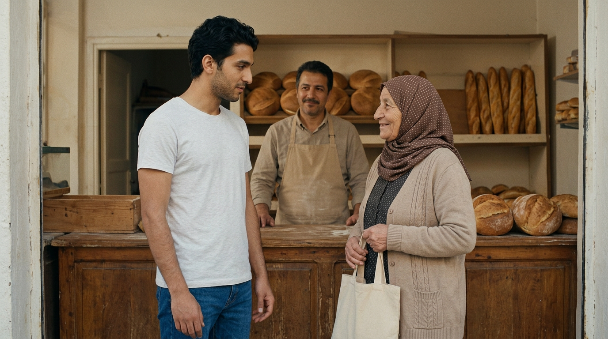

### 📝 PROMPT إنشاء الصور

**START — `SC08_END_FinalMessage.png`:**

```text
CREATE A PHOTOREALISTIC CINEMATIC LIVE-ACTION STILL IMAGE, 16:9. Inside the SAME small Algerian bakery, warm natural daylight, quiet emotional atmosphere. YASSINE (exactly the YASSINE_MASTER reference: 25-year-old Algerian man, short wavy black hair, light stubble, olive skin, light grey-white T-shirt, blue jeans) stands BESIDE the ELDERLY WOMAN (exactly the ELDERLY_WOMAN_MASTER reference: 65-70-year-old Algerian woman, brown/beige hijab, modest dress, cloth bread bag) near the counter. He looks at her with genuine gratitude; she gives him a warm reassuring smile. The BAKER (exactly the BAKER_MASTER reference: mid-40s, short dark hair, light moustache, work apron) remains naturally behind the counter with a small smile. Warm natural daylight, natural skin texture, quiet emotional atmosphere. Camera: warm medium two-shot on Yassine and the old woman, baker readable in the background. Photorealistic Algerian cinema, 35mm cinematic lens, subtle film grain, natural color grading. No text, no subtitles, no logo, no watermark.
```

### 🎬 PROMPT تحويل الصورة إلى فيديو (VIDEO GENERATION PROMPT)

```text
REFERENCE IMAGE ASSIGNMENT:
IMAGE 1 = PRIMARY REFERENCE / EXACT START FRAME: `SC08_END_FinalMessage.png`

The uploaded image is the exact physical and visual starting state.
START EXACTLY FROM THE UPLOADED IMAGE.

Create ONE continuous 4-second photorealistic live-action cinematic shot, 16:9.

START STATE:
Yassine stands beside the elderly woman near the counter, looking at her with gratitude; she looks at him warmly; the baker is behind the counter.

END STATE:
Hold on Yassine's grateful expression after the old woman's final line — the film's last frame.

SCENE PURPOSE:
The emotional finale and the film's message: الخير ما يضيعش (kindness is never lost). Yassine asks why she paid; she answers with the message.

CHARACTERS:
YASSINE — 25-year-old Algerian man, short slightly wavy black hair, light stubble, medium olive skin, light grey-white T-shirt, blue jeans.
ELDERLY WOMAN — 65-70-year-old Algerian woman, brown/beige hijab, modest dress, cloth bread bag.
BAKER — mid-40s Algerian man, short dark hair, light moustache, work apron (background, subtle).

ENVIRONMENT:
Same bakery, warm natural daylight, quiet emotional atmosphere.

SPATIAL CONTINUITY:
WHO is where: Yassine and the elderly woman standing beside each other near the counter; the baker behind the counter. WHO faces whom: they face each other; the baker faces them. WHERE is the camera: warm medium two-shot on Yassine and the woman. WHAT direction: no movement — a still, intimate exchange. No one changes position.

TIMELINE:
0.0-2.0: Yassine looks at the elderly woman with gratitude and says softly: «خَالْتِي، بَصَحّْ عْلَاشْ؟»
2.0-4.0: She smiles and replies: «عَلَى خَاطَرْ اَلْيَوْمْ عَاوَنْتْنِي... وَغَدْوَة يُمْكِنْ أَنْتَ تَحْتَاجْ وَاحِدْ يْعَاوْنِكْ.» End on Yassine's grateful expression.

MOTION DYNAMICS:
Gentle, warm micro-movements: soft eye contact, small smiles, subtle nods, accurate lip-sync for both short lines, natural blinking and breathing. A very subtle slow push-in. No overacting.

CAMERA:
Warm stable medium two-shot with a very subtle slow push-in during the exchange. No cut, no sudden movement, no teleporting camera.

DIALOGUE:
Yassine: «خَالْتِي، بَصَحّْ عْلَاشْ؟»
Elderly woman: «عَلَى خَاطَرْ اَلْيَوْمْ عَاوَنْتْنِي... وَغَدْوَة يُمْكِنْ أَنْتَ تَحْتَاجْ وَاحِدْ يْعَاوْنِكْ.»
Natural Algerian Darija, soft young voice, warm sincere elderly voice, natural conversational rhythm, accurate lip-sync, clear speaker separation.

PRONUNCIATION:
Natural Algerian Darija, soft, sincere, warm. Normal speed, natural pauses (the ellipsis is a genuine pause), no theatrical tone.

AUDIO:
Natural bakery ambience, soft room tone, clear dialogue. No music, no narrator.

REALISM:
Photorealistic Algerian cinema, warm natural skin texture, subtle film grain, 35mm.

CHARACTER CONTINUITY LOCK:
Yassine and the elderly woman consistent with their MASTER references. No identity change, no clothing change, no morphing.

ENVIRONMENT CONTINUITY LOCK:
Same bakery, same counter, same lighting as SC07.

ENDING STATE:
Hold on Yassine's grateful expression — the film's final frame. Message: الخير ما يضيعش.

STRICT NEGATIVE RULES:
NO music. NO subtitles. NO captions. NO text overlays. NO morphing. NO identity drift. NO teleportation. NO extra dialogue. NO logo. NO watermark.
```

---

## 🎞️ الترتيب النهائي والمدة

```text
SC01 = 7s
SC02 = 8s
SC03 = 8s
SC04 = 7s
SC05 = 7s
SC06 = 10s
SC07 = 9s
SC08 = 4s
TOTAL = 60 SECONDS
```

**ترتيب المونتاج:** SC01 → SC02 → SC03 → SC04 → SC05 → SC06 → SC07 → SC08

- **Cuts طبيعية** بين المشاهد، بدون انتقالات مبالغ فيها.
- **ACTION MATCH إجباري:** SC02_END → SC03_START (نفس وضعية الانحناء).
- **الرسالة الأخيرة:** 🥖 **الخير ما يضيعش.**

## ✅ خطوات الإنتاج
1. ارفع صورة/صور المشهد (بالترتيب: IMAGE 1 ثم IMAGE 2).
2. الصق PROMPT تحويل الصورة إلى فيديو (فيه كل شيء: الحالة + الحركة + الحوار المشكّل + الصوت + القواعد).
3. ولّد بالمدة المحددة (7/8/8/7/7/10/9/4 ثواني).
4. اربطهم في المونتاج.

© LATCHI AI — 🎬 100% جزائري 🇩🇿
