# 🕷️ سوبر ذزيري — المذكرة النهائية (برومبوت واحد لكل مشهد)

> **24 مشهد × 10 ثواني = 4 دقائق** — Dola / Seedance 2.5

> **كل مشهد:** الصورة/الصور فوق + برومبوت واحد شامل (كل شيء فيه)

> **عدد الصور:** المشهد عنده 1 أو 2 صورة — مذكور في كل مشهد


---

## 📊 جدول الصور لكل مشهد

| المشهد | الحدث | عدد الصور | أسماء الصور |
|---|---|---|---|
| 01 | دخول السوق → بائع الخضر | 2 | `SDZ_01_START_Anis_EnteringMarket.png`<br>`SDZ_01_END_Anis_TomatoStall.png` |
| 02 | عند الطماطم → اللدغة | 2 | `SDZ_02_START_Anis_TomatoStall.png`<br>`SDZ_02_END_Anis_Bite.png` |
| 03 | آثار القوة / الالتصاق | 1 | `SDZ_03_END_Anis_WallClimb.png` |
| 04 | تجربة الخيط / الفشل | 1 | `SDZ_04_END_Anis_ThreadFail.png` |
| 05 | سرقة حقيبة زهرة | 1 | `SDZ_05_Thief_Snatches_Zahra_Bag.png` |
| 06 | المطاردة إلى الزقاق | 1 | `SDZ_06_END_Thief_AlleyEntrance.png` |
| 07 | سوبر ذزيري يمسك الحرامي | 1 | `SDZ_07_END_SuperDziri_StopsThief.png` |
| 08 | رجوع الحقيبة | 1 | `SDZ_08_Zahra_GetsBag_Back.png` |
| 09 | التاكسي | 1 | `SDZ_09_Taxi_Anis_SiTahar.png` |
| 10 | التحول إلى سوبر ذزيري | 2 | `SDZ_10_START_Anis_HiddenAlley.png`<br>`SDZ_10_END_SuperDziri_Ready.png` |
| 11 | أول ظهور | 1 | `SDZ_11_END_SuperDziri_FirstAppearance.png` |
| 12 | البلدية | 1 | `SDZ_12_Anis_Zahra_Baladiya.png` |
| 13 | نهاية اليوم الأول (السطح) | 1 | `SDZ_13_SuperDziri_Rooftop_Sunset.png` |
| 14 | صباح اليوم التالي / الحي يتكلم | 1 | `SDZ_14_Anis_Neighborhood_Morning.png` |
| 15 | سيلفي مع سي الطاهر | 1 | `SDZ_15_Anis_SiTahar_Selfie.png` |
| 16 | طابور المخبزة | 1 | `SDZ_16_Anis_BakeryQueue.png` |
| 17 | اكتشاف المنتجات المقلدة | 2 | `SDZ_17_START_Anis_MarketFakeShoes.png`<br>`SDZ_17_END_Anis_LeavingStall.png` |
| 18 | التحول الثاني | 2 | `SDZ_18_START_Anis_RooftopBag.png`<br>`SDZ_18_END_SuperDziri_RooftopReady.png` |
| 19 | كشف المقلدة | 1 | `SDZ_19_END_SuperDziri_FakeShoeStall.png` |
| 20 | مساعدة قويدر | 1 | `SDZ_20_SuperDziri_Kouider.png` |
| 21 | فض الشجار | 1 | `SDZ_21_SuperDziri_StopsFight.png` |
| 22 | مطاردة قويدر → Match Cut | 2 | `SDZ_22_START_SuperDziri_Chase.png`<br>`SDZ_22_END_AlleyCorner.png` |
| 23 | Match Cut: الأطفال | 1 | `SDZ_23_END_SuperDziri_WithChildren.png` |
| 24A | سرقة السيارة | 1 | `SDZ_24A_Car_Thief.png` |
| 24B | الشاي مع زهرة | 1 | `SDZ_24B_SuperDziri_Zahra_Tea.png` |
| 24C | التصالح مع قويدر → النهاية | 2 | `SDZ_24C_START_Kouider_Handshake.png`<br>`SDZ_24C_END_Rooftop_Sunset.png` |

---

## 🎬 المشهد 01 — دخول السوق → بائع الخضر

**SDZ_01_START_Anis_EnteringMarket.png**


**SDZ_01_END_Anis_TomatoStall.png**


**📝 البرومبوت الشامل (انسخه كله):**
```text
REFERENCE IMAGE ASSIGNMENT:
IMAGE 1 = START FRAME: `SDZ_01_START_Anis_EnteringMarket.png`
IMAGE 2 = END FRAME: `SDZ_01_END_Anis_TomatoStall.png`

The first uploaded image is the exact visual starting state.
The second uploaded image is the exact visual ending state.
START FROM IMAGE 1. END AT IMAGE 2.
Do not treat the two images as a slideshow. Create the physical action that connects them.

Create ONE continuous 10-second photorealistic live-action cinematic shot.

TIMELINE:
0-2s: Anis continues walking naturally into the crowded vegetable market exactly from IMAGE 1.
2-5s: He walks forward toward the vegetable stalls at a normal human pace.
5-8s: He gradually slows and approaches the tomato stall; the camera smoothly follows him.
8-10s: He stops beside the stall and naturally settles into the exact position and orientation shown in IMAGE 2.

CAMERA:
Smooth handheld tracking from behind, then a subtle natural move toward a three-quarter side view as Anis approaches the stall. No sudden camera jump.

CHARACTER CONTINUITY:
Keep Anis's face, hairstyle, gray T-shirt, blue jeans, black shoulder bag, body proportions and identity consistent. His bag and clothing react naturally to his walking.

ENVIRONMENT:
Preserve the same Algerian market, stalls, vegetables, pedestrians, architecture, lighting and time of day. Background people move subtly and independently.

DIALOGUE:
Anis says naturally in Algerian Darija: «ربي يجيب الخير اليوم.»
He speaks while walking, with realistic lip-sync. Do not invent additional dialogue.

AUDIO:
Natural Algerian market ambience, footsteps, distant vendors and crowd noise. Dialogue must remain intelligible.

ENDING:
The final moment must closely match IMAGE 2 in character position, body orientation, environment and camera geography, creating a clean starting point for Scene 02.

STRICT:
No teleportation. No morphing. No image blending. No reverse walking. No sudden location change. No costume change. No identity drift. No subtitles. No added text.
```


---

## 🎬 المشهد 02 — عند الطماطم → اللدغة

**SDZ_02_START_Anis_TomatoStall.png**

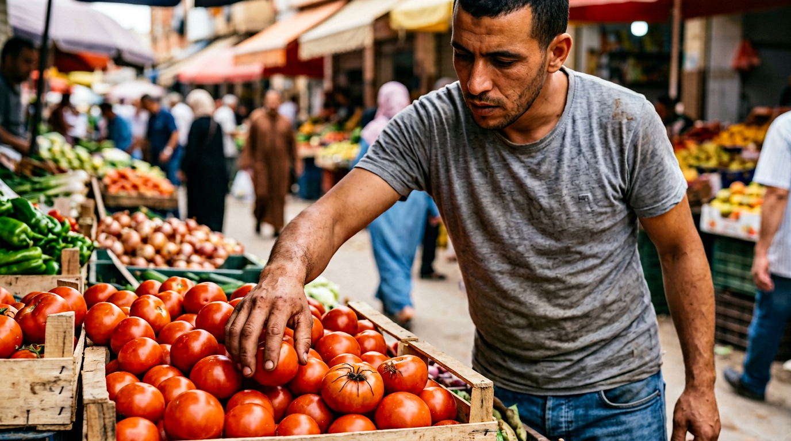

**SDZ_02_END_Anis_Bite.png**

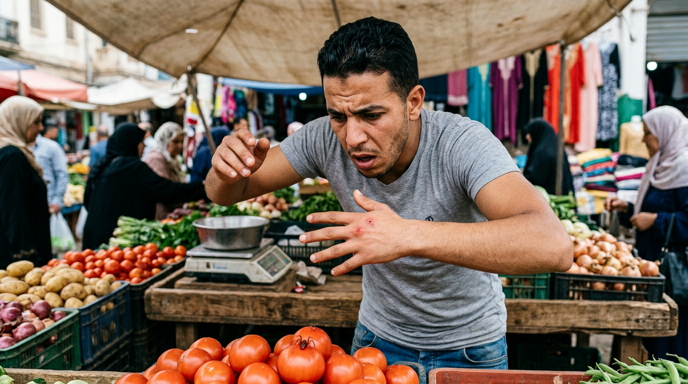

**📝 البرومبوت الشامل (انسخه كله):**
```text
REFERENCE IMAGE ASSIGNMENT:
IMAGE 1 = START FRAME: `SDZ_02_START_Anis_TomatoStall.png`
IMAGE 2 = END FRAME: `SDZ_02_END_Anis_Bite.png`

IMAGE 1 is the exact beginning. IMAGE 2 is the exact ending.
Build one continuous physical action between them.

Create ONE continuous 10-second photorealistic live-action shot.

TIMELINE:
0-2s: Anis stands at the tomato stall and naturally selects a tomato.
2-4s: A small spider suddenly bites him on the hand; the bite is quick and believable.
4-6s: He reacts with a short realistic startle and pulls his hand back.
6-8s: He examines the bitten hand with confusion and mild alarm.
8-10s: He delivers the exact dialogue and settles into the final pose shown in IMAGE 2.

CAMERA:
Start at a medium three-quarter view matching IMAGE 1. Make a subtle push-in during the bite and reaction. Keep the camera physically continuous and end close to the composition of IMAGE 2.

CHARACTER CONTINUITY:
Preserve Anis's exact appearance, clothing, hairstyle, body proportions and identity. Preserve the same stall and market geography.

DIALOGUE:
Anis: «آي! واش هادي؟! عنكبوت؟ في السوق؟!»
Natural Algerian Darija pronunciation and accurate lip-sync. No extra words.

AUDIO:
Market ambience, a small realistic bite/reaction sound, Anis's brief startled voice, then surrounding market noise.

ENDING:
The final pose and hand position must closely match IMAGE 2 so the shot can be edited directly into Scene 03.

STRICT:
No giant spider. No exaggerated cartoon reaction. No teleportation. No morphing. No identity drift. No sudden camera cut. No subtitles or invented dialogue.
```


---

## 🎬 المشهد 03 — آثار القوة / الالتصاق

**SDZ_03_END_Anis_WallClimb.png**

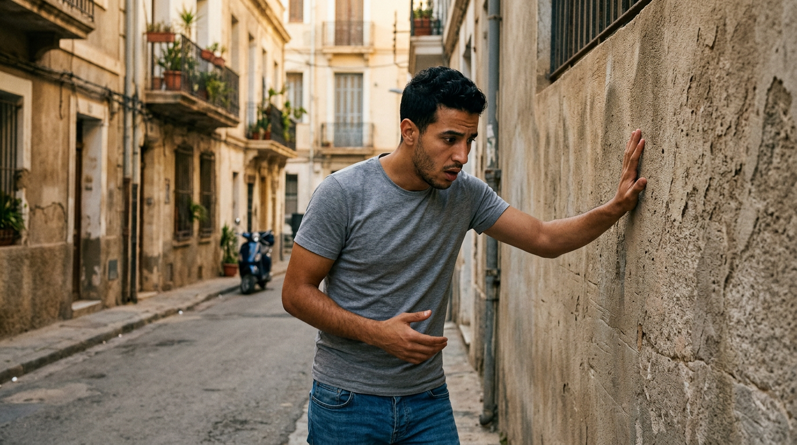

**📝 البرومبوت الشامل (انسخه كله):**
```text
REFERENCE IMAGE ASSIGNMENT:
IMAGE 1 = PRIMARY REFERENCE / START FRAME: `SDZ_03_END_Anis_WallClimb.png`

Use the uploaded image as the exact visual starting state. Do not reconstruct a previous scene.

Create ONE continuous 10-second photorealistic live-action shot.

TIMELINE:
0-2s: Anis begins exactly from the pose in the reference and tests his hand against the wall.
2-4s: His palm sticks naturally to the wall; show believable contact and resistance.
4-6s: He carefully raises one foot and tests whether it can also grip.
6-8s: He makes one short, awkward climbing movement.
8-10s: He realizes the strange ability and carefully returns to a stable standing position.

CAMERA:
Medium side-angle shot with a small handheld adjustment following his hand and foot. Keep the wall and street geography fixed.

CHARACTER / ENVIRONMENT:
Preserve exact identity, clothing, body proportions, wall texture, lighting and location.

DIALOGUE:
Anis: «واش بيّا اليوم؟»
Natural Algerian Darija, clear lip-sync, no extra dialogue.

AUDIO:
Foot movement, subtle contact sound from the palm against the wall, street ambience.

ENDING:
End in a stable believable pose that can be cut cleanly into Scene 04.

STRICT:
No superhero spectacle yet. No impossible floating. No teleportation. No morphing. No sudden environment change. No subtitles.
```


---

## 🎬 المشهد 04 — تجربة الخيط / الفشل

**SDZ_04_END_Anis_ThreadFail.png**

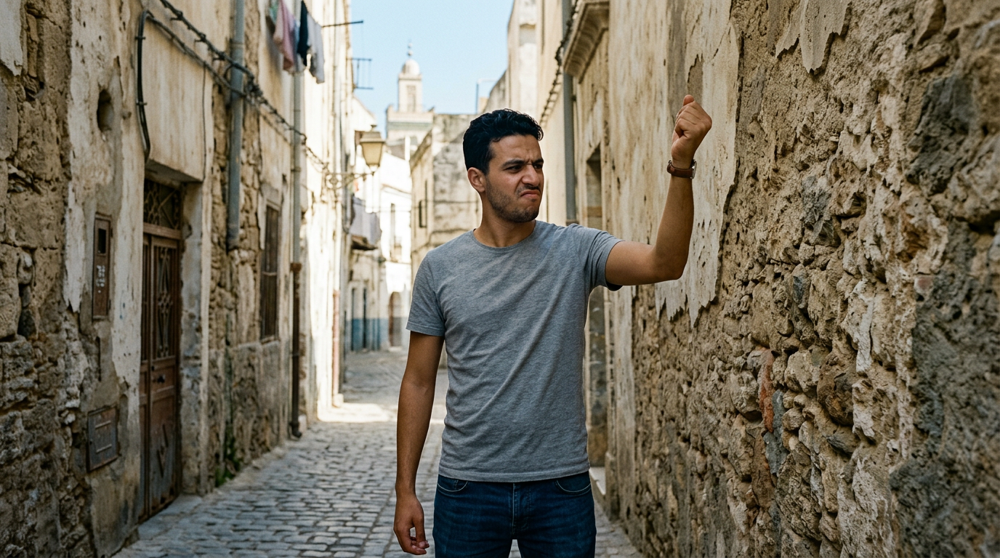

**📝 البرومبوت الشامل (انسخه كله):**
```text
REFERENCE IMAGE ASSIGNMENT:
IMAGE 1 = PRIMARY REFERENCE / START FRAME: `SDZ_04_END_Anis_ThreadFail.png`

Begin exactly from the uploaded image. The image is the visual starting state.

Create ONE continuous 10-second photorealistic live-action shot.

TIMELINE:
0-2s: Anis raises his wrist exactly from the reference pose.
2-4s: He attempts to shoot a web/thread from his wrist.
4-6s: Nothing happens; he looks at his wrist in disbelief.
6-8s: He makes one second, smaller attempt.
8-10s: He gives up with a frustrated, slightly funny expression.

CAMERA:
Stable medium shot with a very subtle push toward his wrist during the failed attempt. No sudden reframing.

CHARACTER / ENVIRONMENT:
Preserve exact face, clothing, body proportions, location and lighting.

DIALOGUE:
Anis: «يلا... نشوفو واش تقدر دير.»
Natural Algerian Darija pronunciation and lip-sync.

AUDIO:
Small failed mechanical/web-like sound, subtle street ambience and a light comic reaction. No exaggerated cartoon effects.

ENDING:
Finish on his frustrated expression and stable body position, suitable for a clean cut to Scene 05.

STRICT:
No successful web. No superhero powers beyond the described failed attempt. No morphing. No teleportation. No extra dialogue. No subtitles.
```


---

## 🎬 المشهد 05 — سرقة حقيبة زهرة

**SDZ_05_Thief_Snatches_Zahra_Bag.png**

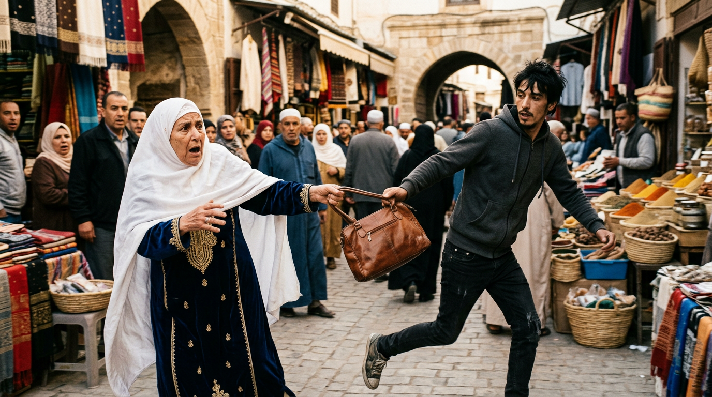

**📝 البرومبوت الشامل (انسخه كله):**
```text
REFERENCE IMAGE ASSIGNMENT:
IMAGE 1 = PRIMARY REFERENCE / START FRAME: `SDZ_05_Thief_Snatches_Zahra_Bag.png`

Begin exactly from the uploaded image.

Create ONE continuous 10-second photorealistic live-action shot.

TIMELINE:
0-2s: The thief moves closer to Zahra while pretending to pass by.
2-4s: He quickly grabs Zahra's bag.
4-6s: Zahra reacts with surprise and shouts.
6-8s: The thief runs away through the market.
8-10s: Zahra points urgently in the direction he escaped.

CAMERA:
Start with the reference composition, then perform a controlled handheld pan following the thief's escape while keeping Zahra readable.

CHARACTER / ENVIRONMENT:
Preserve the exact people, clothing, market geography, lighting and time of day shown in the reference.

DIALOGUE:
Zahra: «آي يا ولدي! الحرامي! الحقو! سرقلي حقيبتي!»
Natural Algerian Darija pronunciation, emotional but believable, with accurate lip-sync.

AUDIO:
Market ambience suddenly reacts to the shout; footsteps of the thief; surrounding voices.

ENDING:
End with Zahra pointing toward the escape route, leaving a clear directional motivation for Scene 06.

STRICT:
No teleportation. No exaggerated action-movie movement. No identity drift. No new major characters. No subtitles.
```


---

## 🎬 المشهد 06 — المطاردة إلى الزقاق

**SDZ_06_END_Thief_AlleyEntrance.png**

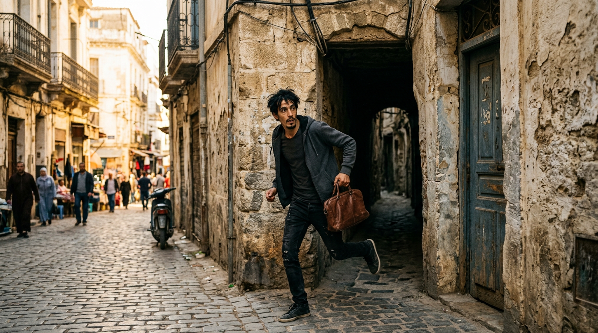

**📝 البرومبوت الشامل (انسخه كله):**
```text
REFERENCE IMAGE ASSIGNMENT:
IMAGE 1 = PRIMARY REFERENCE / START FRAME: `SDZ_06_END_Thief_AlleyEntrance.png`

Begin exactly from the uploaded image.

Create ONE continuous 10-second photorealistic live-action chase shot.

TIMELINE:
0-2s: The thief runs forward from the reference position.
2-5s: Camera follows behind him as he moves through the market.
5-7s: He passes pedestrians who react naturally and make room.
7-10s: He reaches and enters the alley entrance shown by the reference geography.

CAMERA:
Handheld chase camera at realistic human running height. Slight natural shake, never chaotic. Keep the thief centered enough to follow.

CHARACTER / ENVIRONMENT:
Preserve thief clothing, body proportions, market architecture and lighting.

DIALOGUE:
No spoken dialogue.

AUDIO:
Footsteps, breathing, crowd reactions and market ambience.

ENDING:
End with the thief entering the alley, creating a logical cut into Scene 07.

STRICT:
No teleportation. No impossible running speed. No camera flying. No morphing. No sudden location change.
```


---

## 🎬 المشهد 07 — سوبر ذزيري يمسك الحرامي

**SDZ_07_END_SuperDziri_StopsThief.png**

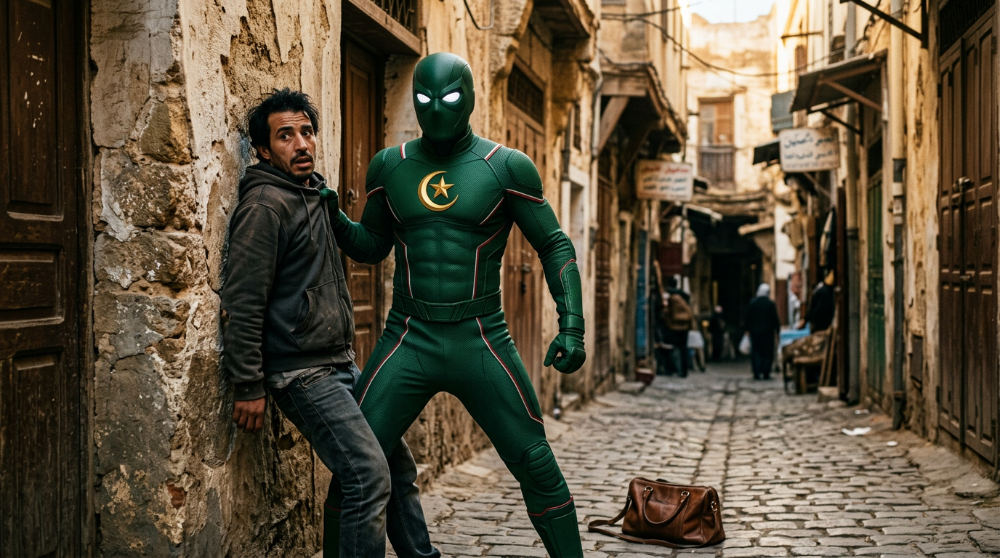

**📝 البرومبوت الشامل (انسخه كله):**
```text
REFERENCE IMAGE ASSIGNMENT:
IMAGE 1 = PRIMARY REFERENCE / START FRAME: `SDZ_07_END_SuperDziri_StopsThief.png`

Begin exactly from the uploaded image.

Create ONE continuous 10-second photorealistic live-action shot.

TIMELINE:
0-2s: Super Dziri firmly holds the thief by the back of his clothing.
2-4s: The thief struggles briefly but cannot escape.
4-6s: The stolen bag falls clearly into view.
6-8s: Super Dziri looks at the thief and gives him a stern warning.
8-10s: He points toward the bag, making it clear that it belongs to Zahra.

CAMERA:
Medium shot with a subtle handheld move around the two men, maintaining clear geography.

DIALOGUE:
Super Dziri: «تسرق حقيبة وحدة عجوز؟ عيب عليك! هذي حقيبة خالتي زهرة!»
Natural Algerian Darija, firm but conversational, accurate lip-sync.

AUDIO:
Alley ambience, fabric movement, footsteps and clear dialogue.

ENDING:
Hold the final pointing gesture for a moment so Scene 08 can cut cleanly from the action.

STRICT:
No excessive violence. No punches. No morphing. No teleportation. No costume change. No subtitles.
```


---

## 🎬 المشهد 08 — رجوع الحقيبة

**SDZ_08_Zahra_GetsBag_Back.png**

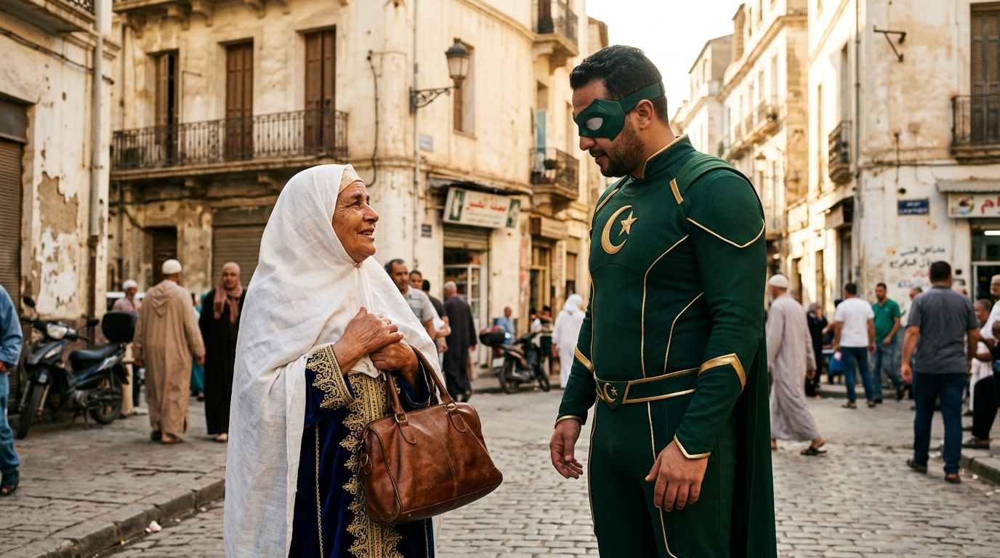

**📝 البرومبوت الشامل (انسخه كله):**
```text
REFERENCE IMAGE ASSIGNMENT:
IMAGE 1 = PRIMARY REFERENCE / START FRAME: `SDZ_08_Zahra_GetsBag_Back.png`

Begin exactly from the uploaded image.

Create ONE continuous 10-second photorealistic live-action shot.

TIMELINE:
0-2s: Super Dziri approaches Zahra with the recovered bag.
2-4s: He extends the bag toward her.
4-6s: Zahra takes it with relief.
6-8s: She thanks him warmly.
8-10s: He gives a small humble nod.

CAMERA:
Gentle medium two-shot. Small natural push-in during the handoff. Keep both faces and the bag visible.

DIALOGUE:
Zahra: «ربي يحفظك يا ولدي.»
Super Dziri: «المهم رجعتلك.»
Natural Algerian Darija, distinct speakers, accurate lip-sync, no overlapping speech.

AUDIO:
Street ambience, cloth/bag movement and clear dialogue.

ENDING:
Finish on the quiet nod and recovered bag, ready for a clean cut to Scene 09.

STRICT:
No invented dialogue. No sudden camera movement. No morphing. No identity drift. No subtitles.
```


---

## 🎬 المشهد 09 — التاكسي

**SDZ_09_Taxi_Anis_SiTahar.png**

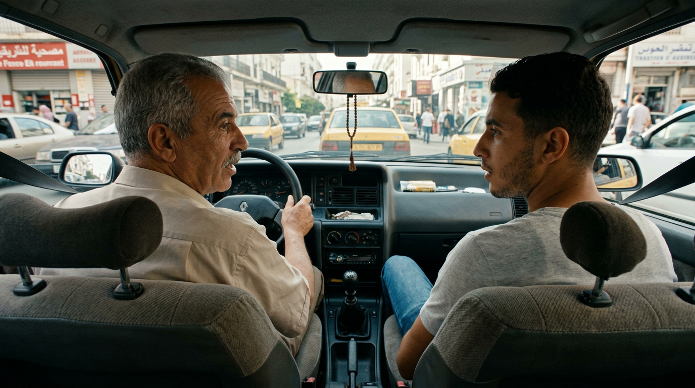

**📝 البرومبوت الشامل (انسخه كله):**
```text
REFERENCE IMAGE ASSIGNMENT:
IMAGE 1 = PRIMARY REFERENCE / START FRAME: `SDZ_09_Taxi_Anis_SiTahar.png`

Begin exactly from the uploaded taxi image.

Create ONE continuous 10-second photorealistic live-action interior taxi shot.

TIMELINE:
0-2s: Anis settles naturally in the passenger seat.
2-4s: Si Tahar asks the question while keeping his attention primarily on the road.
4-6s: Anis answers naturally.
6-8s: Anis gives a small knowing smile.
8-10s: He turns his eyes toward the window.

CAMERA:
Stable interior two-shot from the front passenger/dashboard area. Small natural vehicle vibration. Do not change the taxi interior.

DIALOGUE:
Si Tahar: «وين رايح يا ولدي؟»
Anis: «راني رايح نخدم... غير توقع المفاجآت.»
Natural Algerian Darija, clear speaker separation and accurate lip-sync.

AUDIO:
Taxi engine, road noise and natural dialogue. No music overpowering the voices.

ENDING:
End with Anis looking through the window, giving the editor a clean cut to the next time/place.

STRICT:
Driver keeps realistic attention on driving. No impossible vehicle movement. No identity drift. No subtitles.
```


---

## 🎬 المشهد 10 — التحول إلى سوبر ذزيري

**SDZ_10_START_Anis_HiddenAlley.png**

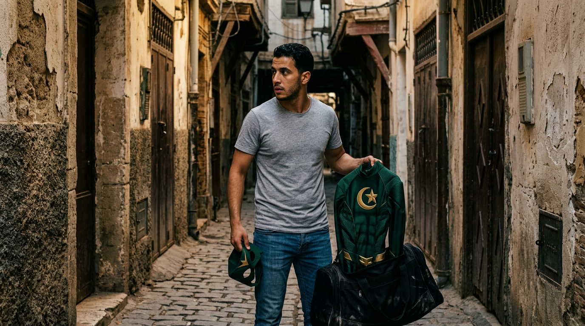

**SDZ_10_END_SuperDziri_Ready.png**

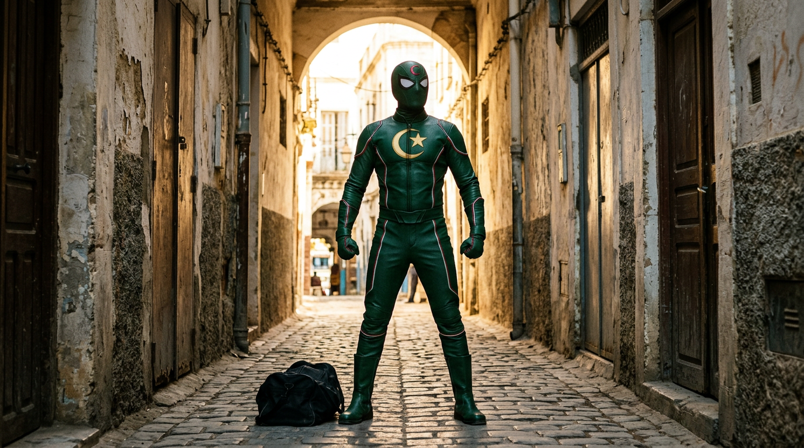

**📝 البرومبوت الشامل (انسخه كله):**
```text
REFERENCE IMAGE ASSIGNMENT:
IMAGE 1 = START FRAME: `SDZ_10_START_Anis_HiddenAlley.png`
IMAGE 2 = END FRAME: `SDZ_10_END_SuperDziri_Ready.png`

IMAGE 1 is the exact beginning. IMAGE 2 is the exact ending.
Create a continuous transformation that physically connects the two reference states.

Create ONE continuous 10-second photorealistic live-action transformation shot.

TIMELINE:
0-2s: Anis opens the bag from the exact position in IMAGE 1.
2-4s: He quickly takes out the Super Dziri suit.
4-6s: He puts on the main suit pieces in a believable rapid change.
6-8s: He places the mask and adjusts it.
8-10s: He stands still in the completed Super Dziri appearance, matching IMAGE 2.

CAMERA:
Use a controlled medium shot with a subtle cinematic push-in. Keep the alley geometry fixed. Do not hide the transformation with a teleport or dissolve.

TRANSFORMATION RULE:
The costume change must look like a fast practical change of clothes, not a magical morph. Do not morph Anis's body or face.

DIALOGUE:
Anis whispers: «يلا... نبداو الخدمة.»
Natural Algerian Darija and accurate lip-sync.

AUDIO:
Bag zipper, fabric movement, subtle tension music and room ambience.

ENDING:
The final pose, suit, mask, body orientation and environment must closely match IMAGE 2 and hold briefly.

STRICT:
No body morphing. No teleportation. No instant costume materialization. No identity drift. No subtitles.
```


---

## 🎬 المشهد 11 — أول ظهور

**SDZ_11_END_SuperDziri_FirstAppearance.png**

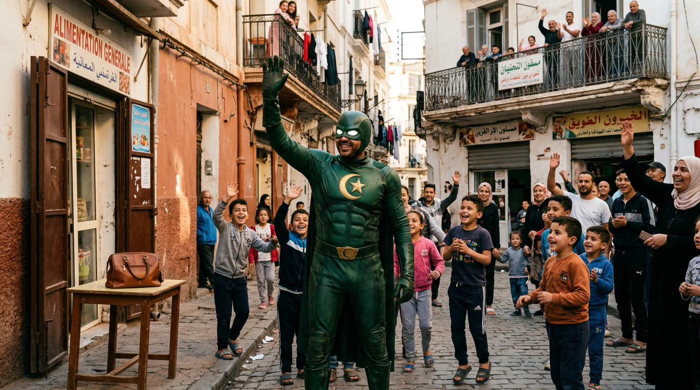

**📝 البرومبوت الشامل (انسخه كله):**
```text
REFERENCE IMAGE ASSIGNMENT:
IMAGE 1 = PRIMARY REFERENCE / START FRAME: `SDZ_11_END_SuperDziri_FirstAppearance.png`

Begin exactly from the uploaded image.

Create ONE continuous 10-second photorealistic live-action first-appearance shot.

TIMELINE:
0-2s: Super Dziri steps naturally into the street from the reference position.
2-4s: Nearby residents notice him.
4-6s: He raises one hand in a friendly greeting.
6-8s: He gestures toward the neighborhood, showing that he intends to help.
8-10s: He gives a small confident wave.

CAMERA:
Medium-wide cinematic shot. Slowly track backward as he moves forward. Keep the neighborhood visible.

DIALOGUE:
Super Dziri: «سلام عليكم! أنا سوبر ذزيري... نعاون الحومة تاعنا.»
Natural Algerian Darija, confident but not theatrical, accurate lip-sync.

AUDIO:
Natural neighborhood ambience, children's reactions and light applause only if visually motivated.

ENDING:
Finish on his friendly wave and a stable heroic-but-human pose.

STRICT:
Do not make him fly. No exaggerated superhero effects. No morphing. No teleportation. No subtitles. Preserve the exact suit and mask.
```


---

## 🎬 المشهد 12 — البلدية

**SDZ_12_Anis_Zahra_Baladiya.png**

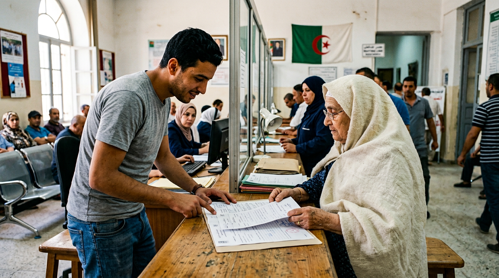

**📝 البرومبوت الشامل (انسخه كله):**
```text
REFERENCE IMAGE ASSIGNMENT:
IMAGE 1 = PRIMARY REFERENCE / START FRAME: `SDZ_12_Anis_Zahra_Baladiya.png`

Begin exactly from the uploaded municipal-office scene.

Create ONE continuous 10-second photorealistic live-action shot.

TIMELINE:
0-2s: Zahra looks confused at the paperwork.
2-4s: Anis calmly explains what to do.
4-6s: He points to the correct part of the document.
6-8s: Zahra understands and smiles.
8-10s: Anis gives a reassuring nod.

CAMERA:
Natural medium two-shot with a subtle push toward the paperwork, then back to the two characters.

DIALOGUE:
Zahra: «البيروقراطية هادي!»
Anis: «لا تخافي يا خالتي، أنا معاك.»
Natural Algerian Darija, separate speakers, accurate lip-sync.

AUDIO:
Quiet municipal-office ambience, paper movement and dialogue.

ENDING:
End on Zahra's relieved expression and Anis's reassuring nod.

STRICT:
No invented paperwork text. No sudden camera jump. No morphing. No subtitles.
```


---

## 🎬 المشهد 13 — نهاية اليوم الأول (السطح)

**SDZ_13_SuperDziri_Rooftop_Sunset.png**

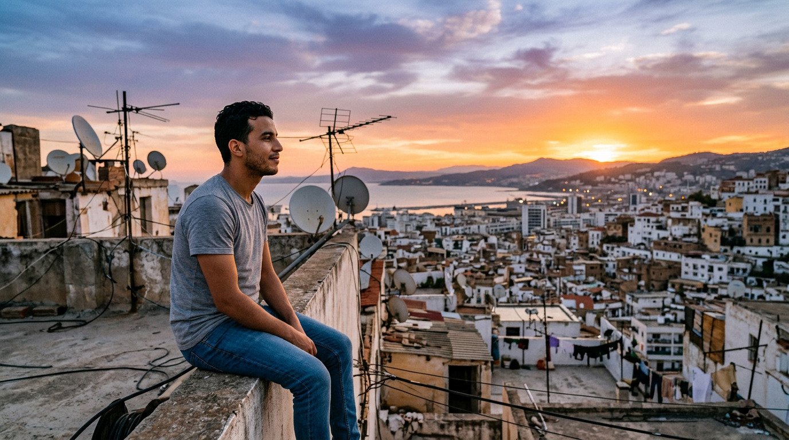

**📝 البرومبوت الشامل (انسخه كله):**
```text
REFERENCE IMAGE ASSIGNMENT:
IMAGE 1 = PRIMARY REFERENCE / START FRAME: `SDZ_13_SuperDziri_Rooftop_Sunset.png`

Begin exactly from the rooftop sunset reference.

Create ONE continuous 10-second photorealistic live-action reflective shot.

TIMELINE:
0-2s: Super Dziri settles into a relaxed seated position.
2-4s: He looks across the city.
4-6s: He looks down toward the neighborhood.
6-8s: He pauses thoughtfully.
8-10s: He gives a subtle nod while watching the sunset.

CAMERA:
Slow cinematic push-in or very slow lateral move. Keep the sunset and neighborhood geography consistent.

DIALOGUE:
Super Dziri: «البطل الحقيقي ماشي اللي يطير... اللي يقف مع الناس.»
Natural Algerian Darija, calm reflective delivery and accurate lip-sync.

AUDIO:
Soft wind, distant neighborhood ambience and restrained emotional music.

ENDING:
Hold the thoughtful pose for a clean time cut into the next morning.

STRICT:
No exaggerated superhero movement. No morphing. No teleportation. No subtitles.
```


---

## 🎬 المشهد 14 — صباح اليوم التالي / الحي يتكلم

**SDZ_14_Anis_Neighborhood_Morning.png**

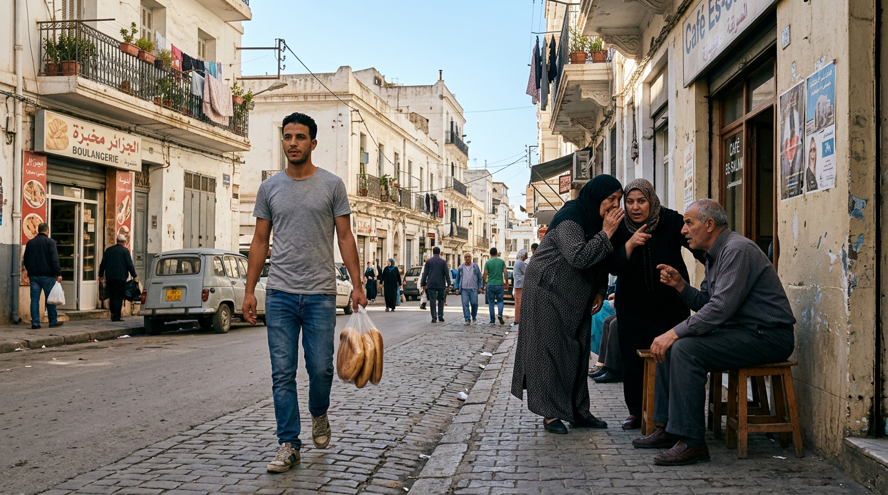

**📝 البرومبوت الشامل (انسخه كله):**
```text
REFERENCE IMAGE ASSIGNMENT:
IMAGE 1 = PRIMARY REFERENCE / START FRAME: `SDZ_14_Anis_Neighborhood_Morning.png`

Begin exactly from the uploaded morning neighborhood image.

Create ONE continuous 10-second photorealistic live-action shot.

TIMELINE:
0-2s: Anis walks naturally through the neighborhood.
2-4s: A couple of neighbors notice him.
4-6s: They quietly whisper to each other.
6-8s: Anis notices the attention and gives a small confused smile.
8-10s: He continues walking without stopping.

CAMERA:
Smooth side-follow tracking shot at walking speed. Keep the neighbors naturally in the background.

DIALOGUE:
Neighbors, quietly: «هذا هو سوبر ذزيري؟»
Other neighbor: «لا، هذا أنيس... عادي.»
Natural Algerian Darija, low-volume background dialogue, believable lip-sync.

AUDIO:
Morning street ambience and quiet whispers.

ENDING:
Anis continues forward, giving a clean directional movement into Scene 15.

STRICT:
Do not make the neighbors stare unnaturally. No exaggerated reactions. No subtitles. No identity drift.
```


---

## 🎬 المشهد 15 — سيلفي مع سي الطاهر

**SDZ_15_Anis_SiTahar_Selfie.png**

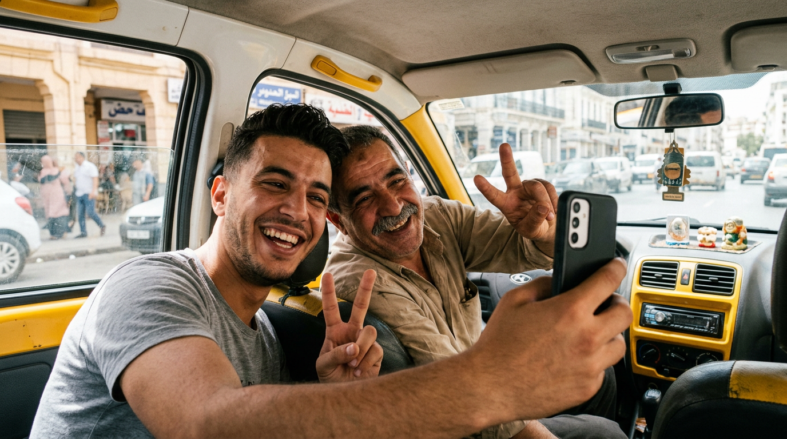

**📝 البرومبوت الشامل (انسخه كله):**
```text
REFERENCE IMAGE ASSIGNMENT:
IMAGE 1 = PRIMARY REFERENCE / START FRAME: `SDZ_15_Anis_SiTahar_Selfie.png`

Begin exactly from the uploaded taxi selfie composition.

Create ONE continuous 10-second photorealistic live-action shot.

TIMELINE:
0-2s: Si Tahar excitedly leans closer toward Anis.
2-4s: He lightly gestures toward Anis while preparing the phone.
4-6s: They position themselves for one selfie.
6-8s: Both make a simple victory sign.
8-10s: They laugh naturally.

CAMERA:
The phone/selfie perspective must remain physically plausible. Avoid impossible camera movement. Preserve taxi interior.

DIALOGUE:
Si Tahar: «سيلفي! نحطها في واتساب!»
Anis: «لا لا خويا، برك صورة وحدة!»
Natural Algerian Darija, distinct speakers, accurate lip-sync.

AUDIO:
Natural laughter, small phone-camera sound and taxi ambience.

ENDING:
Finish on the natural laugh and selfie pose.

STRICT:
No extra phone screens or generated text. No subtitles. No morphing. No identity drift.
```


---

## 🎬 المشهد 16 — طابور المخبزة

**SDZ_16_Anis_BakeryQueue.png**

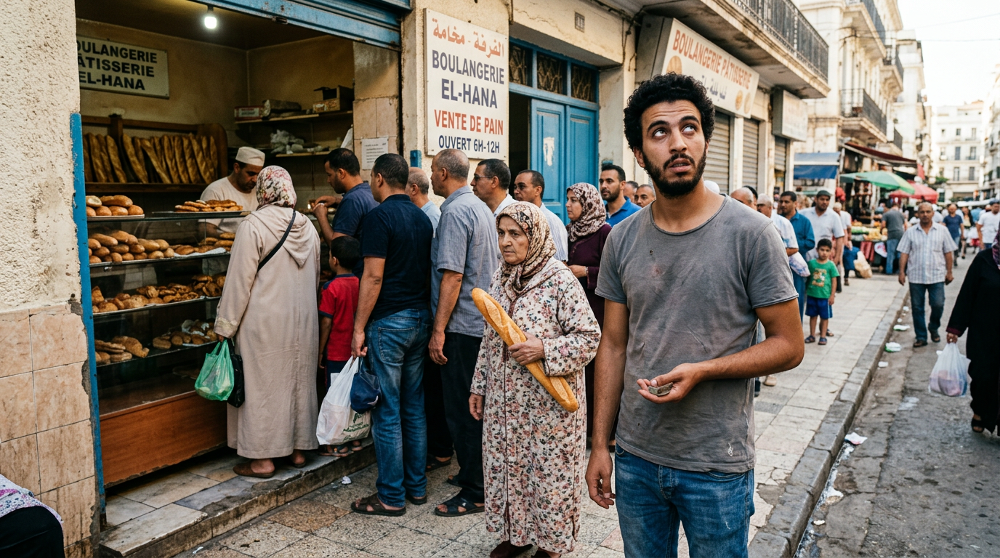

**📝 البرومبوت الشامل (انسخه كله):**
```text
REFERENCE IMAGE ASSIGNMENT:
IMAGE 1 = PRIMARY REFERENCE / START FRAME: `SDZ_16_Anis_BakeryQueue.png`

Begin exactly from the uploaded bakery queue image.

Create ONE continuous 10-second photorealistic live-action shot.

TIMELINE:
0-2s: Anis looks ahead at the long queue.
2-4s: He quietly counts the people in front of him with his fingers.
4-6s: He exhales with mild comic frustration.
6-8s: The person ahead moves forward.
8-10s: Anis takes one natural step forward with the queue.

CAMERA:
Stable medium-wide queue shot with a subtle handheld documentary feel.

DIALOGUE:
Anis: «البطل الحقيقي يوقف في الطابور كيما الناس.»
Natural Algerian Darija, calm humorous delivery and accurate lip-sync.

AUDIO:
Bakery ambience, quiet customer voices, bread-shop sounds and dialogue.

ENDING:
End with Anis taking his step forward, preserving the queue direction for Scene 17's cut.

STRICT:
No jumping the queue. No teleportation. No exaggerated comedy. No subtitles.
```


---

## 🎬 المشهد 17 — اكتشاف المنتجات المقلدة

**SDZ_17_START_Anis_MarketFakeShoes.png**


**SDZ_17_END_Anis_LeavingStall.png**

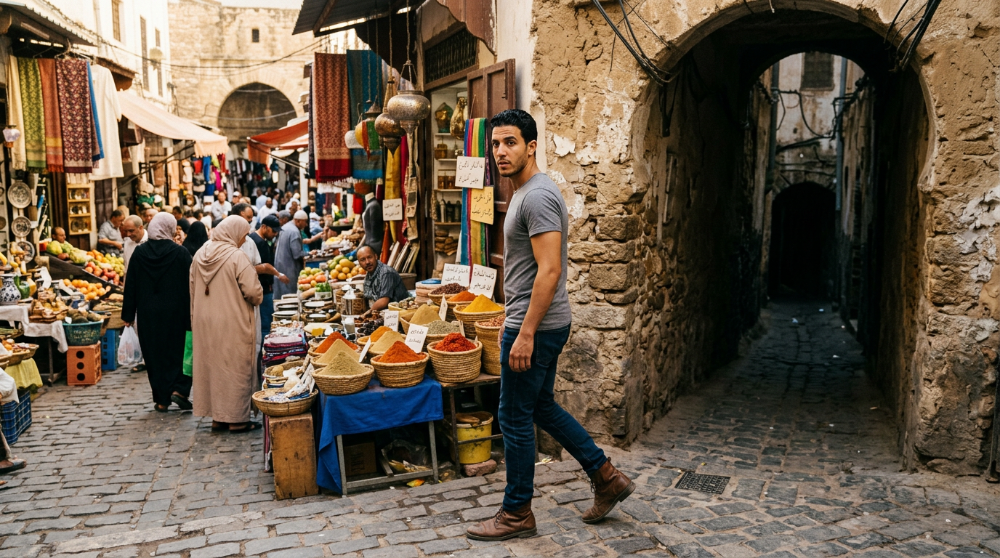

**📝 البرومبوت الشامل (انسخه كله):**
```text
REFERENCE IMAGE ASSIGNMENT:
IMAGE 1 = START FRAME: `SDZ_17_START_Anis_MarketFakeShoes.png`
IMAGE 2 = END FRAME: `SDZ_17_END_Anis_LeavingStall.png`

IMAGE 1 is the exact beginning. IMAGE 2 is the exact ending.
Create the physical action connecting these two states.

Create ONE continuous 10-second photorealistic live-action shot.

TIMELINE:
0-2s: Anis picks up the shoe from the stall.
2-4s: He examines the stitching carefully.
4-6s: He gives the seller a skeptical side glance.
6-8s: He places the shoe back.
8-10s: He turns and begins walking away, arriving at the exact position shown in IMAGE 2.

CAMERA:
Start in a medium view matching IMAGE 1. Small controlled push toward the shoe, then smoothly follow Anis as he turns away. End with the framing close to IMAGE 2.

DIALOGUE:
Anis: «هادي؟ ماركة عالمية؟ باينة مقلدة.»
Natural Algerian Darija, mildly sarcastic, accurate lip-sync.

AUDIO:
Market ambience, subtle shoe handling sound and dialogue.

ENDING:
Match the body orientation, location and camera geography of IMAGE 2.

STRICT:
No sudden cut. No morphing. No teleportation. No invented brand logos or text. No identity drift.
```


---

## 🎬 المشهد 18 — التحول الثاني

**SDZ_18_START_Anis_RooftopBag.png**

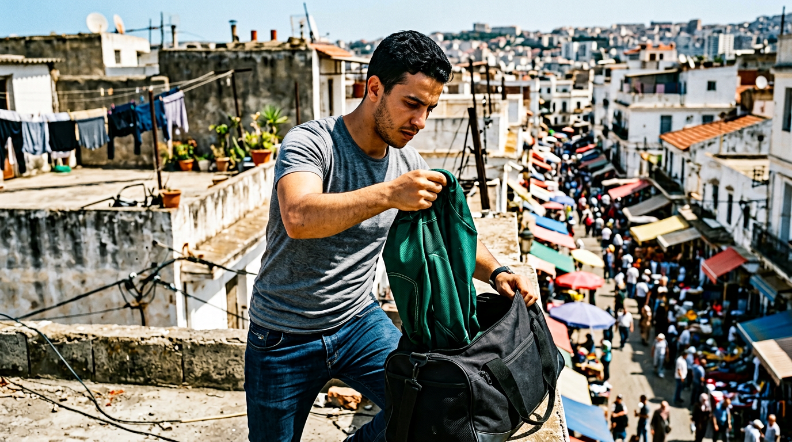

**SDZ_18_END_SuperDziri_RooftopReady.png**

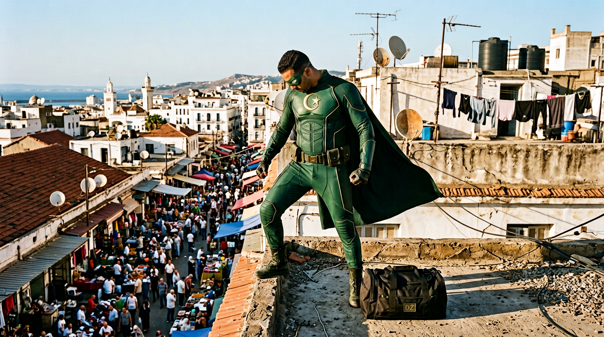

**📝 البرومبوت الشامل (انسخه كله):**
```text
REFERENCE IMAGE ASSIGNMENT:
IMAGE 1 = START FRAME: `SDZ_18_START_Anis_RooftopBag.png`
IMAGE 2 = END FRAME: `SDZ_18_END_SuperDziri_RooftopReady.png`

IMAGE 1 is the exact beginning. IMAGE 2 is the exact ending.
The transformation must be physically continuous.

Create ONE continuous 10-second photorealistic live-action shot.

TIMELINE:
0-2s: Anis opens the bag from the exact position in IMAGE 1.
2-4s: He takes out the suit.
4-6s: He quickly puts on the main suit pieces.
6-8s: He puts on the mask and adjusts it.
8-10s: He stands ready, matching IMAGE 2.

CAMERA:
One controlled rooftop shot with a slow push-in. Keep skyline, rooftop objects and lighting consistent.

TRANSFORMATION:
Treat this as a fast practical costume change. Clothing is physically taken from the bag and put on. No magical body morphing.

DIALOGUE:
Anis whispers: «حان الوقت... سوبر ذزيري ينزل للميدان.»
Natural Algerian Darija and accurate lip-sync.

AUDIO:
Bag zipper, fabric movement, wind and restrained heroic music.

ENDING:
The final suit, mask, posture, lighting and camera composition should closely match IMAGE 2.

STRICT:
No teleportation. No morphing. No instant costume materialization. No identity drift. No subtitles.
```


---

## 🎬 المشهد 19 — كشف المقلدة

**SDZ_19_END_SuperDziri_FakeShoeStall.png**

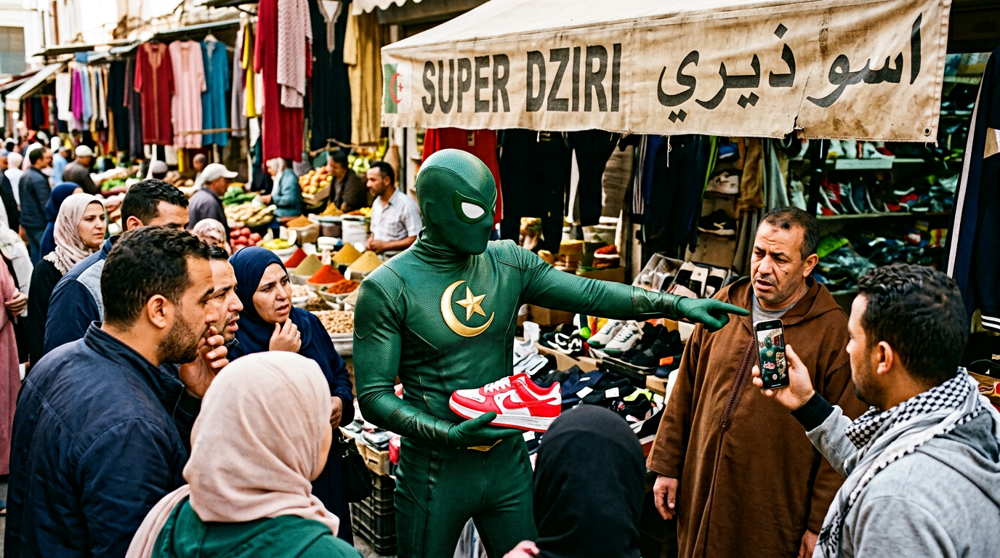

**📝 البرومبوت الشامل (انسخه كله):**
```text
REFERENCE IMAGE ASSIGNMENT:
IMAGE 1 = PRIMARY REFERENCE / START FRAME: `SDZ_19_END_SuperDziri_FakeShoeStall.png`

Begin exactly from the uploaded image.

Create ONE continuous 10-second photorealistic live-action shot.

TIMELINE:
0-2s: Super Dziri moves into the shoe stall area from the reference position.
2-4s: He picks up the questionable shoe.
4-6s: He shows the stitching and construction to the seller.
6-8s: He turns the shoe toward nearby people so they can see the problem.
8-10s: He raises his phone and records the evidence.

CAMERA:
Medium handheld documentary style, moving only enough to follow the shoe and Super Dziri's gestures. Preserve the stall geography.

DIALOGUE:
Super Dziri: «شوفو هذي! يقولك أصلية؟ هذي مقلدة!»
Natural Algerian Darija, firm and clear, accurate lip-sync.

AUDIO:
Market ambience, nearby reactions, shoe handling and dialogue.

ENDING:
End with the phone raised and the fake shoe visible, ready for the next scene.

STRICT:
Do not invent brand names or readable logos. No subtitles. No morphing. No teleportation.
```


---

## 🎬 المشهد 20 — مساعدة قويدر

**SDZ_20_SuperDziri_Kouider.png**

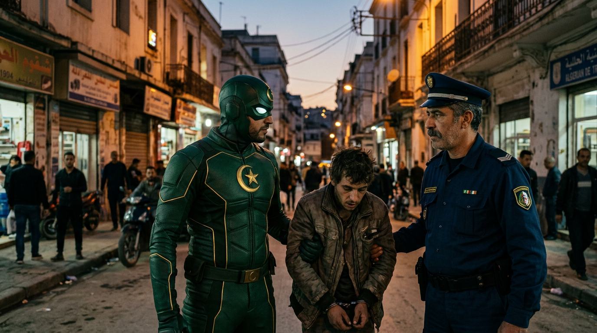

**📝 البرومبوت الشامل (انسخه كله):**
```text
REFERENCE IMAGE ASSIGNMENT:
IMAGE 1 = PRIMARY REFERENCE / START FRAME: `SDZ_20_SuperDziri_Kouider.png`

Begin exactly from the uploaded image.

Create ONE continuous 10-second photorealistic live-action interaction.

TIMELINE:
0-2s: Super Dziri presents the detained criminal to Kouider.
2-4s: Kouider checks the situation.
4-6s: Kouider speaks directly to Super Dziri.
6-8s: Kouider gives a small acknowledging nod.
8-10s: Super Dziri answers calmly and nods.

CAMERA:
Natural medium two-shot, slight lateral movement to keep both men visible. Preserve their spatial relationship.

DIALOGUE:
Kouider: «راك تحب تقوم بدوري؟»
Super Dziri: «أنا ولد هذي الحومة. غير القناع غيّرني.»
Natural Algerian Darija, distinct speakers, accurate lip-sync.

AUDIO:
Outdoor ambience, subtle police radio in the distance and clear dialogue.

ENDING:
Finish on the mutual nod, giving a natural cut point for Scene 21.

STRICT:
No extra police action. No sudden camera jump. No morphing. No subtitles.
```


---

## 🎬 المشهد 21 — فض الشجار

**SDZ_21_SuperDziri_StopsFight.png**

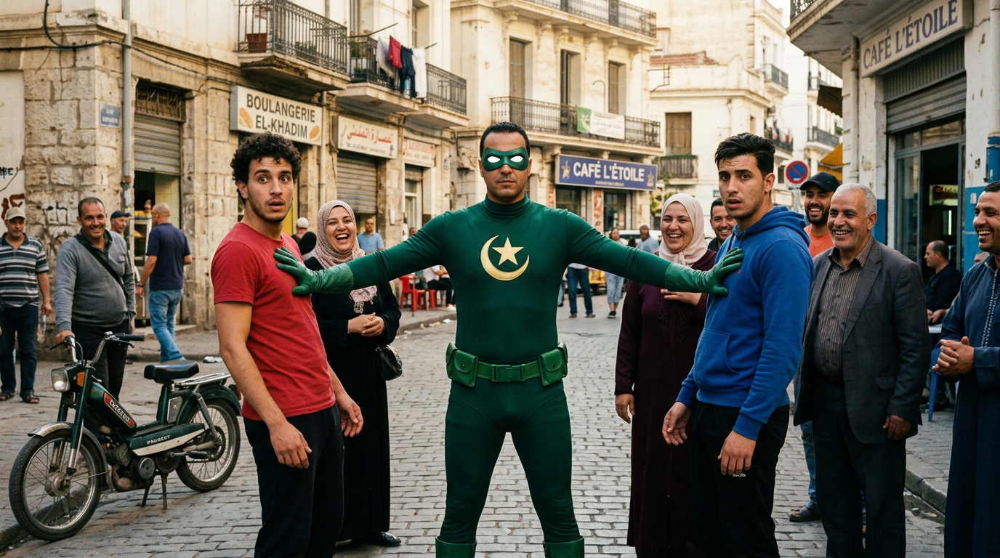

**📝 البرومبوت الشامل (انسخه كله):**
```text
REFERENCE IMAGE ASSIGNMENT:
IMAGE 1 = PRIMARY REFERENCE / START FRAME: `SDZ_21_SuperDziri_StopsFight.png`

Begin exactly from the uploaded image.

Create ONE continuous 10-second photorealistic live-action shot.

TIMELINE:
0-2s: The two young men are in a brief physical argument.
2-4s: Super Dziri steps between them.
4-6s: He separates them with controlled, non-violent physical intervention.
6-8s: He gives them a stern but humorous warning.
8-10s: The surrounding people react with a short laugh as the tension settles.

CAMERA:
Medium-wide street shot with a small handheld adjustment to keep all three subjects visible. No action-movie camera shake.

DIALOGUE:
Super Dziri: «وقفو! على واش تتقاتلو؟ على 500 دج؟ قاتلو في الدوري، ماشي في الشارع!»
Natural Algerian Darija, humorous but authoritative, accurate lip-sync.

AUDIO:
Argument stops, street ambience, brief crowd laughter and dialogue.

ENDING:
End with the two men separated and Super Dziri centered, ready for the next cut.

STRICT:
No serious injury. No punches. No exaggerated fighting. No morphing. No teleportation. No subtitles.
```


---

## 🎬 المشهد 22 — مطاردة قويدر → Match Cut

**SDZ_22_START_SuperDziri_Chase.png**

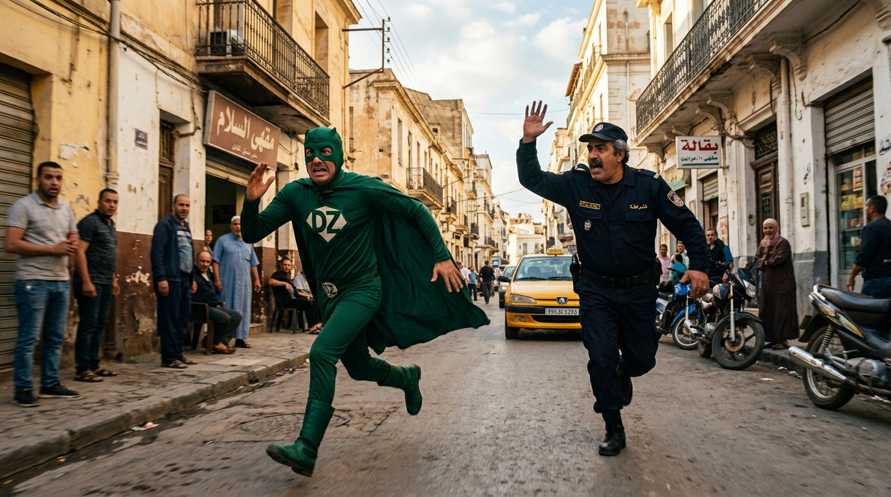

**SDZ_22_END_AlleyCorner.png**


**📝 البرومبوت الشامل (انسخه كله):**
```text
REFERENCE IMAGE ASSIGNMENT:
IMAGE 1 = START FRAME: `SDZ_22_START_SuperDziri_Chase.png`
IMAGE 2 = END FRAME: `SDZ_22_END_AlleyCorner.png`

IMAGE 1 is the exact beginning. IMAGE 2 is the exact ending.
Create one continuous chase that physically reaches IMAGE 2.

Create ONE continuous 10-second photorealistic live-action shot.

TIMELINE:
0-2s: Super Dziri runs from the exact position and direction shown in IMAGE 1.
2-4s: Kouider follows behind at a believable running distance.
4-6s: Kouider calls out while running; Super Dziri briefly responds without stopping.
6-8s: Super Dziri approaches the alley corner.
8-10s: He rounds the corner and the camera follows the movement, arriving at the exact spatial situation shown in IMAGE 2.

CAMERA:
Low-to-medium handheld chase camera moving in the same direction as the characters. Maintain screen direction throughout. No impossible camera jumps.

DIALOGUE:
Kouider: «وقوف!»
Super Dziri: «خويا، نفهمك!»
Natural Algerian Darija shouted while running, accurate lip-sync.

AUDIO:
Running footsteps, breathing, distant street ambience and dialogue.

ENDING / MATCH CUT:
The final body direction and camera movement must make the cut to Scene 23 feel motivated. Hold the final directional movement for a fraction of a second.

STRICT:
No teleportation. No reverse running. No morphing. No sudden location change. No subtitles.
```


---

## 🎬 المشهد 23 — Match Cut: الأطفال

**SDZ_23_END_SuperDziri_WithChildren.png**

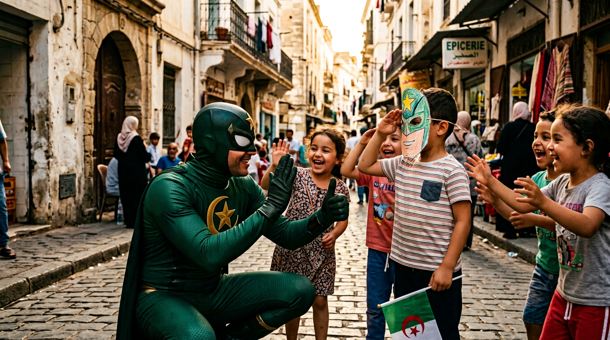

**📝 البرومبوت الشامل (انسخه كله):**
```text
REFERENCE IMAGE ASSIGNMENT:
IMAGE 1 = PRIMARY REFERENCE / START FRAME: `SDZ_23_END_SuperDziri_WithChildren.png`

Begin exactly from the uploaded image.

Create ONE continuous 10-second photorealistic live-action neighborhood shot.

TIMELINE:
0-2s: Super Dziri emerges naturally from the alley-side direction.
2-4s: He notices the children.
4-6s: He crouches slightly to their level.
6-8s: He gives the child a friendly high-five.
8-10s: He raises his hand in a warm greeting as the children react happily.

CAMERA:
Continue the directional energy from Scene 22, then settle into a warm medium-wide shot. Keep the children and Super Dziri readable.

DIALOGUE:
Children: «سوبر ذزيري!»
Child: «شوف! درت ماسك كيماك!»
Super Dziri: «خليك في القراية... وبعد تولي بطل حقيقي!»
Natural Algerian Darija, distinct voices and accurate lip-sync.

AUDIO:
Children laughing, neighborhood ambience and dialogue.

ENDING:
Finish on the friendly interaction, suitable for a clean cut to the next event.

STRICT:
No child danger. No exaggerated superhero effects. No morphing. No subtitles.
```


---

## 🎬 المشهد 24A — سرقة السيارة

**SDZ_24A_Car_Thief.png**

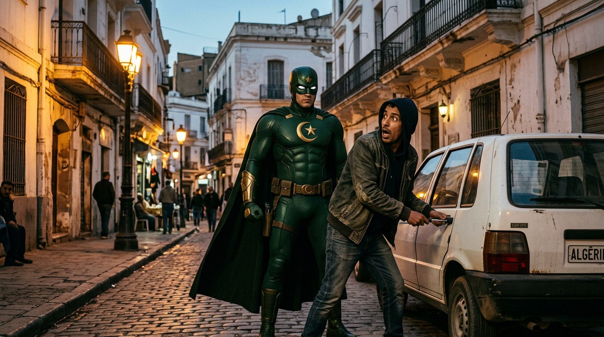

**📝 البرومبوت الشامل (انسخه كله):**
```text
REFERENCE IMAGE ASSIGNMENT:
IMAGE 1 = PRIMARY REFERENCE / START FRAME: `SDZ_24A_Car_Thief.png`

Begin exactly from the uploaded image.

Create ONE continuous 10-second photorealistic live-action shot.

TIMELINE:
0-2s: The thief attempts to take the car.
2-4s: Super Dziri steps into the situation and blocks his escape.
4-6s: The thief freezes and looks nervous.
6-8s: Super Dziri points toward the street, ordering him to leave.
8-10s: The thief backs away and runs off.

CAMERA:
Medium street shot with a small controlled pan following the thief's retreat. Keep the car and characters spatially consistent.

DIALOGUE:
Super Dziri: «سرقة سيارة؟ يلا امشي قبل ما نجيب الشرطة!»
Natural Algerian Darija, firm but not aggressive, accurate lip-sync.

AUDIO:
Street ambience, a small object dropping, footsteps and dialogue.

ENDING:
End with the thief leaving the frame and Super Dziri remaining near the car.

STRICT:
No vehicle crash. No weapons. No violence beyond blocking the escape. No teleportation. No morphing. No subtitles.
```


---

## 🎬 المشهد 24B — الشاي مع زهرة

**SDZ_24B_SuperDziri_Zahra_Tea.png**


**📝 البرومبوت الشامل (انسخه كله):**
```text
REFERENCE IMAGE ASSIGNMENT:
IMAGE 1 = PRIMARY REFERENCE / START FRAME: `SDZ_24B_SuperDziri_Zahra_Tea.png`

Begin exactly from the uploaded tea scene.

Create ONE continuous 10-second photorealistic live-action comedic conversation.

TIMELINE:
0-2s: Super Dziri sits with Zahra.
2-4s: Zahra offers him the tea and pastry.
4-6s: Super Dziri gestures toward his mask, showing the practical problem.
6-8s: Zahra laughs warmly.
8-10s: Super Dziri gives a humorous thumbs-up.

CAMERA:
Warm medium two-shot, stable and intimate. Small natural push-in during the joke.

DIALOGUE:
Zahra: «اشرب يا ولدي، الشاي يبرد!»
Super Dziri: «شوفيني كياش نشرب بالقناع هذا؟ ههه!»
Natural Algerian Darija, distinct speakers, accurate lip-sync.

AUDIO:
Tea pouring, cup movement, light laughter and neighborhood ambience.

ENDING:
End on the shared laugh and thumbs-up.

STRICT:
Do not remove the mask magically. Do not invent extra food or dialogue. No morphing. No subtitles.
```


---

## 🎬 المشهد 24C — التصالح مع قويدر → النهاية

**SDZ_24C_START_Kouider_Handshake.png**

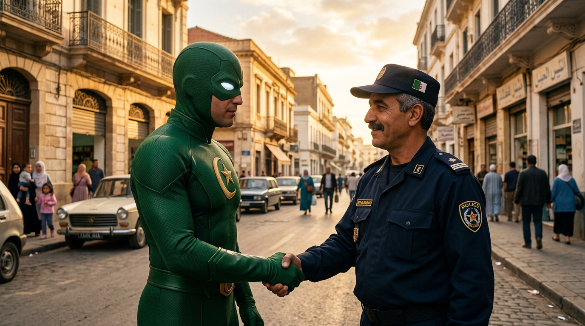

**SDZ_24C_END_Rooftop_Sunset.png**

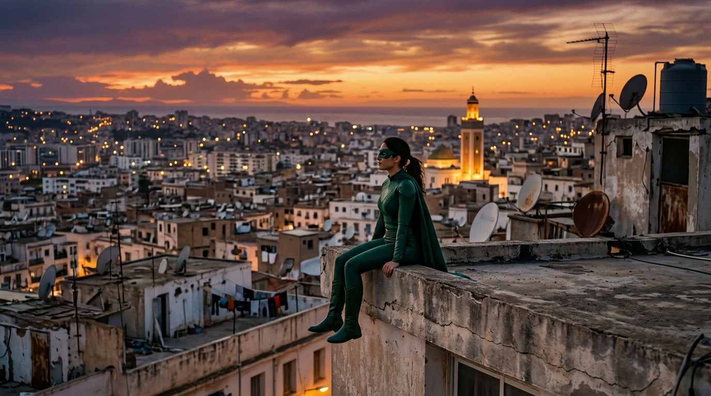

**📝 البرومبوت الشامل (انسخه كله):**
```text
REFERENCE IMAGE ASSIGNMENT:
IMAGE 1 = START FRAME: `SDZ_24C_START_Kouider_Handshake.png`
IMAGE 2 = END FRAME: `SDZ_24C_END_Rooftop_Sunset.png`

IMAGE 1 is the exact beginning. IMAGE 2 is the exact ending.
The move from the handshake scene to the rooftop must be a motivated cinematic transition, not a teleport.

Create ONE continuous 10-second photorealistic cinematic ending shot.

TIMELINE:
0-2s: Kouider and Super Dziri complete the handshake exactly from IMAGE 1.
2-4s: Kouider speaks sincerely.
4-6s: Super Dziri answers calmly.
6-7.5s: They release the handshake and share a final respectful nod.
7.5-10s: Use a motivated camera movement or brief natural transition to the rooftop location, arriving at the exact composition and sunset state shown in IMAGE 2. The transition must feel like an intentional cinematic cut/establishing transition, not physical teleportation of the characters.

DIALOGUE:
Kouider: «شكرا يا سوبر ذزيري. الحومة راهي أهدى بيك.»
Super Dziri: «أنا واحد منكم... غير عندي قناع.»
Natural Algerian Darija, distinct speakers, calm emotional delivery and accurate lip-sync.

AUDIO:
Handshake/clothing movement, natural street ambience, then restrained closing music and rooftop wind.

ENDING:
The final seconds must closely match IMAGE 2: rooftop, sunset, character placement, camera geography and mood. Hold the final composition briefly for the final cut.

STRICT:
No literal teleportation. No morphing between locations. No sudden costume change. No identity drift. No invented dialogue. No subtitles.
```


---


## ✅ خطوات الإنتاج
1. ارفع الصورة/الصور من مجلد `images/` (بالترتيب: IMAGE 1 ثم IMAGE 2)
2. الصق البرومبوت الشامل (فيه الحركة + الحوار + الصوت)
3. ولّد 10 ثواني → كرر على الـ24 مشهد
4. اربطهم في المونتاج — Cut للمنتقلات الزمنية، Match Cut للـ22→23

© LATCHI AI — 🎬 100% جزائري 🇩🇿
