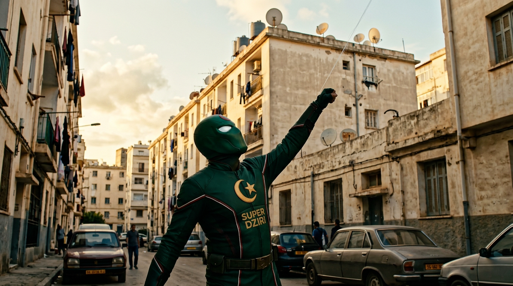
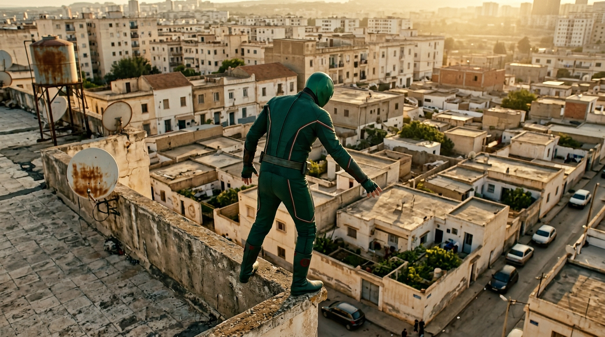
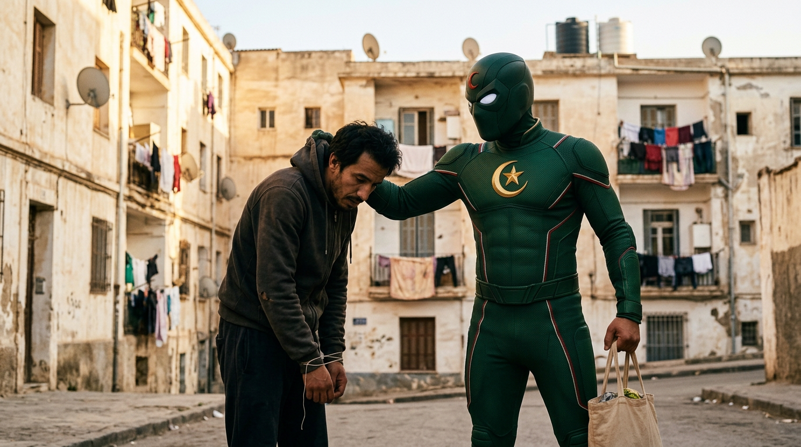
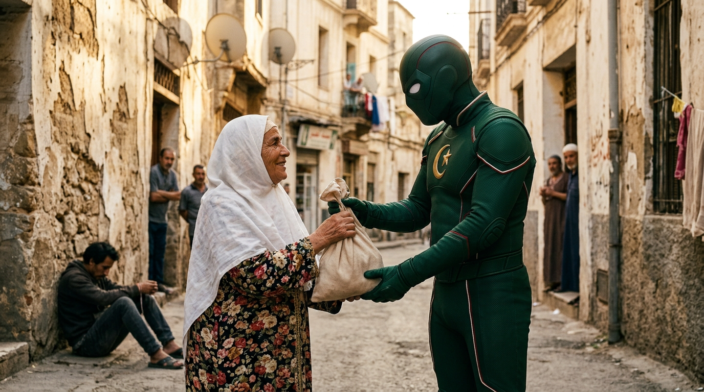
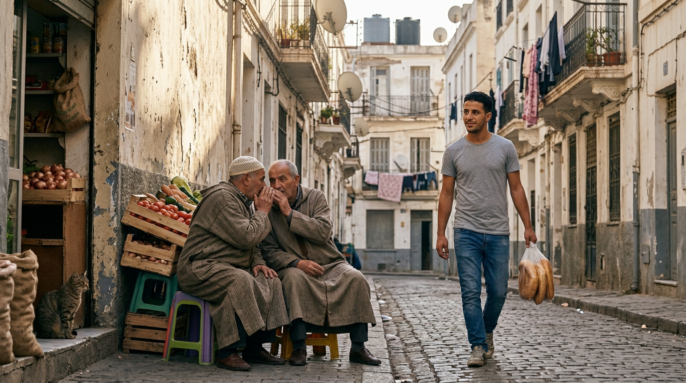
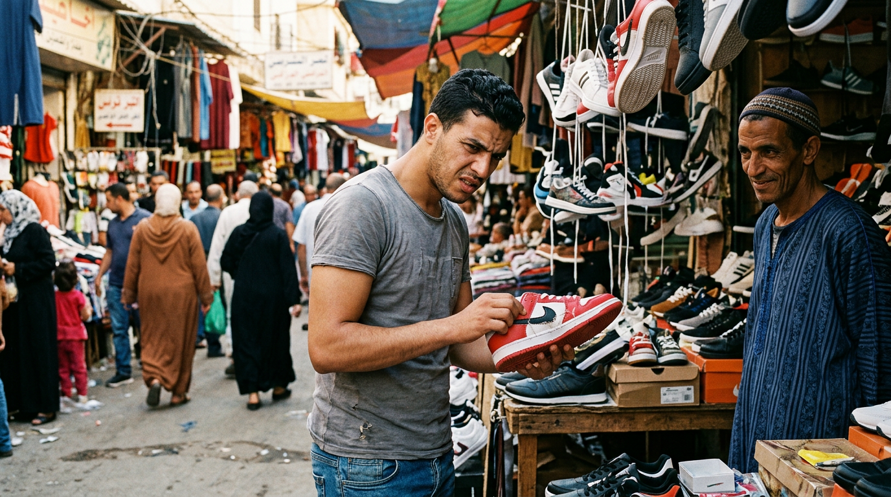
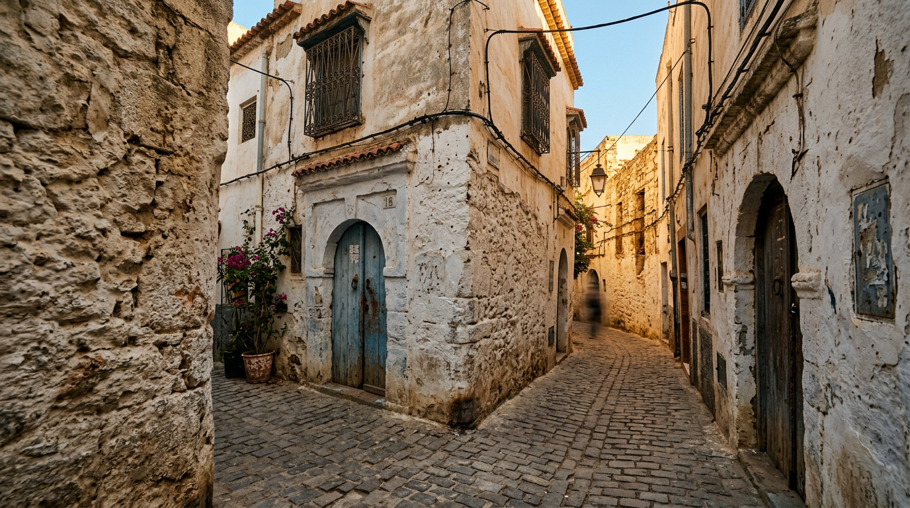
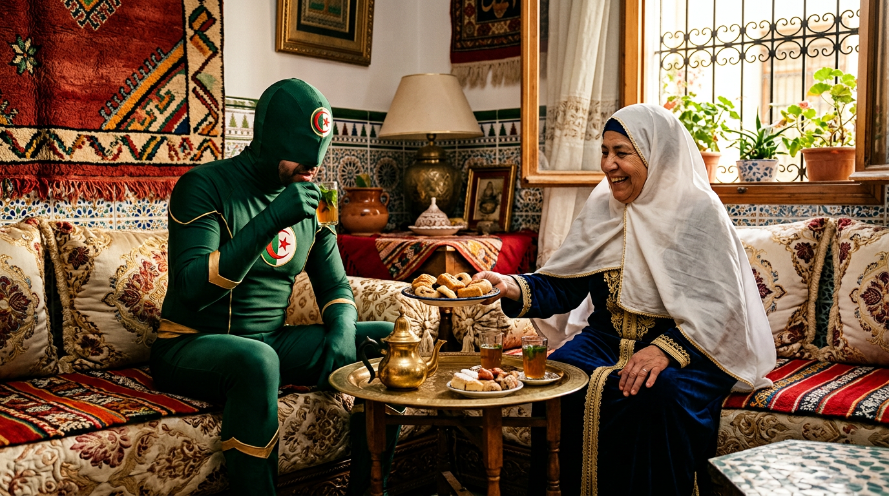

# 🕷️ سوبر ذزيري — المذكرة النهائية الاحترافية (برومبوت واحد لكل مشهد)

> **25 مشهد × 10 ثواني ≈ 4 دقائق** — Dola / Seedance 2.5

> **كل مشهد:** الصور فوق + برومبوت فيديو احترافي كامل بالصيغة الموحدة:
> `REFERENCE IMAGE ASSIGNMENT` + `CRITICAL SPATIAL CONTINUITY` + `SCENE PURPOSE` + `MOVEMENT` + `TIMELINE` + `CAMERA` + `CHARACTER LOCK` + `ENVIRONMENT` + `DIALOGUE` + `AUDIO` + `REALISM` + `ABSOLUTE CONTINUITY RULES` + `ENDING`

> **القاعدة:** المشاهد اللي فيها وجوه واضحة → Flow / المشاهد اللي بلا وجوه (قناع/بعيد) → Seedance

---

## 📊 جدول الصور لكل مشهد

| المشهد | الحدث | عدد الصور | أسماء الصور |
|---|---|---|---|

| 01 | دخول السوق → بائع الخضر | 2 | `SDZ_01_START_Anis_EnteringMarket.png`<br>`SDZ_01_END_Anis_TomatoStall.png` |
| 02 | عند الطماطم → اللدغة | 2 | `SDZ_02_START_Anis_TomatoStall.png`<br>`SDZ_02_END_Anis_Bite.png` |
| 03 | آثار القوة / الالتصاق | 1 | `SDZ_03_END_Anis_WallClimb.png` |
| 04 | تجربة الخيط / الفشل | 1 | `SDZ_04_END_Anis_ThreadFail.png` |
| 05 | سرقة حقيبة زهرة | 1 | `SDZ_05_Thief_Snatches_Zahra_Bag.png` |
| 06 | المطاردة إلى الزقاق | 1 | `SDZ_06_END_Thief_AlleyEntrance.png` |
| 07 | سوبر ذزيري يمسك الحرامي | 1 | `SDZ_07_END_SuperDziri_StopsThief.png` |
| 08 | رجوع الحقيبة | 1 | `SDZ_08_Zahra_GetsBag_Back.png` |
| 09 | التاكسي | 1 | `SDZ_09_Taxi_Anis_SiTahar.png` |
| 10 | التحول إلى سوبر ذزيري | 2 | `SDZ_10_START_Anis_HiddenAlley.png`<br>`SDZ_10_END_SuperDziri_Ready.png` |
| 11 | أول ظهور | 1 | `SDZ_11_END_SuperDziri_FirstAppearance.png` |
| 12 | البلدية | 1 | `SDZ_12_Anis_Zahra_Baladiya.png` |
| 13 | أول طيران ناجح بالخيط → «علاش علاش يا ربي... ما كانش أبراج» 😄 | 2 | `SDZ_13_START_Ground_LookingUp.png`<br>`SDZ_13_END_Rooftop_LookingDown.png` |
| 14 | الإمساك بالحرامي — رجوع الصاك للعجوز | 2 | `SDZ_14_START_Thief_Caught.png`<br>`SDZ_14_END_OldWoman_BagBack.png` |
| 15 | صباح اليوم التالي / الحي يتكلم | 1 | `SDZ_15_Anis_Neighborhood_Morning.png` |
| 16 | سيلفي مع عمي الطاهر | 1 | `SDZ_16_Anis_SiTahar_Selfie.png` |
| 17 | طابور المخبزة | 1 | `SDZ_17_Anis_BakeryQueue.png` |
| 18 | اكتشاف المنتجات المقلدة | 2 | `SDZ_18_START_Anis_MarketFakeShoes.png`<br>`SDZ_18_END_Anis_LeavingStall.png` |
| 19 | التحول الثاني | 2 | `SDZ_19_START_Anis_RooftopBag.png`<br>`SDZ_19_END_SuperDziri_RooftopReady.png` |
| 20 | كشف المقلدة | 1 | `SDZ_20_END_SuperDziri_FakeShoeStall.png` |
| 21 | مساعدة قويدر | 1 | `SDZ_21_SuperDziri_Kouider.png` |
| 22 | فض الشجار | 1 | `SDZ_22_SuperDziri_StopsFight.png` |
| 23 | مطاردة قويدر → Match Cut | 2 | `SDZ_23_START_SuperDziri_Chase.png`<br>`SDZ_23_END_AlleyCorner.png` |
| 24 | Match Cut: الأطفال | 1 | `SDZ_24_END_SuperDziri_WithChildren.png` |
| 25A | سرقة السيارة | 1 | `SDZ_25A_Car_Thief.png` |
| 25B | الشاي مع زهرة | 1 | `SDZ_25B_SuperDziri_Zahra_Tea.png` |
| 25C | التصالح مع قويدر → النهاية | 2 | `SDZ_25C_START_Kouider_Handshake.png`<br>`SDZ_25C_END_Rooftop_Sunset.png` |

---


## 🎬 المشهد 01 — دخول السوق → بائع الخضر

**SDZ_01_START_Anis_EnteringMarket.png** — البداية — أنيس يدخل السوق


**SDZ_01_END_Anis_TomatoStall.png** — النهاية — عند بائع الخضر


**📝 البرومبوت الشامل (انسخه كله):**
```text
REFERENCE IMAGE ASSIGNMENT:
IMAGE 1 = PRIMARY REFERENCE / EXACT START FRAME: `SDZ_01_START_Anis_EnteringMarket.png`
IMAGE 2 = END FRAME: `SDZ_01_END_Anis_TomatoStall.png`

IMAGE 1 is the exact physical and visual starting state.
IMAGE 2 is the exact visual ending state.
START EXACTLY FROM IMAGE 1. END EXACTLY AT IMAGE 2.
Do not treat the two images as a slideshow. Create the physical action that connects them.

Create ONE continuous 10-second photorealistic live-action cinematic shot, 16:9.

ENGINE: FLOW ENGINE — Face/Dialogue scene: micro-expressions (blinking, lip-sync, head stability) + slow push-in / handheld tracking.

SCENE PURPOSE:
Anis enters the crowded Algerian vegetable market and walks to the tomato stall — establishing the ordinary everyday world of the main character before anything strange happens.

CRITICAL SPATIAL CONTINUITY:
The market geography is fixed: stalls on both sides, the main walking aisle in the center, the tomato stall ahead-right. Anis walks forward through the aisle in one continuous direction; he never reverses or teleports. The camera starts behind him and never crosses the physical line of his walk.

MOVEMENT MUST BE SUBTLE AND PHYSICAL:
Natural walking only: steady human stride, arm swing, slight body motion from the bag on his shoulder. No running, no jumping, no action moves.

TIMELINE:
0.0-2.0: Anis continues walking naturally into the crowded vegetable market exactly from IMAGE 1.
2.0-5.0: He walks forward toward the vegetable stalls at a normal human pace.
5.0-8.0: He gradually slows and approaches the tomato stall; the camera smoothly follows him.
8.0-10.0: He stops beside the stall and naturally settles into the exact position and orientation shown in IMAGE 2.

MOTION DYNAMICS & CAMERA MOVEMENT:
SLOW PUSH-IN + HANDHELD TRACKING: camera starts behind Anis with a subtle handheld sway at walking speed, then very slowly pushes in toward a three-quarter side view. MICRO-EXPRESSIONS: natural blinking, lips move exactly in sync with «يا فتّاح يا رزاق...», head stays steady while speaking, slight arm swing and shoulder-bag motion from walking. Clothing and bag react naturally to each stride. No frozen face, no robotic lips.

CAMERA:
Smooth handheld tracking from behind, then a subtle natural move toward a three-quarter side view as Anis approaches the stall. No sudden camera jump, no orbit, no relocation.

CHARACTER CONTINUITY / LOCK:
ANIS BENYOUCEF — 25-year-old Algerian man, short black wavy hair, thin dark eyebrows, dark brown eyes, light stubble, medium olive-tan skin. Light grey T-shirt, blue jeans, dark sneakers, black shoulder bag. Same face, clothing, proportions and identity in every frame.

ENVIRONMENT:
The same Algerian market: vegetable crates, stalls, hanging produce, pedestrians, architecture, lighting and time of day. Background people move subtly and independently. No location change.

DIALOGUE:
Anis says naturally in Algerian Darija while walking: «يا فتّاح يا رزاق... ربي يجيب الخير نهار اليوم!» Realistic lip-sync, natural walking rhythm, no invented dialogue.

AUDIO:
Natural Algerian market ambience, footsteps, distant vendors and crowd noise. Dialogue must remain intelligible. No music.

REALISM:
Photorealistic live-action. Natural human gait, natural fabric motion, realistic crowd depth, natural daylight. No supernatural elements.

ABSOLUTE CONTINUITY RULES / STRICT:
NO seat or position swap. NO teleportation. NO morphing. NO image blending. NO reverse walking. NO sudden location change. NO costume change. NO identity drift. NO subtitles. NO captions. NO text overlays. NO logo. NO watermark.

ENDING / NEXT SCENE CONNECTION:
The final moment must closely match IMAGE 2 in character position, body orientation, environment and camera geography, creating a clean starting point for Scene 02.
```

---


## 🎬 المشهد 02 — عند الطماطم → اللدغة

**SDZ_02_START_Anis_TomatoStall.png** — البداية — أنيس عند بائع الطماطم


**SDZ_02_END_Anis_Bite.png** — النهاية — اللدغة


**📝 البرومبوت الشامل (انسخه كله):**
```text
REFERENCE IMAGE ASSIGNMENT:
IMAGE 1 = PRIMARY REFERENCE / EXACT START FRAME: `SDZ_02_START_Anis_TomatoStall.png`
IMAGE 2 = END FRAME: `SDZ_02_END_Anis_Bite.png`

IMAGE 1 is the exact physical and visual starting state.
IMAGE 2 is the exact visual ending state.
START EXACTLY FROM IMAGE 1. END EXACTLY AT IMAGE 2.
Do not treat the two images as a slideshow. Create the physical action that connects them.

Create ONE continuous 10-second photorealistic live-action cinematic shot, 16:9.

ENGINE: FLOW ENGINE — Face/Dialogue scene: micro-expressions (blinking, lip-sync, head stability) + slow push-in / handheld tracking.

SCENE PURPOSE:
Anis picks a tomato at the stall and is bitten by a small spider on the hand — the origin moment of his abilities, kept small, realistic and believable.

CRITICAL SPATIAL CONTINUITY:
Fixed market stall geography. Anis stands at the stall, the seller stays behind the crates, the camera holds a stable three-quarter view. No character moves away from the stall.

MOVEMENT MUST BE SUBTLE AND PHYSICAL:
Small, precise hand and arm movements: reaching, picking, the bite reaction, examining the hand. No large body repositioning.

TIMELINE:
0.0-2.0: Anis stands at the tomato stall and naturally selects a tomato.
2.0-4.0: A small spider suddenly bites him on the hand; the bite is quick and believable.
4.0-6.0: He reacts with a short realistic startle and pulls his hand back.
6.0-8.0: He examines the bitten hand with confusion and mild alarm.
8.0-10.0: He delivers the exact dialogue and settles into the final pose shown in IMAGE 2.

MOTION DYNAMICS & CAMERA MOVEMENT:
HANDHELD TRACKING + MICRO PUSH-IN: subtle handheld micro-movement, then a fast micro push-in on the bitten hand during the reaction. MICRO-EXPRESSIONS: a quick startled blink and eye-widening at the bite, lips sync exactly with «آحح! واش هادي؟!», natural recoil of the hand, visible breathing. The spider is small and fast; the reaction is human, not cartoonish.

CAMERA:
Start at a medium three-quarter view matching IMAGE 1. Make a subtle push-in during the bite and reaction. Keep the camera physically continuous and end close to the composition of IMAGE 2.

CHARACTER CONTINUITY / LOCK:
Same ANIS: face, hairstyle, grey T-shirt, blue jeans, black shoulder bag, body proportions, identity. No identity drift.

ENVIRONMENT:
Same stall and market geography: tomato crates, the seller, ambient shoppers, lighting, time of day.

DIALOGUE:
Anis: «آحح! واش هادي الدودة؟! رتيلة في نص المرشي؟!» Natural Algerian Darija, startled but comedic, accurate lip-sync, no extra words.

AUDIO:
Market ambience, a small realistic bite/reaction sound, Anis's brief startled voice, then surrounding market noise.

REALISM:
Photorealistic. The spider is small and ordinary, not giant, not cartoonish. The bite is fast. Reaction is human and believable.

ABSOLUTE CONTINUITY RULES / STRICT:
NO giant spider. NO exaggerated cartoon reaction. NO teleportation. NO morphing. NO identity drift. NO sudden camera cut. NO subtitles or invented dialogue.

ENDING / NEXT SCENE CONNECTION:
The final pose and hand position must closely match IMAGE 2 so the shot can be edited directly into Scene 03.
```

---


## 🎬 المشهد 03 — آثار القوة / الالتصاق

**SDZ_03_END_Anis_WallClimb.png** — الالتصاق بالجدار


**📝 البرومبوت الشامل (انسخه كله):**
```text
REFERENCE IMAGE ASSIGNMENT:
IMAGE 1 = PRIMARY REFERENCE / EXACT START FRAME: `SDZ_03_END_Anis_WallClimb.png`

The uploaded image is the exact physical and visual starting state.
START EXACTLY FROM THE UPLOADED IMAGE.

Create ONE continuous 10-second photorealistic live-action cinematic shot, 16:9.

ENGINE: FLOW ENGINE — Face/Dialogue scene: micro-expressions (blinking, lip-sync, head stability) + slow push-in / handheld tracking.

SCENE PURPOSE:
Hours after the bite, Anis discovers his palm sticks to a wall — the first strange proof that something has changed. Small, physical, uncanny.

CRITICAL SPATIAL CONTINUITY:
Fixed alley corner: one wall, the street behind Anis, fixed camera side. Anis stays at the wall; the wall remains in the same place throughout.

MOVEMENT MUST BE SUBTLE AND PHYSICAL:
Slow, careful testing movements: pressing the palm, lifting the foot, one short climbing attempt, stepping back down. No acrobatics.

TIMELINE:
0.0-2.0: Anis begins exactly from the pose in the reference and tests his hand against the wall.
2.0-4.0: His palm sticks naturally to the wall; show believable contact and resistance.
4.0-6.0: He carefully raises one foot and tests whether it can also grip.
6.0-8.0: He makes one short, awkward climbing movement.
8.0-10.0: He realizes the strange ability and carefully returns to a stable standing position.

MOTION DYNAMICS & CAMERA MOVEMENT:
SLOW ZOOM-IN: very slow cinematic zoom toward the palm pressed on the wall. MICRO-EXPRESSIONS: confused squint, slow blink, lips sync with «يا محاينك...», subtle frown, fingers test the grip with small presses. Physical tension reads through the hand and forearm. Camera holds the wall-street geography fixed.

CAMERA:
Medium side-angle shot with a small handheld adjustment following his hand and foot. Keep the wall and street geography fixed.

CHARACTER CONTINUITY / LOCK:
Same ANIS: identity, clothing, body proportions. No identity drift.

ENVIRONMENT:
Same wall texture, street, lighting and location. No environment change.

DIALOGUE:
Anis: «يا محاينك... واش راه صاري فيّا اليوم؟» Natural Algerian Darija, half-amazed half-worried, clear lip-sync, no extra dialogue.

AUDIO:
Foot movement, subtle contact sound from the palm against the wall, street ambience.

REALISM:
Photorealistic. The sticking is physical and believable — like a strong adhesive, no glow, no special effect.

ABSOLUTE CONTINUITY RULES / STRICT:
NO superhero spectacle yet. NO impossible floating. NO teleportation. NO morphing. NO sudden environment change. NO subtitles.

ENDING / NEXT SCENE CONNECTION:
End in a stable believable pose that can be cut cleanly into Scene 04.
```

---


## 🎬 المشهد 04 — تجربة الخيط / الفشل

**SDZ_04_END_Anis_ThreadFail.png** — فشل إطلاق الخيط


**📝 البرومبوت الشامل (انسخه كله):**
```text
REFERENCE IMAGE ASSIGNMENT:
IMAGE 1 = PRIMARY REFERENCE / EXACT START FRAME: `SDZ_04_END_Anis_ThreadFail.png`

The uploaded image is the exact physical and visual starting state.
START EXACTLY FROM THE UPLOADED IMAGE.

Create ONE continuous 10-second photorealistic live-action cinematic shot, 16:9.

ENGINE: FLOW ENGINE — Face/Dialogue scene: micro-expressions (blinking, lip-sync, head stability) + slow push-in / handheld tracking.

SCENE PURPOSE:
Anis tries to shoot a thread from his wrist for the first time and fails — a small comedic beat showing his powers are not yet under control.

CRITICAL SPATIAL CONTINUITY:
Fixed spot in the alley. Anis stays in place, camera stays in front/side of him. No relocation.

MOVEMENT MUST BE SUBTLE AND PHYSICAL:
Wrist raises, small attempts, looking at his wrist, shrugging. Small and physical, slightly funny, never slapstick.

TIMELINE:
0.0-2.0: Anis raises his wrist exactly from the reference pose.
2.0-4.0: He attempts to shoot a web/thread from his wrist.
4.0-6.0: Nothing happens; he looks at his wrist in disbelief.
6.0-8.0: He makes one second, smaller attempt.
8.0-10.0: He gives up with a frustrated, slightly funny expression.

MOTION DYNAMICS & CAMERA MOVEMENT:
STABLE MEDIUM + HANDHELD SWAY: slight handheld sway, then a micro push toward the wrist during the failed attempt. MICRO-EXPRESSIONS: raised eyebrow, deadpan look at the wrist, frustrated exhale, one small failed hand flick («نورمالمون تخرج كاش حاجة منا» + the failed gesture), then a shrug. Movement is small, physical and comedic — never slapstick.

CAMERA:
Stable medium shot with a very subtle push toward his wrist during the failed attempt. No sudden reframing.

CHARACTER CONTINUITY / LOCK:
Same ANIS: face, clothing, body proportions, location and lighting.

ENVIRONMENT:
Same alley location and lighting.

DIALOGUE:
Anis: «أيا سيدي... نورمالمون تخرج كاش حاجة منا.» Said with a small failed hand gesture — he flicks his wrist once more and nothing comes out. Natural Algerian Darija, deadpan comedic delivery, accurate lip-sync.

AUDIO:
Small failed mechanical/web-like sound, subtle street ambience and a light comic reaction. No exaggerated cartoon effects.

REALISM:
Photorealistic. No successful web. The failure is believable and human.

ABSOLUTE CONTINUITY RULES / STRICT:
NO successful web. NO superhero powers beyond the described failed attempt. NO morphing. NO teleportation. NO extra dialogue. NO subtitles.

ENDING / NEXT SCENE CONNECTION:
Finish on his frustrated expression and stable body position, suitable for a clean cut to Scene 05.
```

---


## 🎬 المشهد 05 — سرقة حقيبة زهرة

**SDZ_05_Thief_Snatches_Zahra_Bag.png** — الحرامي يخطف حقيبة خالتي زهرة


**📝 البرومبوت الشامل (انسخه كله):**
```text
REFERENCE IMAGE ASSIGNMENT:
IMAGE 1 = PRIMARY REFERENCE / EXACT START FRAME: `SDZ_05_Thief_Snatches_Zahra_Bag.png`

The uploaded image is the exact physical and visual starting state.
START EXACTLY FROM THE UPLOADED IMAGE.

Create ONE continuous 10-second photorealistic live-action cinematic shot, 16:9.

ENGINE: FLOW ENGINE — Face/Dialogue scene: micro-expressions (blinking, lip-sync, head stability) + slow push-in / handheld tracking.

SCENE PURPOSE:
A thief snatches the bag of خالتي زهرة in the market — the first real street incident that will push Anis to act.

CRITICAL SPATIAL CONTINUITY:
Fixed market square area. Zahra stands at one spot, the thief moves from beside her toward an exit direction. Camera follows the escape line without crossing it.

MOVEMENT MUST BE SUBTLE AND PHYSICAL:
Quick but human: the thief steps close, grabs, turns and runs. Zahra reacts, shouts, points. No action-movie speed.

TIMELINE:
0.0-2.0: The thief moves closer to Zahra while pretending to pass by.
2.0-4.0: He quickly grabs Zahra's bag.
4.0-6.0: Zahra reacts with surprise and shouts.
6.0-8.0: The thief runs away through the market.
8.0-10.0: Zahra points urgently in the direction he escaped.

MOTION DYNAMICS & CAMERA MOVEMENT:
QUICK PUSH-IN + CONTROLLED WHIP PAN: a fast push-in on the snatch, then a controlled whip pan following the thief's escape (fast but readable, no chaotic shake). MICRO-EXPRESSIONS: Zahra's eyes widen, mouth opens and lips sync exactly with «يا وليدي شدّوه!», hands reach out after the bag, body lurches forward one step. Human speed and panic — believable.

CAMERA:
Start with the reference composition, then perform a controlled handheld pan following the thief's escape while keeping Zahra readable. No chaotic shake.

CHARACTER CONTINUITY / LOCK:
ZAHRA (خالتي زهرة) — elderly Algerian woman, floral dress, white hijab, warm face, around 70. THIEF — young man, dark hooded tracksuit. Preserve exact faces, clothing, body proportions, identity.

ENVIRONMENT:
Same market geography, lighting and time of day as the reference.

DIALOGUE:
Zahra: «يا وليدي شدّوه! السراق! دالي الصاك عيني عينك!» Natural Algerian Darija, loud alarmed but believable, accurate lip-sync.

AUDIO:
Market ambience suddenly reacts to the shout; footsteps of the thief; surrounding voices.

REALISM:
Photorealistic. The snatch is fast but physically real, no slow-motion heroics.

ABSOLUTE CONTINUITY RULES / STRICT:
NO teleportation. NO exaggerated action-movie movement. NO identity drift. NO new major characters. NO subtitles.

ENDING / NEXT SCENE CONNECTION:
End with Zahra pointing toward the escape route, leaving a clear directional motivation for Scene 06.
```

---


## 🎬 المشهد 06 — المطاردة إلى الزقاق

**SDZ_06_END_Thief_AlleyEntrance.png** — دخول الزقاق


**📝 البرومبوت الشامل (انسخه كله):**
```text
REFERENCE IMAGE ASSIGNMENT:
IMAGE 1 = PRIMARY REFERENCE / EXACT START FRAME: `SDZ_06_END_Thief_AlleyEntrance.png`

The uploaded image is the exact physical and visual starting state.
START EXACTLY FROM THE UPLOADED IMAGE.

Create ONE continuous 10-second photorealistic live-action cinematic shot, 16:9.

ENGINE: SEEDANCE 2.5 ENGINE — Action scene: dynamic movement + fast whip pan / cinematic shake / low-angle / 360 orbit.

SCENE PURPOSE:
The thief runs through the market and into a narrow alley — the chase that will lead directly to his capture.

CRITICAL SPATIAL CONTINUITY:
One continuous screen direction: the thief runs away from camera into the market then into the alley entrance. Camera follows behind. Screen direction never reverses.

MOVEMENT MUST BE SUBTLE AND PHYSICAL:
Realistic running: human speed, arm swing, slight head bob. Pedestrians step aside naturally.

TIMELINE:
0.0-2.0: The thief runs forward from the reference position.
2.0-5.0: Camera follows behind him as he moves through the market.
5.0-7.0: He passes pedestrians who react naturally and make room.
7.0-10.0: He reaches and enters the alley entrance shown by the reference geography.

MOTION DYNAMICS & CAMERA MOVEMENT:
FAST WHIP PAN + CINEMATIC RUNNING SHAKE: handheld chase camera at realistic running height, fast whip pan as the thief weaves through the market, subtle cinematic shake with each footfall. DYNAMIC MOVEMENT: realistic sprint — arms pumping, knees bending with every stride, hood flapping, pedestrians stepping aside with natural reaction. LOW-ANGLE flashes as he passes people. Screen direction never reverses.

CAMERA:
Handheld chase camera at realistic human running height. Slight natural shake, never chaotic. Keep the thief centered enough to follow.

CHARACTER CONTINUITY / LOCK:
Same THIEF: dark hooded tracksuit, body proportions, identity. Same market and alley architecture.

ENVIRONMENT:
Same market → alley geography, lighting, time of day.

DIALOGUE:
No spoken dialogue.

AUDIO:
Footsteps, breathing, crowd reactions and market ambience.

REALISM:
Photorealistic running physics, natural crowd reaction, believable pace.

ABSOLUTE CONTINUITY RULES / STRICT:
NO teleportation. NO impossible running speed. NO camera flying. NO morphing. NO sudden location change. NO subtitles.

ENDING / NEXT SCENE CONNECTION:
End with the thief entering the alley, creating a logical cut into Scene 07.
```

---


## 🎬 المشهد 07 — سوبر ذزيري يمسك الحرامي

**SDZ_07_END_SuperDziri_StopsThief.png** — سوبر ذزيري يمسك الحرامي


**📝 البرومبوت الشامل (انسخه كله):**
```text
REFERENCE IMAGE ASSIGNMENT:
IMAGE 1 = PRIMARY REFERENCE / EXACT START FRAME: `SDZ_07_END_SuperDziri_StopsThief.png`

The uploaded image is the exact physical and visual starting state.
START EXACTLY FROM THE UPLOADED IMAGE.

Create ONE continuous 10-second photorealistic live-action cinematic shot, 16:9.

ENGINE: FLOW ENGINE — Face/Dialogue scene: micro-expressions (blinking, lip-sync, head stability) + slow push-in / handheld tracking.

SCENE PURPOSE:
Super Dziri — Anis now in costume — catches the thief at the end of the alley and stops him. The hero's first real act.

CRITICAL SPATIAL CONTINUITY:
Fixed alley interior: the two men face each other, the camera holds a medium shot around them. No character leaves the alley. Positions stay constant (Super Dziri on his side, thief on the other).

MOVEMENT MUST BE SUBTLE AND PHYSICAL:
Controlled restraint: holding the thief's clothing, brief struggle, pointing. No punches, no violence.

TIMELINE:
0.0-2.0: Super Dziri firmly holds the thief by the back of his clothing.
2.0-4.0: The thief struggles briefly but cannot escape.
4.0-6.0: The stolen bag falls clearly into view.
6.0-8.0: Super Dziri looks at the thief and gives him a stern warning.
8.0-10.0: He points toward the bag, making it clear that it belongs to Zahra.

MOTION DYNAMICS & CAMERA MOVEMENT:
HANDHELD TRACKING AROUND THE PAIR: subtle lateral handheld move around the two men. MICRO-EXPRESSIONS: the white lens eyes of the mask track the thief with a firm stare, the thief's lips sync with brief struggle sounds, restrained body language, small cloth movement from the held collar. No punches, no violent shakes — calm authority.

CAMERA:
Medium shot with a subtle handheld move around the two men, maintaining clear geography.

CHARACTER CONTINUITY / LOCK:
SUPER DZIRI — exact costume: dark emerald-green suit, red and white trim, golden star-and-crescent chest emblem, full-face mask, white lens eyes, small red crescent on forehead. Face fully covered. Same thief as scenes 05-06.

ENVIRONMENT:
Same alley: walls, ground, lighting. No location change.

DIALOGUE:
Super Dziri: «تسرق صاك تاع مرا شارفة؟ طاح قدرك! هات الصاك تاع خالتي زهرة، طيحوهالك!» Natural Algerian Darija, firm, mocking and authoritative, accurate lip-sync.

AUDIO:
Alley ambience, fabric movement, footsteps and clear dialogue.

REALISM:
Photorealistic. The restraint is physical and calm, no superhuman force.

ABSOLUTE CONTINUITY RULES / STRICT:
NO excessive violence. NO punches. NO morphing. NO teleportation. NO costume change. NO face reveal. NO subtitles.

ENDING / NEXT SCENE CONNECTION:
Hold the final pointing gesture for a moment so Scene 08 can cut cleanly from the action.
```

---


## 🎬 المشهد 08 — رجوع الحقيبة

**SDZ_08_Zahra_GetsBag_Back.png** — زهرة تستلم حقيبتها


**📝 البرومبوت الشامل (انسخه كله):**
```text
REFERENCE IMAGE ASSIGNMENT:
IMAGE 1 = PRIMARY REFERENCE / EXACT START FRAME: `SDZ_08_Zahra_GetsBag_Back.png`

The uploaded image is the exact physical and visual starting state.
START EXACTLY FROM THE UPLOADED IMAGE.

Create ONE continuous 10-second photorealistic live-action cinematic shot, 16:9.

ENGINE: FLOW ENGINE — Face/Dialogue scene: micro-expressions (blinking, lip-sync, head stability) + slow push-in / handheld tracking.

SCENE PURPOSE:
Super Dziri returns the recovered bag to خالتي زهرة, who thanks him warmly — the first connection between the hero and the neighborhood.

CRITICAL SPATIAL CONTINUITY:
Fixed street spot: Super Dziri on one side, Zahra on the other, bag passed between them. Camera holds a gentle two-shot. No relocation.

MOVEMENT MUST BE SUBTLE AND PHYSICAL:
Simple, warm gestures: extending the bag, receiving it, a humble nod. No action.

TIMELINE:
0.0-2.0: Super Dziri approaches Zahra with the recovered bag.
2.0-4.0: He extends the bag toward her.
4.0-6.0: Zahra takes it with relief.
6.0-8.0: She thanks him warmly.
8.0-10.0: He gives a small humble nod.

MOTION DYNAMICS & CAMERA MOVEMENT:
SLOW PUSH-IN: gentle slow push-in during the handoff, then settle back to a two-shot. MICRO-EXPRESSIONS: Zahra's warm relieved smile, eyes soften, lips sync exactly with «كثر خيرك يا ولدي», Super Dziri's mask tilts in a humble nod, subtle breathing, the bag changes hands with natural cloth motion.

CAMERA:
Gentle medium two-shot. Small natural push-in during the handoff. Keep both faces and the bag visible.

CHARACTER CONTINUITY / LOCK:
Same SUPER DZIRI costume and mask; same ZAHRA face, floral dress, white hijab. Distinct speakers.

ENVIRONMENT:
Same street, lighting and time of day.

DIALOGUE:
Zahra: «كثر خيرك يا ولدي.» Super Dziri: «هذا واجبنا يا خالتي، المهم راكي غاية.» Natural Algerian Darija, distinct speakers, warm delivery, accurate lip-sync, no overlapping speech.

AUDIO:
Street ambience, cloth/bag movement and clear dialogue.

REALISM:
Photorealistic, warm and grounded.

ABSOLUTE CONTINUITY RULES / STRICT:
NO invented dialogue. NO sudden camera movement. NO morphing. NO identity drift. NO subtitles.

ENDING / NEXT SCENE CONNECTION:
Finish on the quiet nod and recovered bag, ready for a clean cut to Scene 09.
```

---


## 🎬 المشهد 09 — التاكسي

**SDZ_09_Taxi_Anis_SiTahar.png** — داخل التاكسي — سي الطاهر سائق، أنيس راكب


**📝 البرومبوت الشامل (انسخه كله):**
```text
REFERENCE IMAGE ASSIGNMENT:
IMAGE 1 = PRIMARY REFERENCE / EXACT START FRAME: `SDZ_09_Taxi_Anis_SiTahar.png`

The uploaded image is the exact physical and visual starting state.
START EXACTLY FROM THE UPLOADED IMAGE.

Create ONE continuous 10-second photorealistic live-action cinematic shot, 16:9.

ENGINE: FLOW ENGINE — Face/Dialogue scene: micro-expressions (blinking, lip-sync, head stability) + slow push-in / handheld tracking.

SCENE PURPOSE:
Anis rides in a taxi driven by Si Tahar, an old family friend. A quiet everyday moment right before everything changes — with a hint of Anis's secret.

CRITICAL SPATIAL CONTINUITY:
CRITICAL SPATIAL CONTINUITY: The uploaded image defines the exact seating arrangement, camera position, vehicle interior and character geography. SI TAHAR MUST REMAIN IN THE FRONT LEFT DRIVER'S SEAT FOR THE ENTIRE VIDEO. ANIS MUST REMAIN IN THE FRONT RIGHT PASSENGER SEAT FOR THE ENTIRE VIDEO. NEVER swap their seats. NEVER move either character to another seat. NEVER mirror the image. NEVER reverse the left/right composition. NEVER relocate either character. NEVER reconstruct the interior from another camera angle. The steering wheel must remain directly in front of Si Tahar. Anis must never appear behind the steering wheel. Si Tahar must never appear in Anis's passenger seat. The camera remains physically inside the rear of the taxi throughout the entire shot. Do not change the camera side. Do not move the camera outside the vehicle. Do not rotate the vehicle interior. Do not change the dashboard layout.

MOVEMENT MUST BE SUBTLE AND PHYSICAL:
MOVEMENT MUST BE SUBTLE AND PHYSICAL: Only natural head movement, eye movement, facial expressions, mouth movement, breathing, small hand movements and slight body movement caused by the moving vehicle. No large body repositioning. No standing. No seat changes. No crossing the center console. No exaggerated gestures.

TIMELINE:
0.0-2.0: Begin exactly from the reference image. Si Tahar remains seated behind the steering wheel. Anis remains seated in the front passenger seat. The taxi moves naturally through the Algerian street with small realistic vehicle vibration. Si Tahar briefly looks toward Anis while maintaining realistic driving attention. Anis looks naturally toward Si Tahar.
2.0-4.0: Si Tahar asks naturally: «وين رايح يا ولدي؟» Natural Algerian Darija, relaxed everyday Algerian male voice, clear speech, accurate lip-sync. While speaking he remains seated in exactly the same driver position — only a small natural glance toward Anis, then returns attention to the road. He does NOT turn his body, does NOT release control of the vehicle, does NOT change seats.
4.0-6.5: Anis answers naturally: «راني رايح نخدم... غير توقع المفاجآت.» Natural Algerian Darija, conversational rhythm, clear young Algerian male voice, accurate lip-sync. Anis remains seated exactly in the front passenger seat, only a subtle facial expression and small natural head movement.
6.5-8.0: Anis finishes speaking. He gives a very small knowing smile. Natural facial expression, no exaggerated acting. Si Tahar continues driving naturally.
8.0-10.0: Anis slowly shifts only his EYES then slightly turns his head toward the passenger-side window. He remains seated in exactly the same position. The taxi continues moving naturally.

MOTION DYNAMICS & CAMERA MOVEMENT:
SLOW ZOOM-IN + HANDHELD VIBRATION: fixed interior camera with a very slow subtle push-in during the dialogue; tiny handheld vibration from the moving taxi throughout. MICRO-EXPRESSIONS: natural blinking, lips perfectly synced with the two lines, عمي الطاهر gives one quick glance to Anis then returns attention to the road, Anis's small knowing smile then eyes drift toward the passenger-side window. SEATING IS NEVER SWAPPED.

CAMERA:
Fixed interior camera position based on the reference image. No camera relocation. No camera orbit. No sudden push-in. No change to the side from which the scene is filmed. Only extremely subtle handheld vibration caused by the moving taxi. Keep the exact spatial relationship between Si Tahar, Anis, steering wheel, dashboard, center console, front seats, rear-view mirror, windshield.

CHARACTER CONTINUITY / LOCK:
عمي الطاهر (SI TAHAR) — older Algerian man, late 50s to early 60s, short grey hair, grey moustache, natural wrinkles, light beige short-sleeve shirt, dark trousers, seated in driver's seat. ANIS — 25-year-old Algerian man, short dark slightly wavy hair, dark eyes, light stubble, medium olive skin, light grey T-shirt, blue jeans, seated in the front passenger seat. Preserve both exactly: same face, same hairstyle, same facial hair, same clothing, same body proportions, same seats.

ENVIRONMENT:
Preserve the exact taxi interior from the reference image: same dashboard, same steering wheel, same seats, same rear-view mirror, same hanging ornament, same daytime Algerian street outside the windows.

DIALOGUE:
عمي الطاهر (Si Tahar): «وين طايح يا وليدي؟» Anis: «رايحين نخدمو يا عمي الطاهر... و دير في بالك كلش ممكن اليوم.» Natural Algerian Darija, relaxed everyday tone, clear speaker separation, accurate lip-sync.

AUDIO:
Natural taxi engine, road vibration, subtle tire and traffic noise, distant Algerian street ambience. Dialogue clear and naturally recorded inside the vehicle. No music. No narrator. No additional dialogue.

REALISM:
Photorealistic live-action. Natural human motion, natural facial animation, natural blinking, natural breathing, realistic lip-sync, realistic vehicle vibration, realistic lighting changes from passing streets.

ABSOLUTE CONTINUITY RULES / STRICT:
ABSOLUTE CONTINUITY RULES: NO seat swapping. NO left/right reversal. NO mirroring. NO character relocation. NO body teleportation. NO morphing. NO identity drift. NO costume change. NO hairstyle change. NO camera relocation. NO interior reconstruction. NO sudden cuts. NO hidden cuts. NO duplicate characters. NO extra limbs. NO deformed hands. NO subtitles. NO captions. NO text overlays. NO logo. NO watermark.

ENDING / NEXT SCENE CONNECTION:
The final frame must preserve the exact same seating arrangement and camera geography as the reference image, with Anis looking naturally toward the passenger-side window — a clean cut point to Scene 10.
```

---


## 🎬 المشهد 10 — التحول إلى سوبر ذزيري

**SDZ_10_START_Anis_HiddenAlley.png** — البداية — أنيس في الزقاق المخفي


**SDZ_10_END_SuperDziri_Ready.png** — النهاية — سوبر ذزيري جاهز


**📝 البرومبوت الشامل (انسخه كله):**
```text
REFERENCE IMAGE ASSIGNMENT:
IMAGE 1 = PRIMARY REFERENCE / EXACT START FRAME: `SDZ_10_START_Anis_HiddenAlley.png`
IMAGE 2 = END FRAME: `SDZ_10_END_SuperDziri_Ready.png`

IMAGE 1 is the exact physical and visual starting state.
IMAGE 2 is the exact visual ending state.
START EXACTLY FROM IMAGE 1. END EXACTLY AT IMAGE 2.
Do not treat the two images as a slideshow. Create the physical action that connects them.

Create ONE continuous 10-second photorealistic live-action cinematic shot, 16:9.

ENGINE: FLOW ENGINE — Face/Dialogue scene: micro-expressions (blinking, lip-sync, head stability) + slow push-in / handheld tracking.

SCENE PURPOSE:
Anis changes into the Super Dziri costume in a hidden alley — the first full transformation, done as a fast practical change, not magic.

CRITICAL SPATIAL CONTINUITY:
Fixed hidden alley: the bag stays on the ground in the same spot, Anis occupies the same area, camera keeps the alley geometry. No relocation, no teleport.

MOVEMENT MUST BE SUBTLE AND PHYSICAL:
Fast practical costume change: opening the bag, pulling out suit pieces, putting them on, placing the mask. Quick but physical and believable.

TIMELINE:
0.0-2.0: Anis opens the bag from the exact position in IMAGE 1.
2.0-4.0: He quickly takes out the Super Dziri suit.
4.0-6.0: He puts on the main suit pieces in a believable rapid change.
6.0-8.0: He places the mask and adjusts it.
8.0-10.0: He stands still in the completed Super Dziri appearance, matching IMAGE 2.

MOTION DYNAMICS & CAMERA MOVEMENT:
SLOW PUSH-IN: controlled push-in during the costume change. MICRO-EXPRESSIONS: focused eyes, lips sync with the whisper «يلا... نبداو الخدمة». DYNAMIC COSTUME CHANGE: fast practical clothing movement — zipper, fabric snap, suit pieces pulled on quickly, mask placed and adjusted. Quick but physical, never a magical morph.

CAMERA:
Controlled medium shot with a subtle cinematic push-in. Keep the alley geometry fixed. Do not hide the transformation with a teleport or dissolve.

CHARACTER CONTINUITY / LOCK:
Same ANIS body, then SAME body in the exact SUPER DZIRI costume: dark emerald-green suit, red and white trim, golden star-and-crescent emblem, full-face mask, white lens eyes, small red crescent on forehead.

ENVIRONMENT:
Same hidden alley: walls, ground, lighting.

DIALOGUE:
Anis whispers: «يلا... نبداو الخدمة.» Natural Algerian Darija and accurate lip-sync.

AUDIO:
Bag zipper, fabric movement, subtle tension music and room ambience.

REALISM:
The costume change must look like a fast practical change of clothes, not a magical morph. Do not morph Anis's body or face.

ABSOLUTE CONTINUITY RULES / STRICT:
NO body morphing. NO teleportation. NO instant costume materialization. NO identity drift. NO subtitles.

ENDING / NEXT SCENE CONNECTION:
The final pose, suit, mask, body orientation and environment must closely match IMAGE 2 and hold briefly.
```

---


## 🎬 المشهد 11 — أول ظهور

**SDZ_11_END_SuperDziri_FirstAppearance.png** — أول ظهور لسوبر ذزيري


**📝 البرومبوت الشامل (انسخه كله):**
```text
REFERENCE IMAGE ASSIGNMENT:
IMAGE 1 = PRIMARY REFERENCE / EXACT START FRAME: `SDZ_11_END_SuperDziri_FirstAppearance.png`

The uploaded image is the exact physical and visual starting state.
START EXACTLY FROM THE UPLOADED IMAGE.

Create ONE continuous 10-second photorealistic live-action cinematic shot, 16:9.

ENGINE: SEEDANCE 2.5 ENGINE — Action scene: dynamic movement + fast whip pan / cinematic shake / low-angle / 360 orbit.

SCENE PURPOSE:
Super Dziri steps into the street for the first time and greets the neighborhood — introducing himself as a local hero.

CRITICAL SPATIAL CONTINUITY:
Fixed street block: Super Dziri walks toward camera/street, residents stay in the background. Screen direction consistent, no relocation.

MOVEMENT MUST BE SUBTLE AND PHYSICAL:
Confident but human: stepping forward, raising a hand in greeting, gesturing, a small wave. No flying, no heroic jumps.

TIMELINE:
0.0-2.0: Super Dziri steps naturally into the street from the reference position.
2.0-4.0: Nearby residents notice him.
4.0-6.0: He raises one hand in a friendly greeting.
6.0-8.0: He gestures toward the neighborhood, showing that he intends to help.
8.0-10.0: He gives a small confident wave.

MOTION DYNAMICS & CAMERA MOVEMENT:
LOW-ANGLE + SLOW TRACK BACK: camera tracks backward as Super Dziri steps forward, low-angle making him feel heroic but human. MICRO-EXPRESSIONS: steady white lens eyes, small head tilt, natural friendly wave. DYNAMIC MOVEMENT: confident stride, no flying, no superhuman jumps — grounded presence.

CAMERA:
Medium-wide cinematic shot. Slowly track backward as he moves forward. Keep the neighborhood visible.

CHARACTER CONTINUITY / LOCK:
Same SUPER DZIRI costume and mask. Face fully covered. Residents: ordinary Algerian neighbors.

ENVIRONMENT:
Same Algerian street and neighborhood.

DIALOGUE:
Super Dziri: «السلام عليكم الحومة! معاكم سوبر ذزيري... راني هنا باش نريڨلوا الحالة.» Natural Algerian Darija, confident, warm and grounded, accurate lip-sync.

AUDIO:
Natural neighborhood ambience, children's reactions and light applause only if visually motivated.

REALISM:
Photorealistic, grounded. A man in a suit greeting his neighbors, not a spectacle.

ABSOLUTE CONTINUITY RULES / STRICT:
Do not make him fly. NO exaggerated superhero effects. NO morphing. NO teleportation. NO subtitles. Preserve the exact suit and mask.

ENDING / NEXT SCENE CONNECTION:
Finish on his friendly wave and a stable heroic-but-human pose.
```

---


## 🎬 المشهد 12 — البلدية

**SDZ_12_Anis_Zahra_Baladiya.png** — أنيس وزهرة في البلدية


**📝 البرومبوت الشامل (انسخه كله):**
```text
REFERENCE IMAGE ASSIGNMENT:
IMAGE 1 = PRIMARY REFERENCE / EXACT START FRAME: `SDZ_12_Anis_Zahra_Baladiya.png`

The uploaded image is the exact physical and visual starting state.
START EXACTLY FROM THE UPLOADED IMAGE.

Create ONE continuous 10-second photorealistic live-action cinematic shot, 16:9.

ENGINE: FLOW ENGINE — Face/Dialogue scene: micro-expressions (blinking, lip-sync, head stability) + slow push-in / handheld tracking.

SCENE PURPOSE:
Anis helps خالتي زهرة with the bureaucratic paperwork at the municipal office (البلدية) — a daily Algerian struggle solved with patience.

CRITICAL SPATIAL CONTINUITY:
Fixed office interior: the two characters sit at the counter, paperwork on the desk between them, camera holds a two-shot. No relocation.

MOVEMENT MUST BE SUBTLE AND PHYSICAL:
Sitting, gesturing at the paper, pointing, nodding. Calm and human.

TIMELINE:
0.0-2.0: Zahra looks confused at the paperwork.
2.0-4.0: Anis calmly explains what to do.
4.0-6.0: He points to the correct part of the document.
6.0-8.0: Zahra understands and smiles.
8.0-10.0: Anis gives a reassuring nod.

MOTION DYNAMICS & CAMERA MOVEMENT:
SLOW PUSH-IN + RELEASE: subtle push toward the paperwork, then pull back to the two faces. MICRO-EXPRESSIONS: Zahra's tired frustrated eyes, lips sync exactly with «هاد الكواغط يمرضو!», Anis's calm reassuring smile, lips sync with «ما تعمريش راسك», hands turn the paper, small relieved nod at the end.

CAMERA:
Natural medium two-shot with a subtle push toward the paperwork, then back to the two characters.

CHARACTER CONTINUITY / LOCK:
Same ANIS (grey T-shirt, blue jeans) and same ZAHRA (floral dress, white hijab). Distinct speakers.

ENVIRONMENT:
Same municipal office interior: counter, window, furniture, lighting.

DIALOGUE:
Zahra: «هاد الكواغط يمرضو!» Anis: «ما تعمريش راسك يا خالتي، ضرك نفرزوها.» Natural Algerian Darija, separate speakers, calm reassuring delivery, accurate lip-sync.

AUDIO:
Quiet municipal-office ambience, paper movement and dialogue.

REALISM:
Photorealistic, everyday realism.

ABSOLUTE CONTINUITY RULES / STRICT:
NO invented paperwork text. NO sudden camera jump. NO morphing. NO subtitles.

ENDING / NEXT SCENE CONNECTION:
End on Zahra's relieved expression and Anis's reassuring nod.
```

---


## 🎬 المشهد 13 — أول طيران ناجح بالخيط → «علاش علاش يا ربي... ما كانش أبراج» 😄

**SDZ_13_START_Ground_LookingUp.png** — البداية — في الأرض ينظر للفوق



**SDZ_13_END_Rooftop_LookingDown.png** — النهاية — فوق العمارة ينظر للأسفل



**📝 البرومبوت الشامل (انسخه كله):**
```text
REFERENCE IMAGE ASSIGNMENT:
IMAGE 1 = PRIMARY REFERENCE / EXACT START FRAME: `SDZ_13_START_Ground_LookingUp.png`
IMAGE 2 = END FRAME: `SDZ_13_END_Rooftop_LookingDown.png`

IMAGE 1 is the exact physical and visual starting state.
IMAGE 2 is the exact visual ending state.
START EXACTLY FROM IMAGE 1. END EXACTLY AT IMAGE 2.
Do not treat the two images as a slideshow. Create the physical action that connects them.

Create ONE continuous 10-second photorealistic live-action cinematic shot, 16:9.

ENGINE: SEEDANCE 2.5 ENGINE — Action scene: dynamic movement + fast whip pan / cinematic shake / low-angle / 360 orbit.

SCENE PURPOSE:
This is Super Dziri's first SUCCESSFUL flight using a thin thread shot from his wrist. He is on the ground, looks up, launches the thread, succeeds in flying for the first time, lands on top of a building, then looks down and realizes all the houses are too short — nothing tall enough to attach his thread to, unlike American skyscrapers. The scene must feel like a real Algerian movie with subtle situational comedy.

CRITICAL SPATIAL CONTINUITY:
CRITICAL SPATIAL CONTINUITY: Start on the ground at a fixed street spot, rise vertically with the hero, land on the same flat rooftop shown in IMAGE 2. The street below and the rooftop above belong to the SAME building; the geography connects physically. No location jump. The rooftop edge, parapet and the low houses below stay in the same spatial relationship.

MOVEMENT MUST BE SUBTLE AND PHYSICAL:
MOVEMENT MUST BE PHYSICAL: thread launch, natural climbing ascent along the thread, landing on the roof, stepping to the edge, looking down, one small disappointed hand gesture. No floating without the thread, no supernatural hovering.

TIMELINE:
0.0-1.5: Super Dziri stands exactly in the starting position from IMAGE 1, on the ground, looking up. He raises his wrist toward the rooftop above him.
1.5-3.0: A very thin, realistic, slightly glistening thread shoots from his wrist upward and attaches firmly to the rooftop edge of the nearest building. He grips it and pulls.
3.0-5.5: He lifts off the ground and rises smoothly upward along the thread, arms and legs in a natural climbing posture. Realistic physics. This is his first successful flight.
5.5-7.0: He arrives above the rooftop, releases the thread and lands safely on the flat concrete rooftop. He stands up straight at the edge of the roof.
7.0-8.5: He looks down over the edge and sees the street below: tiny cars, tiny people, small shops — all the houses are SHORT. He extends one arm down as if trying to attach a thread, but there is nothing tall enough to hold it.
8.5-10.0: He delivers naturally: «علاش علاش يا ربي... هذه بلاد حتى أبراج كيما تاع الماريكان ما كانش.» He finishes with a small disappointed hand gesture toward the low houses, matching IMAGE 2.

MOTION DYNAMICS & CAMERA MOVEMENT:
LOW-ANGLE START + DYNAMIC ASCENT: low-angle at ground looking up at the hero, then the camera rises smoothly with him as the thread carries him up. DYNAMIC MOVEMENT: launch with knees bent to absorb the pull, natural climbing posture, landing with knees bending to absorb impact on the rooftop. CINEMATIC SHAKE: subtle air-speed shake during ascent, thread zip sound. Ends in an over-the-shoulder down-shot of the small houses — the comedic reveal.

CAMERA:
One continuous cinematic camera shot. Start medium-wide from behind and slightly to the side at ground level, then smoothly rise with the hero as he flies upward. 35mm realistic lens. No cuts. No camera teleportation. No impossible orbit. Natural handheld feel, no dramatic superhero camera effects.

CHARACTER CONTINUITY / LOCK:
SUPER DZIRI — exact costume: dark emerald-green suit, red and white trim, golden star-and-crescent chest emblem, full-face dark mask, white lens-style eyes, small red crescent on the forehead. Face fully covered. No real person's face visible. Do not resemble any real person, celebrity or public figure. Do not imitate or mention any copyrighted hero.

ENVIRONMENT:
Algerian residential neighborhood. On the ground: narrow street, low old apartment buildings, concrete facades, satellite dishes, water tanks, laundry, small grocery shop. On the rooftop: flat concrete roof, satellite dish, water tank, low parapet wall. All buildings LOW and modest. NO skyscrapers. NO modern American city skyline.

DIALOGUE:
Super Dziri (looking down, frustrated comedy): «يا الزح... بلاد كاملة مافيهاش باطيمة طالعة كيما تاع الماريكان، وين نلصق الخيط درك؟!» Natural Algerian Darija, deadpan comedic frustration, accurate lip-sync.

AUDIO:
Street ambience fading as he rises, wind growing at altitude, the soft zip of the thread, a realistic foot landing sound. Clear dialogue, no music during the line, no narrator.

REALISM:
Photorealistic live-action Algerian cinema. Realistic thread physics, realistic ascent, realistic landing, realistic costume movement. The flight is limited and physically grounded — he flies to the nearest low building only.

ABSOLUTE CONTINUITY RULES / STRICT:
ABSOLUTE CONTINUITY RULES: NO web patterns. NO swinging between buildings. NO superhuman leap across the city. NO floating without support. NO teleportation. NO morphing. NO costume change. NO identity change. NO face reveal. NO additional characters appearing suddenly. NO sudden location change. NO subtitles. NO captions. NO text overlays. NO logo. NO watermark. Do not imitate or mention any copyrighted superhero.

ENDING / NEXT SCENE CONNECTION:
The final seconds must closely match IMAGE 2: Super Dziri at the rooftop edge looking down at the small houses, low buildings around, golden hour mood. Clean cut point to Scene 14.
```

---


## 🎬 المشهد 14 — الإمساك بالحرامي — رجوع الصاك للعجوز

**SDZ_14_START_Thief_Caught.png** — البداية — سوبر دزيري يمسك الحرامي



**SDZ_14_END_OldWoman_BagBack.png** — النهاية — رجوع الصاك للعجوز



**📝 البرومبوت الشامل (انسخه كله):**
```text
REFERENCE IMAGE ASSIGNMENT:
IMAGE 1 = PRIMARY REFERENCE / EXACT START FRAME: `SDZ_14_START_Thief_Caught.png`
IMAGE 2 = END FRAME: `SDZ_14_END_OldWoman_BagBack.png`

IMAGE 1 is the exact physical and visual starting state.
IMAGE 2 is the exact visual ending state.
START EXACTLY FROM IMAGE 1. END EXACTLY AT IMAGE 2.
Do not treat the two images as a slideshow. Create the physical action that connects them.

Create ONE continuous 10-second photorealistic live-action cinematic shot, 16:9.

ENGINE: FLOW ENGINE — Face/Dialogue scene: micro-expressions (blinking, lip-sync, head stability) + slow push-in / handheld tracking.

SCENE PURPOSE:
After learning to fly with his thread (Scene 13), Super Dziri catches the same thief who stole the old woman's bag (خالتي زهرة) and returns the bag to her. A warm heroic moment with a light comedic touch.

CRITICAL SPATIAL CONTINUITY:
CRITICAL SPATIAL CONTINUITY: one continuous street space. IMAGE 1: Super Dziri holds the thief, the bag between them. IMAGE 2: the old woman receives the bag, the thief sits slumped in the background. The street, walls and camera side stay fixed; the thief never leaves the background spot, the hero never disappears from the frame.

MOVEMENT MUST BE SUBTLE AND PHYSICAL:
Controlled and warm: holding the thief, picking up the bag, turning to the old woman, handing the bag, a humble nod. No violence, no action moves.

TIMELINE:
0.0-2.0: From IMAGE 1: Super Dziri firmly holds the caught thief; a very thin realistic thread is wrapped around the thief's wrists. The thief struggles briefly.
2.0-3.5: The thief gives up and slumps; Super Dziri looks at him sternly.
3.5-5.0: Super Dziri picks up the old woman's cloth bag (صاك) from the ground.
5.0-6.5: The old woman approaches; Super Dziri turns toward her and extends the bag.
6.5-8.5: He hands the bag to her; she receives it with both hands, relieved and thankful.
8.5-10.0: She thanks him warmly; he gives a small humble nod. Settle into the exact composition of IMAGE 2.

MOTION DYNAMICS & CAMERA MOVEMENT:
HANDHELD TRACKING FOLLOWING THE HANDOFF: medium shot, subtle handheld move following the bag from the ground into the old woman's hands. MICRO-EXPRESSIONS: the thief's defeated slump, lips sync with the warning «هادي التوالية لي تخمم...», Zahra's warm grateful eyes and smile, lips sync with «يا وليدي... الله يخليك!», Super Dziri's humble nod. No violence, no sudden moves.

CAMERA:
Medium shot with a subtle handheld move following the handoff. No cuts. No camera teleportation. 35mm realistic lens.

CHARACTER CONTINUITY / LOCK:
Same SUPER DZIRI costume and mask (face fully covered). Same THIEF: young man, dark hooded tracksuit. Same ZAHRA: elderly woman, floral dress, white hijab. Preserve all faces, clothing and body proportions exactly.

ENVIRONMENT:
Same modest Algerian street: low buildings, satellite dishes, laundry, golden hour light.

DIALOGUE:
Super Dziri (to the thief): «هادي التوالية لي تخمم تسرق فيها شوابين الحومة!» Old woman: «يا وليدي... الله يخليك!» Super Dziri (handing the bag): «هاهو الصاك ديالك يا خالتي.» Natural Algerian Darija, distinct speakers, warm but firm, accurate lip-sync.

AUDIO:
Street ambience, murmurs of neighbors, footsteps, the small sound of the bag being handed over, clear dialogue. No music during dialogue.

REALISM:
Photorealistic live-action. Physical restraint, real cloth bag, real street light.

ABSOLUTE CONTINUITY RULES / STRICT:
ABSOLUTE CONTINUITY RULES: NO excessive violence. NO punches. NO web patterns on the thief. NO glowing effects. NO morphing. NO teleportation. NO costume change. NO identity change. NO face reveal. NO additional characters suddenly appearing. NO sudden location change. NO subtitles. NO captions. NO logo. NO watermark.

ENDING / NEXT SCENE CONNECTION:
The final seconds must closely match IMAGE 2: bag in the old woman's hands, the caught thief slumped in the background, neighbors watching from a distance. Clean cut to Scene 15.
```

---


## 🎬 المشهد 15 — صباح اليوم التالي / الحي يتكلم

**SDZ_15_Anis_Neighborhood_Morning.png** — أنيس يمشي والجيران يهمسوا



**📝 البرومبوت الشامل (انسخه كله):**
```text
REFERENCE IMAGE ASSIGNMENT:
IMAGE 1 = PRIMARY REFERENCE / EXACT START FRAME: `SDZ_15_Anis_Neighborhood_Morning.png`

The uploaded image is the exact physical and visual starting state.
START EXACTLY FROM THE UPLOADED IMAGE.

Create ONE continuous 10-second photorealistic live-action cinematic shot, 16:9.

ENGINE: FLOW ENGINE — Face/Dialogue scene: micro-expressions (blinking, lip-sync, head stability) + slow push-in / handheld tracking.

SCENE PURPOSE:
The morning after: Anis walks through the neighborhood and two elderly neighbors whisper about him, wondering if he could be the masked hero. The secret starts to stir in the community.

CRITICAL SPATIAL CONTINUITY:
CRITICAL SPATIAL CONTINUITY: Anis walks along the alley in one direction (rightward out of frame). The two neighbors stay seated by the wall at their fixed spot. Camera tracks beside Anis; the neighbors remain in the medium background. No reversal, no relocation.

MOVEMENT MUST BE SUBTLE AND PHYSICAL:
Natural walking only; small head turns, one eyebrow raise, a half-smile. The neighbors only turn their heads and gesture subtly while whispering. No exaggerated reactions.

TIMELINE:
0.0-2.0: Anis walks naturally through the morning alley, holding a fresh baguette under his arm.
2.0-4.0: Two elderly neighbors sitting by a wall turn their heads slightly and lock eyes on him.
4.0-6.0: One neighbor leans in close to the other, muttering discreetly with subtle hand gestures.
6.0-8.0: Anis catches their gaze mid-stride, raises one eyebrow, and gives a quick, confused half-smile.
8.0-10.0: He adjusts his walk, looking straight ahead, and continues pacing down the street smoothly.

MOTION DYNAMICS & CAMERA MOVEMENT:
SIDE-FOLLOW TRACKING: smooth side tracking at walking speed, keeping Anis in focus and the whispering neighbors in the medium background. MICRO-EXPRESSIONS: the two neighbors turn heads slightly, one leans close with a discreet hand gesture, lips move in hushed whispers; Anis raises one eyebrow, gives a quick confused half-smile, blinks naturally, adjusts his walk. Baguette held steady under his arm.

CAMERA:
Smooth side-follow tracking shot at walking speed, maintaining focus on Anis while keeping the whispering neighbors framed in the medium background.

CHARACTER CONTINUITY / LOCK:
Same ANIS: grey T-shirt, blue jeans, black shoulder bag, short dark wavy hair, light stubble. Two elderly Algerian neighbors in traditional djellabas, natural wrinkles.

ENVIRONMENT:
Same morning alley: low buildings, satellite dishes, laundry, a small grocery shop, morning light.

DIALOGUE:
Neighbor 1 (whispering): «خزر خزر... هاداك ماشي سوبر دزيري لي راهم يهدروا عليه؟» Neighbor 2 (muttering): «يودي أخطيك، هاداك غير أنيس... زوالي كيما حنا، منين جاه السوبر؟» Authentic street-level Algerian Darija, low-volume hushed delivery, natural mouth movement matching speech.

AUDIO:
Quiet morning neighborhood ambience, distant birds, footsteps on asphalt, and realistic low whispers.

REALISM:
Photorealistic live-action. Natural walking, natural whispering, believable morning light.

ABSOLUTE CONTINUITY RULES / STRICT:
ABSOLUTE CONTINUITY RULES: NO unnatural staring or frozen animations. NO exaggerated cartoonish comedy. NO facial morphing. NO teleportation. NO identity drift. NO subtitles. NO captions. NO text overlays. NO logo. NO watermark.

ENDING / NEXT SCENE CONNECTION:
Anis continues walking out of frame to the right, establishing clear continuity toward Scene 16.
```

---


## 🎬 المشهد 16 — سيلفي مع عمي الطاهر

**SDZ_16_Anis_SiTahar_Selfie.png** — سيلفي مع عمي الطاهر


**📝 البرومبوت الشامل (انسخه كله):**
```text
REFERENCE IMAGE ASSIGNMENT:
IMAGE 1 = PRIMARY REFERENCE / EXACT START FRAME: `SDZ_16_Anis_SiTahar_Selfie.png`

The uploaded image is the exact physical and visual starting state.
START EXACTLY FROM THE UPLOADED IMAGE.

Create ONE continuous 10-second photorealistic live-action cinematic shot, 16:9.

ENGINE: FLOW ENGINE — Face/Dialogue scene: micro-expressions (blinking, lip-sync, head stability) + slow push-in / handheld tracking.

SCENE PURPOSE:
Comedic beat: Si Tahar, delighted by his taxi passenger, wants a selfie to post on WhatsApp — everyday Algerian humor between the two.

CRITICAL SPATIAL CONTINUITY:
CRITICAL SPATIAL CONTINUITY: same taxi interior as Scene 09 — Si Tahar remains on the LEFT behind the steering wheel, Anis remains on the RIGHT passenger seat. The phone/selfie perspective stays physically plausible inside the car. No seat swap, no mirroring, no camera outside the vehicle.

MOVEMENT MUST BE SUBTLE AND PHYSICAL:
Small movements: leaning closer, gesturing, positioning for the selfie, victory sign, laughing. No large body repositioning.

TIMELINE:
0.0-2.0: Si Tahar excitedly leans closer toward Anis.
2.0-4.0: He lightly gestures toward Anis while preparing the phone.
4.0-6.0: They position themselves for one selfie.
6.0-8.0: Both make a simple victory sign.
8.0-10.0: They laugh naturally.

MOTION DYNAMICS & CAMERA MOVEMENT:
HANDHELD SELFIE SHAKE: plausible phone-camera handheld micro-shake, staying inside the taxi. MICRO-EXPRESSIONS: عمي الطاهر's big excited grin, eyes bright, lips sync exactly with «أيا سيلفي نطيّح بيها الغاشي!», Anis's playful eye-roll and smile, lips sync with «يا عمي الطاهر زرب», both make the victory sign, natural laughter. Seats stay fixed — no swapping.

CAMERA:
The phone/selfie perspective must remain physically plausible. Avoid impossible camera movement. Preserve taxi interior.

CHARACTER CONTINUITY / LOCK:
Same عمي الطاهر (SI TAHAR) — grey hair, grey moustache, beige shirt, driver's seat and same ANIS (grey T-shirt, blue jeans, passenger seat).

ENVIRONMENT:
Same taxi interior: dashboard, steering wheel, seats, windows with the street outside.

DIALOGUE:
عمي الطاهر (Si Tahar): «أيا سيلفي نطيّح بيها الغاشي في الواتساب!» Anis: «يا عمي الطاهر زرب، راني مقلق!» Natural Algerian Darija, excited + playful urgency, distinct speakers, accurate lip-sync.

AUDIO:
Natural laughter, small phone-camera sound and taxi ambience.

REALISM:
Photorealistic, everyday realism.

ABSOLUTE CONTINUITY RULES / STRICT:
NO extra phone screens or generated text. NO subtitles. NO morphing. NO identity drift. NO seat swap.

ENDING / NEXT SCENE CONNECTION:
Finish on the natural laugh and selfie pose.
```

---


## 🎬 المشهد 17 — طابور المخبزة

**SDZ_17_Anis_BakeryQueue.png** — طابور المخبزة


**📝 البرومبوت الشامل (انسخه كله):**
```text
REFERENCE IMAGE ASSIGNMENT:
IMAGE 1 = PRIMARY REFERENCE / EXACT START FRAME: `SDZ_17_Anis_BakeryQueue.png`

The uploaded image is the exact physical and visual starting state.
START EXACTLY FROM THE UPLOADED IMAGE.

Create ONE continuous 10-second photorealistic live-action cinematic shot, 16:9.

ENGINE: FLOW ENGINE — Face/Dialogue scene: micro-expressions (blinking, lip-sync, head stability) + slow push-in / handheld tracking.

SCENE PURPOSE:
Everyday comedy: even a superhero waits in line at the bakery. Anis's calm line in the queue mirrors the ordinary life behind the mask.

CRITICAL SPATIAL CONTINUITY:
Fixed bakery queue: Anis stands in line, the queue extends forward in one direction. Camera keeps the queue direction. No one changes place.

MOVEMENT MUST BE SUBTLE AND PHYSICAL:
Small movements: looking ahead, counting with fingers, exhaling, one step forward. No jumping the queue.

TIMELINE:
0.0-2.0: Anis looks ahead at the long queue.
2.0-4.0: He quietly counts the people in front of him with his fingers.
4.0-6.0: He exhales with mild comic frustration.
6.0-8.0: The person ahead moves forward.
8.0-10.0: Anis takes one natural step forward with the queue.

MOTION DYNAMICS & CAMERA MOVEMENT:
SLOW ZOOM-IN + DOCUMENTARY SWAY: stable medium-wide with a subtle documentary handheld sway. MICRO-EXPRESSIONS: Anis's calm deadpan face, lips sync with «بطل خارق بصح الكرواصون ما يستناش», quiet finger counting, one comic exhale, then one natural step forward with the queue. No jumping the queue, no exaggerated comedy.

CAMERA:
Stable medium-wide queue shot with a subtle handheld documentary feel.

CHARACTER CONTINUITY / LOCK:
Same ANIS. Background: ordinary bakery customers.

ENVIRONMENT:
Same bakery facade, queue, street.

DIALOGUE:
Anis: «بطل خارق بصح الكرواصون ما يستناش... لازم نشدو لاشان كي العباد.» Natural Algerian Darija, calm deadpan humor, accurate lip-sync.

AUDIO:
Bakery ambience, quiet customer voices, bread-shop sounds and dialogue.

REALISM:
Photorealistic, everyday realism.

ABSOLUTE CONTINUITY RULES / STRICT:
NO jumping the queue. NO teleportation. NO exaggerated comedy. NO subtitles.

ENDING / NEXT SCENE CONNECTION:
End with Anis taking his step forward, preserving the queue direction for Scene 18's cut.
```

---


## 🎬 المشهد 18 — اكتشاف المنتجات المقلدة

**SDZ_18_START_Anis_MarketFakeShoes.png** — البداية — فحص الحذاء المقلد



**SDZ_18_END_Anis_LeavingStall.png** — النهاية — يغادر المحل


**📝 البرومبوت الشامل (انسخه كله):**
```text
REFERENCE IMAGE ASSIGNMENT:
IMAGE 1 = PRIMARY REFERENCE / EXACT START FRAME: `SDZ_18_START_Anis_MarketFakeShoes.png`
IMAGE 2 = END FRAME: `SDZ_18_END_Anis_LeavingStall.png`

IMAGE 1 is the exact physical and visual starting state.
IMAGE 2 is the exact visual ending state.
START EXACTLY FROM IMAGE 1. END EXACTLY AT IMAGE 2.
Do not treat the two images as a slideshow. Create the physical action that connects them.

Create ONE continuous 10-second photorealistic live-action cinematic shot, 16:9.

ENGINE: FLOW ENGINE — Face/Dialogue scene: micro-expressions (blinking, lip-sync, head stability) + slow push-in / handheld tracking.

SCENE PURPOSE:
Anis discovers counterfeit shoes at a market stall — a daily Algerian frustration he will later expose as Super Dziri.

CRITICAL SPATIAL CONTINUITY:
Fixed stall area: Anis at the stall, the seller behind the counter. Camera moves from the shoe close-up back to Anis. No relocation.

MOVEMENT MUST BE SUBTLE AND PHYSICAL:
Picking up the shoe, turning it, examining the stitching, a side glance, placing it back, turning and walking away.

TIMELINE:
0.0-2.0: Anis picks up the shoe from the stall.
2.0-4.0: He examines the stitching carefully.
4.0-6.0: He gives the seller a skeptical side glance.
6.0-8.0: He places the shoe back.
8.0-10.0: He turns and begins walking away, arriving at the exact position shown in IMAGE 2.

MOTION DYNAMICS & CAMERA MOVEMENT:
PUSH-IN + FOLLOW: small controlled push toward the shoe in his hands, then smoothly follow Anis as he turns away. MICRO-EXPRESSIONS: skeptical side-glance at the seller, raised eyebrow, lips sync with the sarcastic line «قالك أوريجينال قالك...», fingers turn the shoe to inspect stitching, then he places it back and walks.

CAMERA:
Start in a medium view matching IMAGE 1. Small controlled push toward the shoe, then smoothly follow Anis as he turns away. End with the framing close to IMAGE 2.

CHARACTER CONTINUITY / LOCK:
Same ANIS. Seller: ordinary market vendor.

ENVIRONMENT:
Same stall, shoes, market geography and lighting.

DIALOGUE:
Anis: «قالك أوريجينال قالك... باينة دوريجين تاع تايوان خويا، الخياطة راهي تضحك.» Natural Algerian Darija, sarcastic amused tone, accurate lip-sync.

AUDIO:
Market ambience, subtle shoe handling sound and dialogue.

REALISM:
Photorealistic.

ABSOLUTE CONTINUITY RULES / STRICT:
NO sudden cut. NO morphing. NO teleportation. NO invented brand logos or text. NO identity drift. NO subtitles.

ENDING / NEXT SCENE CONNECTION:
Match the body orientation, location and camera geography of IMAGE 2.
```

---


## 🎬 المشهد 19 — التحول الثاني

**SDZ_19_START_Anis_RooftopBag.png** — البداية — الحقيبة على السطح


**SDZ_19_END_SuperDziri_RooftopReady.png** — النهاية — سوبر ذزيري جاهز


**📝 البرومبوت الشامل (انسخه كله):**
```text
REFERENCE IMAGE ASSIGNMENT:
IMAGE 1 = PRIMARY REFERENCE / EXACT START FRAME: `SDZ_19_START_Anis_RooftopBag.png`
IMAGE 2 = END FRAME: `SDZ_19_END_SuperDziri_RooftopReady.png`

IMAGE 1 is the exact physical and visual starting state.
IMAGE 2 is the exact visual ending state.
START EXACTLY FROM IMAGE 1. END EXACTLY AT IMAGE 2.
Do not treat the two images as a slideshow. Create the physical action that connects them.

Create ONE continuous 10-second photorealistic live-action cinematic shot, 16:9.

ENGINE: FLOW ENGINE — Face/Dialogue scene: micro-expressions (blinking, lip-sync, head stability) + slow push-in / handheld tracking.

SCENE PURPOSE:
Second transformation: Anis changes into the suit on a rooftop before going into action — reinforcing that the suit is a real object he carries and wears.

CRITICAL SPATIAL CONTINUITY:
Fixed rooftop: the bag stays in place, Anis occupies the same area, camera keeps the rooftop composition. No relocation.

MOVEMENT MUST BE SUBTLE AND PHYSICAL:
Fast practical costume change: opening the bag, taking out the suit, putting it on, placing the mask. Physical and believable.

TIMELINE:
0.0-2.0: Anis opens the bag from the exact position in IMAGE 1.
2.0-4.0: He takes out the suit.
4.0-6.0: He quickly puts on the main suit pieces.
6.0-8.0: He puts on the mask and adjusts it.
8.0-10.0: He stands ready, matching IMAGE 2.

MOTION DYNAMICS & CAMERA MOVEMENT:
SLOW PUSH-IN: rooftop shot with a slow push-in. MICRO-EXPRESSIONS: focused eyes, lips sync with the whisper «حان الوقت...», wind moving the fabric. FAST PRACTICAL CHANGE: suit pieces pulled from the bag, zipper, mask placed and adjusted, standing ready — physical and quick, never a morph.

CAMERA:
One controlled rooftop shot with a slow push-in. Keep skyline, rooftop objects and lighting consistent.

CHARACTER CONTINUITY / LOCK:
Same ANIS → same SUPER DZIRI costume and mask.

ENVIRONMENT:
Same rooftop: skyline, satellite dishes, water tanks, lighting.

DIALOGUE:
Anis whispers: «حان الوقت... سوبر ذزيري ينزل للميدان.» Natural Algerian Darija and accurate lip-sync.

AUDIO:
Bag zipper, fabric movement, wind and restrained heroic music.

REALISM:
Treat this as a fast practical costume change. Clothing is physically taken from the bag and put on. No magical body morphing.

ABSOLUTE CONTINUITY RULES / STRICT:
NO teleportation. NO morphing. NO instant costume materialization. NO identity drift. NO subtitles.

ENDING / NEXT SCENE CONNECTION:
The final suit, mask, posture, lighting and camera composition should closely match IMAGE 2.
```

---


## 🎬 المشهد 20 — كشف المقلدة

**SDZ_20_END_SuperDziri_FakeShoeStall.png** — سوبر دزيري يكشف المقلدة


**📝 البرومبوت الشامل (انسخه كله):**
```text
REFERENCE IMAGE ASSIGNMENT:
IMAGE 1 = PRIMARY REFERENCE / EXACT START FRAME: `SDZ_20_END_SuperDziri_FakeShoeStall.png`

The uploaded image is the exact physical and visual starting state.
START EXACTLY FROM THE UPLOADED IMAGE.

Create ONE continuous 10-second photorealistic live-action cinematic shot, 16:9.

ENGINE: SEEDANCE 2.5 ENGINE — Action scene: dynamic movement + fast whip pan / cinematic shake / low-angle / 360 orbit.

SCENE PURPOSE:
As Super Dziri, Anis exposes the counterfeit shoes publicly at the stall — a hero fighting a very Algerian daily problem.

CRITICAL SPATIAL CONTINUITY:
Fixed stall area: Super Dziri at the stall, seller behind, nearby people watching. Camera stays in the stall geography.

MOVEMENT MUST BE SUBTLE AND PHYSICAL:
Holding the shoe, showing the stitching, turning toward people, raising the phone to record. Firm but calm.

TIMELINE:
0.0-2.0: Super Dziri moves into the shoe stall area from the reference position.
2.0-4.0: He picks up the questionable shoe.
4.0-6.0: He shows the stitching and construction to the seller.
6.0-8.0: He turns the shoe toward nearby people so they can see the problem.
8.0-10.0: He raises his phone and records the evidence.

MOTION DYNAMICS & CAMERA MOVEMENT:
HANDHELD DOCUMENTARY MOVEMENT: handheld camera following the shoe and Super Dziri's gestures with low-angle flashes toward the bystanders. DYNAMIC MOVEMENT: firm authoritative gestures, the shoe shown clearly to the seller then turned to the crowd, phone raised to record. MICRO-EXPRESSIONS behind the mask: steady lens-eye direction, no face reveal.

CAMERA:
Medium handheld documentary style, moving only enough to follow the shoe and Super Dziri's gestures. Preserve the stall geography.

CHARACTER CONTINUITY / LOCK:
Same SUPER DZIRI costume and mask. Seller and bystanders: ordinary Algerians.

ENVIRONMENT:
Same stall, shoes, market lighting.

DIALOGUE:
Super Dziri: «شوفو هذي! يقولك أصلية؟ هذي مقلدة!» Natural Algerian Darija, firm and clear, accurate lip-sync.

AUDIO:
Market ambience, nearby reactions, shoe handling and dialogue.

REALISM:
Photorealistic.

ABSOLUTE CONTINUITY RULES / STRICT:
Do not invent brand names or readable logos. NO subtitles. NO morphing. NO teleportation.

ENDING / NEXT SCENE CONNECTION:
End with the phone raised and the fake shoe visible, ready for the next scene.
```

---


## 🎬 المشهد 21 — مساعدة قويدر

**SDZ_21_SuperDziri_Kouider.png** — سوبر دزيري مع قويدر


**📝 البرومبوت الشامل (انسخه كله):**
```text
REFERENCE IMAGE ASSIGNMENT:
IMAGE 1 = PRIMARY REFERENCE / EXACT START FRAME: `SDZ_21_SuperDziri_Kouider.png`

The uploaded image is the exact physical and visual starting state.
START EXACTLY FROM THE UPLOADED IMAGE.

Create ONE continuous 10-second photorealistic live-action cinematic shot, 16:9.

ENGINE: FLOW ENGINE — Face/Dialogue scene: micro-expressions (blinking, lip-sync, head stability) + slow push-in / handheld tracking.

SCENE PURPOSE:
Super Dziri brings the detained criminal to قويدر (Kouider), the neighborhood police officer — an alliance between the hero and local law enforcement.

CRITICAL SPATIAL CONTINUITY:
CRITICAL SPATIAL CONTINUITY: two men face each other in a fixed outdoor spot; Kouider stays on his side, Super Dziri on his. Camera holds a two-shot without crossing the line between them.

MOVEMENT MUST BE SUBTLE AND PHYSICAL:
Calm interaction: presenting the detainee, checking, talking, nodding. No action moves.

TIMELINE:
0.0-2.0: Super Dziri presents the detained criminal to Kouider.
2.0-4.0: Kouider checks the situation.
4.0-6.0: Kouider speaks directly to Super Dziri.
6.0-8.0: Kouider gives a small acknowledging nod.
8.0-10.0: Super Dziri answers calmly and nods.

MOTION DYNAMICS & CAMERA MOVEMENT:
HANDHELD TWO-SHOT: slight lateral movement keeping both men visible. MICRO-EXPRESSIONS: Kouider's amused-suspicious squint, lips sync exactly with «راك حاب تخدم خدمتي ولا كيفاش؟», Super Dziri's calm confident stance, lips sync with «أنا وليد الحومة يا شاف», small acknowledging nods. Distant police-radio ambience stays low.

CAMERA:
Natural medium two-shot, slight lateral movement to keep both men visible. Preserve their spatial relationship.

CHARACTER CONTINUITY / LOCK:
KOUIDER — Algerian police officer, 40s, dark uniform, short dark hair, moustache. Same SUPER DZIRI costume and mask.

ENVIRONMENT:
Same outdoor spot: street, station vicinity, lighting.

DIALOGUE:
Kouider: «راك حاب تخدم خدمتي ولا كيفاش؟» Super Dziri: «أنا وليد الحومة يا شاف. غير الكاغول لي بدل الديكور.» Natural Algerian Darija, distinct speakers, amused-suspicious + calm reply, accurate lip-sync.

AUDIO:
Outdoor ambience, subtle police radio in the distance and clear dialogue.

REALISM:
Photorealistic.

ABSOLUTE CONTINUITY RULES / STRICT:
NO extra police action. NO sudden camera jump. NO morphing. NO subtitles.

ENDING / NEXT SCENE CONNECTION:
Finish on the mutual nod, giving a natural cut point for Scene 22.
```

---


## 🎬 المشهد 22 — فض الشجار

**SDZ_22_SuperDziri_StopsFight.png** — سوبر دزيري يفض الشجار


**📝 البرومبوت الشامل (انسخه كله):**
```text
REFERENCE IMAGE ASSIGNMENT:
IMAGE 1 = PRIMARY REFERENCE / EXACT START FRAME: `SDZ_22_SuperDziri_StopsFight.png`

The uploaded image is the exact physical and visual starting state.
START EXACTLY FROM THE UPLOADED IMAGE.

Create ONE continuous 10-second photorealistic live-action cinematic shot, 16:9.

ENGINE: FLOW ENGINE — Face/Dialogue scene: micro-expressions (blinking, lip-sync, head stability) + slow push-in / handheld tracking.

SCENE PURPOSE:
Super Dziri stops a street fight between two young men over a trivial amount of money — heroism with humor.

CRITICAL SPATIAL CONTINUITY:
Fixed street spot: two fighters on either side, Super Dziri steps between them. Camera keeps the trio in frame; no one leaves the space.

MOVEMENT MUST BE SUBTLE AND PHYSICAL:
Controlled, non-violent intervention: stepping between, separating, talking. No punches, no serious fighting.

TIMELINE:
0.0-2.0: The two young men are in a brief physical argument.
2.0-4.0: Super Dziri steps between them.
4.0-6.0: He separates them with controlled, non-violent physical intervention.
6.0-8.0: He gives them a stern but humorous warning.
8.0-10.0: The surrounding people react with a short laugh as the tension settles.

MOTION DYNAMICS & CAMERA MOVEMENT:
HANDHELD ADJUST: small handheld adjustment keeping the two fighters and Super Dziri visible. DYNAMIC MOVEMENT: he steps between them and separates them with controlled, non-violent arm movement — no punches. MICRO-EXPRESSIONS: the fighters' anger deflates, lips sync with the humorous warning «حبس حبس! على جال 50 دج؟!», bystanders react with a short laugh.

CAMERA:
Medium-wide street shot with a small handheld adjustment to keep all three subjects visible. No action-movie camera shake.

CHARACTER CONTINUITY / LOCK:
Same SUPER DZIRI. Two young Algerian men, ordinary clothing. Bystanders.

ENVIRONMENT:
Same street, lighting.

DIALOGUE:
Super Dziri: «حبس حبس! على جال 50 دج راكم تتقاتلو؟ روحو دابزو في UFC ماشي في الدرب!» Natural Algerian Darija, humorous but authoritative, accurate lip-sync.

AUDIO:
Argument stops, street ambience, brief crowd laughter and dialogue.

REALISM:
Photorealistic, restrained action.

ABSOLUTE CONTINUITY RULES / STRICT:
NO serious injury. NO punches. NO exaggerated fighting. NO morphing. NO teleportation. NO subtitles.

ENDING / NEXT SCENE CONNECTION:
End with the two men separated and Super Dziri centered, ready for the next cut.
```

---


## 🎬 المشهد 23 — مطاردة قويدر → Match Cut

**SDZ_23_START_SuperDziri_Chase.png** — البداية — المطاردة


**SDZ_23_END_AlleyCorner.png** — النهاية — زاوية الزقاق



**📝 البرومبوت الشامل (انسخه كله):**
```text
REFERENCE IMAGE ASSIGNMENT:
IMAGE 1 = PRIMARY REFERENCE / EXACT START FRAME: `SDZ_23_START_SuperDziri_Chase.png`
IMAGE 2 = END FRAME: `SDZ_23_END_AlleyCorner.png`

IMAGE 1 is the exact physical and visual starting state.
IMAGE 2 is the exact visual ending state.
START EXACTLY FROM IMAGE 1. END EXACTLY AT IMAGE 2.
Do not treat the two images as a slideshow. Create the physical action that connects them.

Create ONE continuous 10-second photorealistic live-action cinematic shot, 16:9.

ENGINE: SEEDANCE 2.5 ENGINE — Action scene: dynamic movement + fast whip pan / cinematic shake / low-angle / 360 orbit.

SCENE PURPOSE:
Kouider chases Super Dziri (who may be mistaken for a suspect) through the streets — a comic chase ending at an alley corner, with the MATCH CUT to the children's scene prepared.

CRITICAL SPATIAL CONTINUITY:
CRITICAL SPATIAL CONTINUITY: one continuous chase in one direction. Super Dziri runs ahead, Kouider follows behind at a believable distance. The camera moves in the same direction; screen direction NEVER reverses. The final alley corner in IMAGE 2 is the physical destination.

MOVEMENT MUST BE SUBTLE AND PHYSICAL:
Realistic running: human speed, arm swing, breathing. Brief call-outs while running. No superhuman speed.

TIMELINE:
0.0-2.0: Super Dziri runs from the exact position and direction shown in IMAGE 1.
2.0-4.0: Kouider follows behind at a believable running distance.
4.0-6.0: Kouider calls out while running; Super Dziri briefly responds without stopping.
6.0-8.0: Super Dziri approaches the alley corner.
8.0-10.0: He rounds the corner and the camera follows the movement, arriving at the exact spatial situation shown in IMAGE 2.

MOTION DYNAMICS & CAMERA MOVEMENT:
FAST WHIP PAN + RUNNING SHAKE: low-to-medium handheld chase at running height, fast whip pan as Super Dziri rounds the alley corner, cinematic shake with each footfall. DYNAMIC MOVEMENT: realistic sprint — arms pumping, knees bending, breathing audible, brief call-outs mid-run («وقوف!» / «خويا، نفهمك!»). Screen direction never reverses; the MATCH CUT to Scene 24 is prepared by holding the final direction.

CAMERA:
Low-to-medium handheld chase camera moving in the same direction as the characters. Maintain screen direction throughout. No impossible camera jumps.

CHARACTER CONTINUITY / LOCK:
Same SUPER DZIRI costume and mask. Same KOUIDER in uniform.

ENVIRONMENT:
Same streets → alley corner geography.

DIALOGUE:
Kouider: «وقوف!» Super Dziri: «خويا، نفهمك!» Natural Algerian Darija shouted while running, accurate lip-sync.

AUDIO:
Running footsteps, breathing, distant street ambience and dialogue.

REALISM:
Photorealistic running physics.

ABSOLUTE CONTINUITY RULES / STRICT:
NO teleportation. NO reverse running. NO morphing. NO sudden location change. NO subtitles.

ENDING / NEXT SCENE CONNECTION:
MATCH CUT: The final body direction and camera movement must make the cut to Scene 24 feel motivated. Hold the final directional movement for a fraction of a second.
```

---


## 🎬 المشهد 24 — Match Cut: الأطفال

**SDZ_24_END_SuperDziri_WithChildren.png** — سوبر دزيري مع الأطفال


**📝 البرومبوت الشامل (انسخه كله):**
```text
REFERENCE IMAGE ASSIGNMENT:
IMAGE 1 = PRIMARY REFERENCE / EXACT START FRAME: `SDZ_24_END_SuperDziri_WithChildren.png`

The uploaded image is the exact physical and visual starting state.
START EXACTLY FROM THE UPLOADED IMAGE.

Create ONE continuous 10-second photorealistic live-action cinematic shot, 16:9.

ENGINE: FLOW ENGINE — Face/Dialogue scene: micro-expressions (blinking, lip-sync, head stability) + slow push-in / handheld tracking.

SCENE PURPOSE:
MATCH CUT from the chase: Super Dziri emerges among children who admire him — a warm, human payoff after the chase, with the same alley-corner screen direction.

CRITICAL SPATIAL CONTINUITY:
MATCH CUT continuity with Scene 23: the same direction of movement carries into this scene; Super Dziri enters from the alley-side direction matching the previous shot. Then the camera settles into a warm medium-wide composition. Children gather around him.

MOVEMENT MUST BE SUBTLE AND PHYSICAL:
Warm interaction: entering, noticing the children, crouching slightly, high-five, greeting. Gentle and human.

TIMELINE:
0.0-2.0: Super Dziri emerges naturally from the alley-side direction.
2.0-4.0: He notices the children.
4.0-6.0: He crouches slightly to their level.
6.0-8.0: He gives the child a friendly high-five.
8.0-10.0: He raises his hand in a warm greeting as the children react happily.

MOTION DYNAMICS & CAMERA MOVEMENT:
SETTLE FROM CHASE: start with a hint of directional energy from Scene 23, then settle into a warm medium-wide shot. MICRO-EXPRESSIONS: children's excited bright faces, lips sync with «سوبر ذزيري!», Super Dziri crouches slightly to their level, warm high-five with a small impact, kind nod, lips sync with «خليك في القراية...». Warm, human, no child danger.

CAMERA:
Continue the directional energy from Scene 23, then settle into a warm medium-wide shot. Keep the children and Super Dziri readable.

CHARACTER CONTINUITY / LOCK:
Same SUPER DZIRI. Algerian children, 6-10 years old, everyday clothing.

ENVIRONMENT:
Same neighborhood street/alley area.

DIALOGUE:
Children: «سوبر ذزيري!» Child: «شوف! درت ماسك كيماك!» Super Dziri: «خليك في القراية... وبعد تولي بطل حقيقي!» Natural Algerian Darija, distinct voices and accurate lip-sync.

AUDIO:
Children laughing, neighborhood ambience and dialogue.

REALISM:
Photorealistic, warm.

ABSOLUTE CONTINUITY RULES / STRICT:
NO child danger. NO exaggerated superhero effects. NO morphing. NO subtitles.

ENDING / NEXT SCENE CONNECTION:
Finish on the friendly interaction, suitable for a clean cut to the next event.
```

---


## 🎬 المشهد 25A — سرقة السيارة

**SDZ_25A_Car_Thief.png** — الحرامي عند السيارة


**📝 البرومبوت الشامل (انسخه كله):**
```text
REFERENCE IMAGE ASSIGNMENT:
IMAGE 1 = PRIMARY REFERENCE / EXACT START FRAME: `SDZ_25A_Car_Thief.png`

The uploaded image is the exact physical and visual starting state.
START EXACTLY FROM THE UPLOADED IMAGE.

Create ONE continuous 10-second photorealistic live-action cinematic shot, 16:9.

ENGINE: FLOW ENGINE — Face/Dialogue scene: micro-expressions (blinking, lip-sync, head stability) + slow push-in / handheld tracking.

SCENE PURPOSE:
Super Dziri catches another thief — this time attempting to steal a car — and sends him away. Another everyday crime stopped.

CRITICAL SPATIAL CONTINUITY:
Fixed street spot: the car stays in place, Super Dziri blocks the thief's escape, the thief retreats and leaves the frame. Camera pans slightly following the retreat. No relocation of the car.

MOVEMENT MUST BE SUBTLE AND PHYSICAL:
Blocking, pointing, the thief backing away then running. Firm but calm, no violence.

TIMELINE:
0.0-2.0: The thief attempts to take the car.
2.0-4.0: Super Dziri steps into the situation and blocks his escape.
4.0-6.0: The thief freezes and looks nervous.
6.0-8.0: Super Dziri points toward the street, ordering him to leave.
8.0-10.0: The thief backs away and runs off.

MOTION DYNAMICS & CAMERA MOVEMENT:
MEDIUM PAN: controlled pan following the thief's retreat out of frame. DYNAMIC MOVEMENT: Super Dziri steps in and blocks the escape, firm authoritative pointing, the thief freezes (eyes darting nervously), then backs away and runs off. MICRO-EXPRESSIONS: thief's nervous swallow and quick blinking, lips sync with «تسرق طونوبيل في وضح النهار؟», Super Dziri's steady lens-eye stare.

CAMERA:
Medium street shot with a small controlled pan following the thief's retreat. Keep the car and characters spatially consistent.

CHARACTER CONTINUITY / LOCK:
Same SUPER DZIRI. Same type of thief: young man, dark hooded tracksuit.

ENVIRONMENT:
Same street, car, lighting.

DIALOGUE:
Super Dziri: «تسرق طونوبيل في وضح النهار؟ طير عليا قبل ما نعيط للبوليس!» Natural Algerian Darija, firm but not aggressive, accurate lip-sync.

AUDIO:
Street ambience, a small object dropping, footsteps and dialogue.

REALISM:
Photorealistic.

ABSOLUTE CONTINUITY RULES / STRICT:
NO vehicle crash. NO weapons. NO violence beyond blocking the escape. NO teleportation. NO morphing. NO subtitles.

ENDING / NEXT SCENE CONNECTION:
End with the thief leaving the frame and Super Dziri remaining near the car.
```

---


## 🎬 المشهد 25B — الشاي مع زهرة

**SDZ_25B_SuperDziri_Zahra_Tea.png** — الشاي مع خالتي زهرة



**📝 البرومبوت الشامل (انسخه كله):**
```text
REFERENCE IMAGE ASSIGNMENT:
IMAGE 1 = PRIMARY REFERENCE / EXACT START FRAME: `SDZ_25B_SuperDziri_Zahra_Tea.png`

The uploaded image is the exact physical and visual starting state.
START EXACTLY FROM THE UPLOADED IMAGE.

Create ONE continuous 10-second photorealistic live-action cinematic shot, 16:9.

ENGINE: FLOW ENGINE — Face/Dialogue scene: micro-expressions (blinking, lip-sync, head stability) + slow push-in / handheld tracking.

SCENE PURPOSE:
Comedic coda: خالتي زهرة invites Super Dziri for tea, but he can't drink through his mask — a warm, funny ending beat for their friendship.

CRITICAL SPATIAL CONTINUITY:
CRITICAL SPATIAL CONTINUITY: fixed seated positions — Zahra on one side, Super Dziri on the other, tea tray between them. Camera holds a warm two-shot. No seat changes.

MOVEMENT MUST BE SUBTLE AND PHYSICAL:
Seated interaction: offering tea, gesturing at the mask, laughing, thumbs-up. Small and warm.

TIMELINE:
0.0-2.0: Super Dziri sits with Zahra.
2.0-4.0: Zahra offers him the tea and pastry.
4.0-6.0: Super Dziri gestures toward his mask, showing the practical problem.
6.0-8.0: Zahra laughs warmly.
8.0-10.0: Super Dziri gives a humorous thumbs-up.

MOTION DYNAMICS & CAMERA MOVEMENT:
SLOW PUSH-IN: warm intimate push-in during the joke. MICRO-EXPRESSIONS: Zahra's warm laugh lines, lips sync exactly with «اشرب يا ولدي الكاس راه يبرد!», Super Dziri's playful mask tilt and thumbs-up, lips sync with «يا خالتي كيفاش نشرب والكاغول مبلع؟ ههه!», tea steam rising, cups moving naturally. The mask never comes off.

CAMERA:
Warm medium two-shot, stable and intimate. Small natural push-in during the joke.

CHARACTER CONTINUITY / LOCK:
Same SUPER DZIRI costume and mask. Same ZAHRA: floral dress, white hijab, warm face.

ENVIRONMENT:
Same cozy setting: sofa/table, tea glasses, neighborhood light.

DIALOGUE:
Zahra: «اشرب يا ولدي الكاس راه يبرد!» Super Dziri: «يا خالتي كيفاش نشرب والكاغول مبلع؟ ههه!» Natural Algerian Darija, distinct speakers, warm laugh, accurate lip-sync.

AUDIO:
Tea pouring, cup movement, light laughter and neighborhood ambience.

REALISM:
Photorealistic, warm comedy.

ABSOLUTE CONTINUITY RULES / STRICT:
Do not remove the mask magically. Do not invent extra food or dialogue. NO morphing. NO subtitles.

ENDING / NEXT SCENE CONNECTION:
End on the shared laugh and thumbs-up.
```

---


## 🎬 المشهد 25C — التصالح مع قويدر → النهاية

**SDZ_25C_START_Kouider_Handshake.png** — البداية — المصافحة مع قويدر


**SDZ_25C_END_Rooftop_Sunset.png** — النهاية — الغروب على السطح


**📝 البرومبوت الشامل (انسخه كله):**
```text
REFERENCE IMAGE ASSIGNMENT:
IMAGE 1 = PRIMARY REFERENCE / EXACT START FRAME: `SDZ_25C_START_Kouider_Handshake.png`
IMAGE 2 = END FRAME: `SDZ_25C_END_Rooftop_Sunset.png`

IMAGE 1 is the exact physical and visual starting state.
IMAGE 2 is the exact visual ending state.
START EXACTLY FROM IMAGE 1. END EXACTLY AT IMAGE 2.
Do not treat the two images as a slideshow. Create the physical action that connects them.

Create ONE continuous 10-second photorealistic live-action cinematic shot, 16:9.

ENGINE: FLOW ENGINE — Face/Dialogue scene: micro-expressions (blinking, lip-sync, head stability) + slow push-in / handheld tracking.

SCENE PURPOSE:
The finale: Kouider thanks Super Dziri and they shake hands, then the film closes on the hero alone on the rooftop at sunset — a quiet, emotional ending.

CRITICAL SPATIAL CONTINUITY:
CRITICAL SPATIAL CONTINUITY: IMAGE 1 — the two men at a fixed street spot facing each other for the handshake. IMAGE 2 — the same hero alone on the rooftop at sunset. The move between the two locations must be a MOTIVATED cinematic transition (a cut/establishing move), not a teleport or morph.

MOVEMENT MUST BE SUBTLE AND PHYSICAL:
Handshake, sincere talk, release, respectful nod — then a clean cinematic transition to the rooftop where the hero stands at peace.

TIMELINE:
0.0-2.0: Kouider and Super Dziri complete the handshake exactly from IMAGE 1.
2.0-4.0: Kouider speaks sincerely.
4.0-6.0: Super Dziri answers calmly.
6.0-7.5: They release the handshake and share a final respectful nod.
7.5-10.0: Use a motivated camera movement or brief natural transition to the rooftop location, arriving at the exact composition and sunset state shown in IMAGE 2. The transition must feel like an intentional cinematic cut/establishing transition, not physical teleportation of the characters.

MOTION DYNAMICS & CAMERA MOVEMENT:
TWO-SHOT → MOTIVATED MOVE: medium two-shot for the handshake with subtle handheld warmth, then a motivated cinematic move (establishing cut) to the rooftop at sunset. MICRO-EXPRESSIONS: sincere eyes and warm nods, lips sync with «شكرا يا سوبر ذزيري...», the handshake is firm and released gently, then calm breathing on the rooftop, wind in the suit fabric. No teleport, no morph.

CAMERA:
Medium two-shot for the handshake, then a motivated camera move to the rooftop establishing shot at sunset. No teleporting camera.

CHARACTER CONTINUITY / LOCK:
Same KOUIDER in uniform. Same SUPER DZIRI costume and mask.

ENVIRONMENT:
IMAGE 1: street near the station. IMAGE 2: rooftop, sunset sky, low buildings below.

DIALOGUE:
Kouider: «شكرا يا سوبر ذزيري. الحومة راهي أهدى بيك.» Super Dziri: «أنا واحد منكم... غير عندي قناع.» Natural Algerian Darija, distinct speakers, calm emotional delivery and accurate lip-sync.

AUDIO:
Handshake/clothing movement, natural street ambience, then restrained closing music and rooftop wind.

REALISM:
Photorealistic. The transition is cinematic but motivated, never a magical teleport.

ABSOLUTE CONTINUITY RULES / STRICT:
NO literal teleportation. NO morphing between locations. NO sudden costume change. NO identity drift. NO invented dialogue. NO subtitles. NO captions. NO logo. NO watermark.

ENDING / NEXT SCENE CONNECTION:
The final seconds must closely match IMAGE 2: rooftop, sunset, character placement, camera geography and mood. Hold the final composition briefly for the final cut.
```

---


## ✅ خطوات الإنتاج
1. ارفع الصورة/الصور من مجلد `images/` (بالترتيب: IMAGE 1 ثم IMAGE 2)
2. الصق البرومبوت الشامل (فيه كل شيء: الاستمرارية + الحركة + الحوار + الصوت + القواعد)
3. ولّد 10 ثواني → كرر على الـ25 مشهد
4. اربطهم في المونتاج — Cut للمنتقلات الزمنية، Match Cut للـ23→24

© LATCHI AI — 🎬 100% جزائري 🇩🇿
