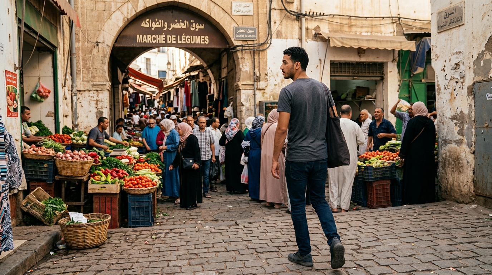
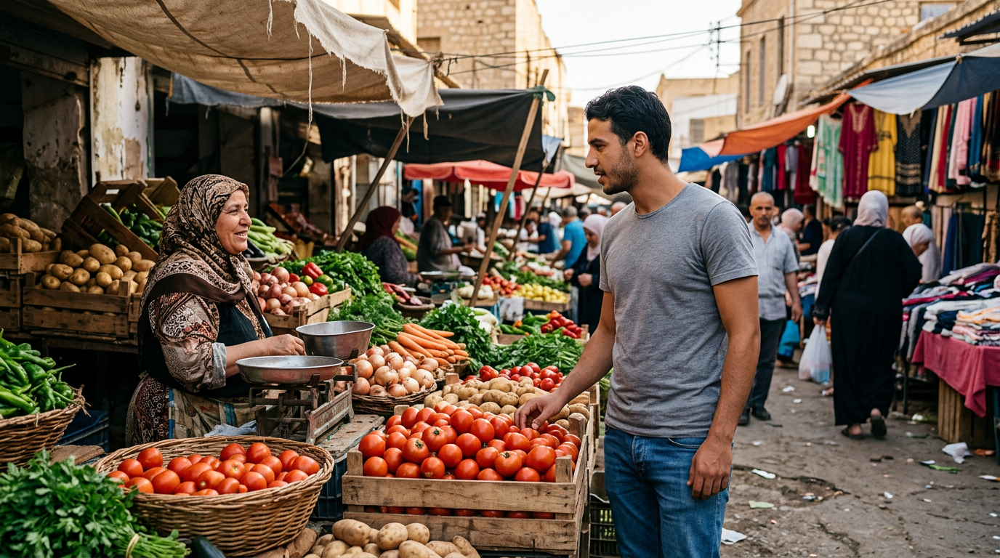

# 🕷️ سوبر ذزيري — مذكرة الإنتاج الاحترافية

> **24 مشهد × 10 ثواني = 4 دقائق** — Seedance 2.5 / Dola

> **البنية:** كل مشهد: الصورة/الصور فوق + البرومبوت تحت (START IMAGE + END IMAGE + VIDEO PROMPT + الحوار)

> **الصور:** في مجلد `images/` — اسم الملف مكتوب فوق كل صورة


---

## 🧑🎨 الشخصيات (ثابتة — لا تغير أبداً)


### 🧑 أنيس بن يوسف — ANIS_BENYOUCEF (المواطن)
```
Photorealistic young Algerian man, Anis Benyoucef, 25, 178cm, slim athletic,
short black wavy hair, thin dark eyebrows, dark brown eyes, light stubble on
jawline, medium olive-tan skin, small scar on left eyebrow. Light grey t-shirt,
blue jeans, dark sneakers. NO mask, NO suit. Same face/proportions in every
civilian scene.
```

### 🕷️ سوبر ذزيري — SUPER_DZIRI (البطل)
```
Photorealistic original Algerian superhero, same 25yo athletic body as Anis.
Clean DARK EMERALD GREEN full-body suit, subtle RED AND WHITE trim on sleeves
and belt, small GOLDEN STAR AND CRESCENT emblem on chest. Simple full-face mask,
WHITE lens-shaped eyes, small RED crescent on forehead. No web patterns,
no ornaments, no Spider-Man resemblance. Same exact suit/mask in every hero scene.
```

### 👵 خالتي زهرة — AUNT_ZAHRA
```
Photorealistic elderly Algerian woman, 72, short, slightly hunched, deep wrinkles,
warm brown eyes, grey hair in a bun under a white haik head covering, dark blue
traditional karakou dress with gold embroidery, worn brown leather handbag.
```

### 👮 قويدر — OFFICER_KOUIDER
```
Photorealistic Algerian police officer, 40, medium height, stocky, short
grey-flecked black hair, thick moustache, stern but kind face, light brown skin,
dark blue Algerian police uniform with badge and cap.
```

### 🧑 حرامي السوق — MARKET_THIEF
```
Photorealistic thin Algerian man, 30, thin build, shifty narrow eyes, short messy
black hair, thin goatee, light brown skin, dark grey hooded jacket, black jeans.
```

### 🚖 سي الطاهر — SI_TAHAR
```
Photorealistic Algerian taxi driver, 50, medium build, grey moustache, weathered
friendly face, light brown skin, beige shirt, dark trousers, white-yellow taxi.
```


---

## 🚫 Master Negative Prompt

```text
cartoon, anime, illustration, CGI, 3D render, plastic skin, game graphics, changing face, identity drift, changing clothes, changing costume, changing mask, changing emblem, extra fingers, missing fingers, deformed hands, extra limbs, duplicate characters, warped face, warped mouth, broken teeth, unnatural lip sync, random dialogue, random subtitles, text, watermark, logo, Spider-Man, Marvel, web pattern, exaggerated muscles, teleporting camera, impossible physics, sudden location change, inconsistent lighting, inconsistent time of day
```


---

## 🎬 صيغة Video Prompt الإجبارية (صورتان)

```text
REFERENCE IMAGE ASSIGNMENT:
IMAGE 1 = START FRAME.  IMAGE 2 = END FRAME.
The first uploaded image is the exact visual starting state.
The second uploaded image is the exact visual ending state.
Create ONE continuous 10-second photorealistic live-action shot.
The video must physically and naturally travel from IMAGE 1 to IMAGE 2.
Do not jump directly. Do not blend. Do not morph. Do not teleport.
Do not change the character identity.
TIMELINE: 0-2s initial movement, 2-5s main transition, 5-8s action/dialogue,
8-10s arrive at the exact visual state of IMAGE 2.
CAMERA: realistic movement. CHARACTER: exact identity.
ENVIRONMENT: same place/lighting/time. DIALOGUE: exact Algerian Darija.
AUDIO: ambience + footsteps + dialogue.
ENDING STATE: what is visible at end. NEXT SCENE: how next video begins.
```


---


## 🎬 SCENE 01 — دخول السوق → الوصول إلى بائع الخضار

**SDZ_01_START_Anis_EnteringMarket.png**



**SDZ_01_END_Anis_TomatoStall.png**




**🖼️ START IMAGE PROMPT:**
```text
Photorealistic Algerian neighborhood market entrance, Anis Benyoucef, 25,
same fixed civilian identity, grey t-shirt, blue jeans, dark sneakers, entering
a busy vegetable market on foot. Warm afternoon sunlight, authentic Algerian
market, vegetable stalls, pedestrians, realistic architecture. Medium-wide
three-quarter rear shot, natural cinematic photography, 16:9.
```


**🖼️ END IMAGE PROMPT:**
```text
Photorealistic same Algerian market, same afternoon light and same stall layout.
Anis Benyoucef is now standing naturally at a vegetable stall, facing a vendor,
his right hand close to a pile of tomatoes. Same face, hair, grey t-shirt,
blue jeans and body proportions. Medium shot, matching the spatial direction
of movement from the previous image, 16:9.
```


**🎥 SEEDANCE VIDEO PROMPT:**
```text
START REFERENCE FILE: SDZ_01_START_Anis_EnteringMarket.png
END REFERENCE FILE: SDZ_01_END_Anis_TomatoStall.png

Use START IMAGE as the exact beginning state and END IMAGE as the exact target
state.

0-2s:
Anis enters the market at a normal human walking speed. Keep the camera behind
and slightly to his left. Natural arm swing and footsteps.

2-4s:
The camera smoothly tracks forward with Anis. He notices the vegetable stall
ahead and gradually turns his head toward it without stopping suddenly.

4-6s:
Anis slows down naturally as he approaches the stall. His body rotates slightly
toward the vendor. Camera moves from the rear three-quarter angle toward a
medium side angle.

6-8s:
Anis reaches the stall and stops naturally. He extends his right hand toward
the tomatoes.

8-10s:
He settles into the exact position represented by
SDZ_01_END_Anis_TomatoStall.png. The final 1 second must be stable and visually
match the END IMAGE in body position, screen placement, lighting and framing.

NO CUT between START and END.
NO teleportation.
NO sudden zoom.
NO change of clothes.
NO change of face.
```


---


## 🎬 SCENE 02 — عند الطماطم → اللدغة

**(لا توجد صور مولّدة بعد — راجع جدول الاستمرارية)**


**🖼️ END IMAGE PROMPT:**
```text
Same market, same vegetable stall, same Anis identity and clothes. Anis has just
pulled his right hand back after a small spider bite. He looks at the bite with
surprise. A tiny realistic spider is visible near the vegetables. Medium
close-up including face and right hand.
```


---


## 🎬 SCENE 03 — آثار القوة / تجربة الالتصاق

**(لا توجد صور مولّدة بعد — راجع جدول الاستمرارية)**


---


## 🎬 SCENE 04 — تجربة الخيط / الفشل الكوميدي

**(لا توجد صور مولّدة بعد — راجع جدول الاستمرارية)**


---


## 🎬 SCENE 05 — سرقة حقيبة زهرة

**(لا توجد صور مولّدة بعد — راجع جدول الاستمرارية)**


---


## 🎬 SCENE 06 — المطاردة إلى الزقاق

**(لا توجد صور مولّدة بعد — راجع جدول الاستمرارية)**


---


## 🎬 SCENE 07 — سوبر ذزيري يمسك الحرامي

**(لا توجد صور مولّدة بعد — راجع جدول الاستمرارية)**


---


## 🎬 SCENE 08 — رجوع الحقيبة

**(لا توجد صور مولّدة بعد — راجع جدول الاستمرارية)**


---


## 🎬 SCENE 09 — التاكسي والحياة العادية

**(لا توجد صور مولّدة بعد — راجع جدول الاستمرارية)**


---


## 🎬 SCENE 10 — التحول إلى سوبر ذزيري

**(لا توجد صور مولّدة بعد — راجع جدول الاستمرارية)**


---


## 🎬 SCENE 11 — أول ظهور في الحومة

**(لا توجد صور مولّدة بعد — راجع جدول الاستمرارية)**


---


## 🎬 SCENE 12 — البلدية

**(لا توجد صور مولّدة بعد — راجع جدول الاستمرارية)**


---


## 🎬 SCENE 13 — نهاية اليوم الأول فوق السطح

**(لا توجد صور مولّدة بعد — راجع جدول الاستمرارية)**


---


## 🎬 SCENE 14 — صباح اليوم التالي / الحي يتكلم

**(لا توجد صور مولّدة بعد — راجع جدول الاستمرارية)**


---


## 🎬 SCENE 15 — سيلفي مع سي الطاهر

**(لا توجد صور مولّدة بعد — راجع جدول الاستمرارية)**


---


## 🎬 SCENE 16 — طابور المخبزة

**(لا توجد صور مولّدة بعد — راجع جدول الاستمرارية)**


---


## 🎬 SCENE 17 — اكتشاف المنتجات المقلدة

**(لا توجد صور مولّدة بعد — راجع جدول الاستمرارية)**


---


## 🎬 SCENE 18 — التحول الثاني

**(لا توجد صور مولّدة بعد — راجع جدول الاستمرارية)**


---


## 🎬 SCENE 19 — كشف المقلدة

**(لا توجد صور مولّدة بعد — راجع جدول الاستمرارية)**


---


## 🎬 SCENE 20 — مساعدة قويدر

**(لا توجد صور مولّدة بعد — راجع جدول الاستمرارية)**


---


## 🎬 SCENE 21 — فض الشجار

**(لا توجد صور مولّدة بعد — راجع جدول الاستمرارية)**


---


## 🎬 SCENE 22 — مطاردة قويدر → Match Cut إلى الأطفال

**(لا توجد صور مولّدة بعد — راجع جدول الاستمرارية)**


---


## 🎬 SCENE 23 — Match Cut: الأطفال

**(لا توجد صور مولّدة بعد — راجع جدول الاستمرارية)**


---


## 🎬 SCENE 24 — سرقة السيارة → الشاي → التصالح → النهاية

**(لا توجد صور مولّدة بعد — راجع جدول الاستمرارية)**


---


## ✅ خطوات الإنتاج
1. لكل مشهد: ارفع الصورة/الصور (من `images/`)
2. الصق **IMAGE PROMPT** (لإنشاء صورة جديدة إن لزم)
3. الصق **SEEDANCE VIDEO PROMPT** (لتحريك 10 ثواني)
4. أضف الحوار بالدارجة (من المذكرة)
5. كرر على الـ24 → اربط في المونتاج
6. Cut للمنتقلات الزمنية، Match Cut للـ 22→23

© LATCHI AI — 🎬 100% جزائري 🇩🇿
